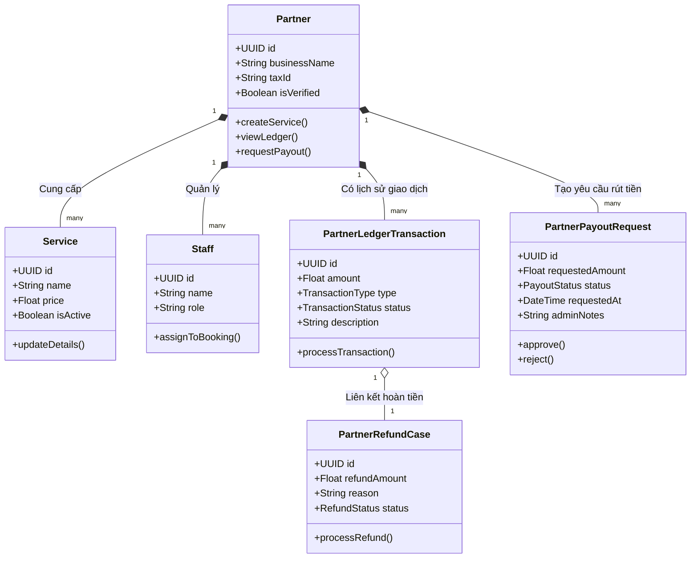

# Danh sách công việc: Cập nhật & Đồng bộ Sơ đồ Báo cáo (Healytics)

Tài liệu này là danh sách kiểm tra (checklist) để nhắc nhở những phần sơ đồ (Diagrams) trong tài liệu báo cáo đang bị thiếu hoặc chưa đồng bộ với thực tế mã nguồn Backend. Cần hoàn thiện những mục này để hội đồng chấm thi thấy được hết độ phức tạp và công sức lập trình của nhóm.

## 1. CÁC TÍNH NĂNG ĐANG THIẾU SƠ ĐỒ HOÀN TOÀN
*Mặc dù Backend đã code rất chi tiết, nhưng tài liệu thiết kế chưa có sơ đồ cho các tính năng này.*

### 🛒 Giỏ hàng & Mã giảm giá (Cart & Coupons)
- [ ] **Use Case Diagram:** Bổ sung Use Case "Quản lý giỏ hàng" và "Áp dụng mã giảm giá".
- [ ] **Sequence Diagram:** Vẽ luồng *Add to Cart -> Xem giỏ hàng -> Áp dụng Coupon -> Thanh toán (Checkout)*. (Hiện tại ảnh `4.2.4.png` mới chỉ có luồng "Mua ngay" đặt 1 dịch vụ).
- [ ] **Activity Diagram:** Vẽ luồng hoạt động thanh toán từ giỏ hàng.
- [ ] **Class Diagram:** Đảm bảo các thực thể `cart_items`, `coupons` được nhắc đến trong mô tả thiết kế hệ thống.

### 💬 Trò chuyện trực tiếp (User-to-Partner Chat qua WebSocket)
- [ ] **Use Case Diagram:** Bổ sung Use Case "Nhắn tin trực tiếp với Bác sĩ/Phòng khám".
- [ ] **Sequence Diagram:** Vẽ luồng kết nối Real-time qua WebSocket (Dựa trên `PartnerChatGateway` và module `chat`). *(Hiện tại báo cáo chỉ có sơ đồ Chatbot AI `4.2.2.png`)*.
- [ ] **Activity Diagram:** Luồng xử lý tin nhắn và thông báo khi có tin nhắn mới.

### 💰 Quản lý Tài chính, Đối soát & Hoàn tiền (Finance, Payouts, Refunds)
- [ ] **Sequence Diagram (Rút tiền - Payout):** Quy trình Partner tạo yêu cầu rút tiền -> Admin duyệt -> Trừ số dư ví Ledger -> Chuyển khoản (Dựa trên `partner-payouts.controller.ts`).
- [ ] **Sequence Diagram (Hoàn tiền - Refund):** Quy trình hủy lịch hẹn -> Cập nhật `partner_refund_cases` -> Hoàn tiền về tài khoản User.
- [ ] **Cập nhật LaTeX:** Mở comment (uncomment) các phần liên quan đến Quản lý tài chính trong file `PhanTichHeThong.tex` (quanh dòng 468+).

### 🔔 Hệ thống Thông báo (Notifications)
- [ ] **Sequence Diagram:** Sơ đồ mô tả luồng bắn thông báo Push/WebSocket tới thiết bị di động của User và Partner (Dựa trên module `notification`).

---

## 2. CÁC ĐIỂM BẤT HỢP LÝ / LỖI LOGIC TRONG TÀI LIỆU
*Cần sửa chữa để tránh bị mất điểm trình bày.*

### 📝 File `PhanTichHeThong.tex`
- [ ] **Thiếu Activity Diagram "Quản lý Dịch vụ":** Đã có Sequence (Hình 4.2.10) nhưng lại quên vẽ Activity Diagram tương ứng ở phần 4.5.
- [ ] **Lộn xộn số thứ tự ảnh Activity:** Thứ tự ảnh chèn đang bị nhảy: `4.5.1` -> `4.5.2` -> `4.5.4` -> `4.5.3`. Không có ảnh `4.5.5` nào được gọi đúng logic. Cần sắp xếp lại tên file và thứ tự `\figure`.
- [ ] **Sơ đồ 4.2.5 bị lãng quên:** Trong thư mục `Images/sequences/` có file `4.2.5.png` (luồng Payment & Rating chi tiết) nhưng **không hề được chèn** vào file `.tex`. Hãy chèn vào hoặc gộp ý nếu cần.

### 🗑️ Dọn dẹp File Rác
- [ ] Xóa file `d:\GitHub\Healytics\Report\Images\sequences\4.2.4(old).png` để tránh nhầm lẫn khi nén file nộp.

### 🏛️ Cập nhật File `ThietKeHeThong.tex` (Class Diagrams)
- [ ] **class_diagram.png (Sơ đồ tổng thể):** Đang hoàn toàn vắng bóng các class thuộc `Cart` (Giỏ hàng), `Finance` (Tài chính) và `Chat trực tiếp`. Cần bổ sung để thấy sự liên kết tổng thể.
- [ ] **module_booking.png:** Đang chỉ có `Service` -> `Booking` -> `Payment`. Bổ sung thêm `Cart` và `CartItem` làm tiền đề tạo ra `Booking`. Bổ sung thêm `Coupon` (áp dụng mã giảm giá).
- [ ] **module_communication.png:** Đang chỉ mô tả kết nối giữa `User` và `Chatbot` / `SupportTicket`. Cần vẽ bổ sung thêm `Conversation`, `Message` (cho phép User chat với Partner) và `WebSocketHandler`.
- [ ] **module_partner.png:** Đang thiếu nghiêm trọng các class về tài chính: `LedgerTransaction`, `PayoutRequest`, `RefundCase`. (Đây là phân hệ rất quan trọng để quản lý dòng tiền của Partner).
- [ ] **module_admin.png:** `SystemFinancials` hiện tại quá sơ sài. Cần thiết kế lại để thể hiện khả năng Admin duyệt `Payout` và quản lý `PlatformFee`.
- [ ] **ERD / Class Description:** Bổ sung thêm mô tả cho các bảng quan trọng như `partner_ledger_transactions`, `partner_payouts`, `cart_items` ở phần Phân hệ tương ứng trong LaTeX.

---

## 3. KIỂM TRA CÁC SƠ ĐỒ KHÁC (Use Case, ERD, Architecture)
Dựa trên đợt kiểm tra mới nhất đối với các sơ đồ tổng quan hệ thống, đây là các vấn đề cần khắc phục:

### 👤 Sơ đồ Use Case (User, Partner, Admin, Wellness)
- [ ] **User_Usecase.jpg:** Hoàn toàn thiếu Use Case **"Thêm vào Giỏ hàng"** (Add to Cart) và **"Nhắn tin trực tiếp với Phòng khám"** (Direct Chat). Hiện tại chỉ có Booking và Chatbot AI.
- [ ] **Partner_Usecase.jpg:** Thiếu Use Case **"Nhắn tin với Bệnh nhân"**, **"Xem Sổ cái (Ledger)"**, **"Yêu cầu rút tiền (Payout)"**, và **"Quản lý hoàn tiền (Refund)"**. (Đang chỉ có Xem doanh thu chung chung).
- [ ] **Admin_Usecase.jpg:** Đã có "Quản lý Tài chính" nhưng cần làm rõ thêm Use Case **"Duyệt yêu cầu rút tiền của Partner"** để đúng với thực tế code.

### 🗄️ Sơ đồ ERD (ERD.png)
- [ ] **Thiếu Bảng Giỏ hàng (Cart):** ERD hiện tại chưa vẽ các thực thể `Cart` và `CartItem`.
- [ ] **Thiếu Bảng Sổ cái & Hoàn tiền:** Đã có `Payout` (Rút tiền), nhưng lại vắng bóng `PartnerLedgerTransaction` (Lịch sử biến động số dư) và `PartnerRefundCase` (Lịch sử hoàn tiền).

### 🏗️ Sơ đồ Architecture (ArchSys.png, implement_arch.png, Deploy_arch.jpg)
- **Đánh giá:** Các sơ đồ Kiến trúc nhìn chung **rất tốt và bám sát thực tế**. Đã có sự xuất hiện của `WebSocket` (cho real-time chat), các cổng thanh toán (`Momo`, `Stripe`, `VNPay`), và các services AI/ML. Không cần chỉnh sửa nhiều về mặt kiến trúc.

---
**💡 Ghi chú:** Để tiết kiệm thời gian, nhóm có thể dùng công cụ vẽ tự động (PlantUML, Mermaid) để tạo nhanh các sơ đồ Sequence và Class Diagram còn thiếu.

### 📝 Mẫu Code Mermaid cho `module_partner.png` (Đã cập nhật Tài chính)
Dưới đây là đoạn code mẫu bằng Mermaid để bạn có thể nhanh chóng tạo lại Class Diagram cho phân hệ Partner (bao gồm cả các tính năng tài chính mới) trên trang web [Mermaid Live Editor](https://mermaid.live/):

