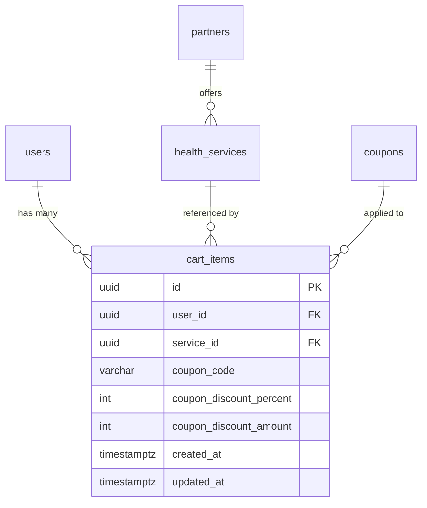

# Cart API — Backend Implementation Guide

## Overview

This document specifies the REST API endpoints required for the frontend **Add to Cart** feature. The frontend uses these APIs for all cart operations — no local persistence.

**Base URL**: `/api/v1/cart`  
**Authentication**: All endpoints require a valid JWT Bearer token. The `userId` is extracted from the token.

---

## Database Schema

### `cart_items` Table

```sql
CREATE TABLE cart_items (
    id              UUID PRIMARY KEY DEFAULT gen_random_uuid(),
    user_id         UUID NOT NULL REFERENCES users(id) ON DELETE CASCADE,
    service_id      UUID NOT NULL REFERENCES health_services(id),
    coupon_code     VARCHAR(50),
    coupon_discount_percent  INT,
    coupon_discount_amount   INT,
    created_at      TIMESTAMPTZ NOT NULL DEFAULT NOW(),
    updated_at      TIMESTAMPTZ NOT NULL DEFAULT NOW(),

    -- A user cannot add the same service twice
    UNIQUE (user_id, service_id)
);

CREATE INDEX idx_cart_items_user_id ON cart_items(user_id);
```

### Relationships



---

## API Endpoints

### 1. GET `/api/v1/cart` — Get Cart Items

Returns all items in the authenticated user's cart with joined service and clinic (partner) details.

**Request**: No body required.

**Response** `200 OK`:
```typescript
interface CartItemDto {
  id: string;                       // cart_items.id (UUID)
  serviceId: string;                // health_services.id
  serviceName: string;              // health_services.name
  serviceImageUrl: string;          // health_services.image_url
  price: string;                    // Formatted: "500.000đ"
  priceAmount: number;              // health_services.price (numeric)
  clinicId: string;                 // partners.id
  clinicName: string;               // partners.business_name
  clinicAddress: string;            // partners.address
  clinicImageUrl: string;           // partners.avatar_url
  couponCode: string | null;
  couponDiscountPercent: number | null;
  couponDiscountAmount: number | null;
  createdAt: string;                // ISO 8601
}

// Response body
type GetCartResponse = CartItemDto[];
```

**SQL Query Pattern**:
```sql
SELECT
    ci.id,
    ci.service_id,
    hs.name AS service_name,
    hs.image_url AS service_image_url,
    hs.price AS price_amount,
    p.id AS clinic_id,
    p.business_name AS clinic_name,
    p.address AS clinic_address,
    p.avatar_url AS clinic_image_url,
    ci.coupon_code,
    ci.coupon_discount_percent,
    ci.coupon_discount_amount,
    ci.created_at
FROM cart_items ci
    JOIN health_services hs ON ci.service_id = hs.id
    JOIN partners p ON hs.partner_id = p.id
WHERE ci.user_id = :userId
ORDER BY ci.created_at DESC;
```

---

### 2. POST `/api/v1/cart` — Add Item to Cart

Adds a service to the user's cart. Returns the created cart item with full details.

**Request Body**:
```typescript
interface AddToCartDto {
  serviceId: string;  // UUID of the health_service
}
```

**Validation Rules**:
- `serviceId` must exist in `health_services` table
- `serviceId` must belong to an active/published service
- User cannot add the same service twice (unique constraint)

**Response** `201 Created`:
```typescript
CartItemDto  // Same shape as GET response item
```

**Error Responses**:

| Status | Code | Description |
|--------|------|-------------|
| 400 | `INVALID_SERVICE` | Service ID doesn't exist or is inactive |
| 409 | `ITEM_ALREADY_EXISTS` | Service is already in the user's cart |
| 401 | `UNAUTHORIZED` | Invalid/missing JWT |

---

### 3. DELETE `/api/v1/cart/:cartItemId` — Remove Item

Removes a single item from the cart.

**Path Parameters**:
- `cartItemId` (UUID): The cart item's ID

**Response** `204 No Content`

**Error Responses**:

| Status | Code | Description |
|--------|------|-------------|
| 404 | `ITEM_NOT_FOUND` | Cart item doesn't exist or belongs to another user |
| 401 | `UNAUTHORIZED` | Invalid/missing JWT |

> [!IMPORTANT]
> Always verify `cart_items.user_id = currentUser.id` before deleting to prevent IDOR.

---

### 4. POST `/api/v1/cart/:cartItemId/coupon` — Apply Coupon

Validates and applies a coupon code to a specific cart item.

**Path Parameters**:
- `cartItemId` (UUID)

**Request Body**:
```typescript
interface ApplyCouponDto {
  couponCode: string;  // e.g. "WELCOME10"
}
```

**Business Logic**:
1. Validate `couponCode` exists in `coupons` table
2. Check coupon is active (`is_active = true`)  
3. Check coupon hasn't expired (`expires_at > NOW()`)
4. Check coupon usage limit hasn't been reached
5. Check coupon is applicable to this service/category
6. Calculate discount amount: `service.price * coupon.discount_percent / 100`
7. Cap discount at `coupon.max_discount_amount` if set
8. Update `cart_items` with coupon info

**Response** `200 OK`:
```typescript
CartItemDto  // Updated item with coupon fields populated
```

**Error Responses**:

| Status | Code | Description |
|--------|------|-------------|
| 400 | `INVALID_COUPON` | Coupon code doesn't exist |
| 400 | `COUPON_EXPIRED` | Coupon has passed its expiry date |
| 400 | `COUPON_LIMIT_REACHED` | Usage limit exceeded |
| 400 | `COUPON_NOT_APPLICABLE` | Coupon doesn't apply to this service |
| 404 | `ITEM_NOT_FOUND` | Cart item not found |

---

### 5. DELETE `/api/v1/cart/:cartItemId/coupon` — Remove Coupon

Removes the applied coupon from a specific cart item.

**Path Parameters**:
- `cartItemId` (UUID)

**Response** `200 OK`:
```typescript
CartItemDto  // Updated item with coupon fields set to null
```

**SQL**:
```sql
UPDATE cart_items
SET coupon_code = NULL,
    coupon_discount_percent = NULL,
    coupon_discount_amount = NULL,
    updated_at = NOW()
WHERE id = :cartItemId AND user_id = :userId
RETURNING *;
```

---

### 6. DELETE `/api/v1/cart` — Clear Cart

Removes all items from the authenticated user's cart.

**Response** `204 No Content`

**SQL**:
```sql
DELETE FROM cart_items WHERE user_id = :userId;
```

---

## NestJS Controller Skeleton

```typescript
@Controller('cart')
@UseGuards(JwtAuthGuard)
@ApiTags('Cart')
export class CartController {
  constructor(
    private readonly cartService: CartService,
  ) {}

  @Get()
  @ApiOperation({ operationId: 'cartControllerGetItems' })
  async getItems(
    @CurrentUser() user: UserEntity,
  ): Promise<CartItemDto[]> {
    return this.cartService.getCartItems(user.id);
  }

  @Post()
  @ApiOperation({ operationId: 'cartControllerAddItem' })
  async addItem(
    @CurrentUser() user: UserEntity,
    @Body() dto: AddToCartDto,
  ): Promise<CartItemDto> {
    return this.cartService.addItem(user.id, dto);
  }

  @Delete(':cartItemId')
  @HttpCode(HttpStatus.NO_CONTENT)
  @ApiOperation({ operationId: 'cartControllerRemoveItem' })
  async removeItem(
    @CurrentUser() user: UserEntity,
    @Param('cartItemId', ParseUUIDPipe) cartItemId: string,
  ): Promise<void> {
    return this.cartService.removeItem(user.id, cartItemId);
  }

  @Post(':cartItemId/coupon')
  @ApiOperation({ operationId: 'cartControllerApplyCoupon' })
  async applyCoupon(
    @CurrentUser() user: UserEntity,
    @Param('cartItemId', ParseUUIDPipe) cartItemId: string,
    @Body() dto: ApplyCouponDto,
  ): Promise<CartItemDto> {
    return this.cartService.applyCoupon(
      user.id, cartItemId, dto,
    );
  }

  @Delete(':cartItemId/coupon')
  @ApiOperation({ operationId: 'cartControllerRemoveCoupon' })
  async removeCoupon(
    @CurrentUser() user: UserEntity,
    @Param('cartItemId', ParseUUIDPipe) cartItemId: string,
  ): Promise<CartItemDto> {
    return this.cartService.removeCoupon(
      user.id, cartItemId,
    );
  }

  @Delete()
  @HttpCode(HttpStatus.NO_CONTENT)
  @ApiOperation({ operationId: 'cartControllerClearCart' })
  async clearCart(
    @CurrentUser() user: UserEntity,
  ): Promise<void> {
    return this.cartService.clearCart(user.id);
  }
}
```

---

## OpenAPI Spec Snippet

```yaml
paths:
  /api/v1/cart:
    get:
      operationId: cartControllerGetItems
      summary: Get all cart items
      tags: [Cart]
      security:
        - bearer: []
      responses:
        '200':
          description: List of cart items
          content:
            application/json:
              schema:
                type: array
                items:
                  $ref: '#/components/schemas/CartItemDto'
    post:
      operationId: cartControllerAddItem
      summary: Add item to cart
      tags: [Cart]
      security:
        - bearer: []
      requestBody:
        required: true
        content:
          application/json:
            schema:
              $ref: '#/components/schemas/AddToCartDto'
      responses:
        '201':
          description: Item added
          content:
            application/json:
              schema:
                $ref: '#/components/schemas/CartItemDto'
        '409':
          description: Item already exists in cart
    delete:
      operationId: cartControllerClearCart
      summary: Clear all cart items
      tags: [Cart]
      security:
        - bearer: []
      responses:
        '204':
          description: Cart cleared

  /api/v1/cart/{cartItemId}:
    delete:
      operationId: cartControllerRemoveItem
      summary: Remove item from cart
      tags: [Cart]
      security:
        - bearer: []
      parameters:
        - name: cartItemId
          in: path
          required: true
          schema:
            type: string
            format: uuid
      responses:
        '204':
          description: Item removed
        '404':
          description: Item not found

  /api/v1/cart/{cartItemId}/coupon:
    post:
      operationId: cartControllerApplyCoupon
      summary: Apply coupon to cart item
      tags: [Cart]
      security:
        - bearer: []
      parameters:
        - name: cartItemId
          in: path
          required: true
          schema:
            type: string
            format: uuid
      requestBody:
        required: true
        content:
          application/json:
            schema:
              $ref: '#/components/schemas/ApplyCouponDto'
      responses:
        '200':
          description: Coupon applied
          content:
            application/json:
              schema:
                $ref: '#/components/schemas/CartItemDto'
        '400':
          description: Invalid or expired coupon
    delete:
      operationId: cartControllerRemoveCoupon
      summary: Remove coupon from cart item
      tags: [Cart]
      security:
        - bearer: []
      parameters:
        - name: cartItemId
          in: path
          required: true
          schema:
            type: string
            format: uuid
      responses:
        '200':
          description: Coupon removed
          content:
            application/json:
              schema:
                $ref: '#/components/schemas/CartItemDto'

components:
  schemas:
    CartItemDto:
      type: object
      required:
        - id
        - serviceId
        - serviceName
        - serviceImageUrl
        - price
        - priceAmount
        - clinicId
        - clinicName
        - clinicAddress
        - clinicImageUrl
        - createdAt
      properties:
        id:
          type: string
          format: uuid
        serviceId:
          type: string
          format: uuid
        serviceName:
          type: string
          example: "Swedish Relax Massage"
        serviceImageUrl:
          type: string
          format: uri
        price:
          type: string
          example: "500.000đ"
          description: Formatted price for display
        priceAmount:
          type: integer
          example: 500000
          description: Price in VND for calculation
        clinicId:
          type: string
          format: uuid
        clinicName:
          type: string
          example: "Spa An Nhien"
        clinicAddress:
          type: string
          example: "123 Dien Bien Phu, Q1, HCM"
        clinicImageUrl:
          type: string
          format: uri
        couponCode:
          type: string
          nullable: true
        couponDiscountPercent:
          type: integer
          nullable: true
        couponDiscountAmount:
          type: integer
          nullable: true
          description: Discount amount in VND
        createdAt:
          type: string
          format: date-time

    AddToCartDto:
      type: object
      required:
        - serviceId
      properties:
        serviceId:
          type: string
          format: uuid

    ApplyCouponDto:
      type: object
      required:
        - couponCode
      properties:
        couponCode:
          type: string
          example: "WELCOME10"
```

---

## Error Response Format

All error responses follow the standard NestJS error format:

```typescript
interface ErrorResponse {
  statusCode: number;
  message: string;
  error: string;  // Error code for frontend matching
}
```

**Example**:
```json
{
  "statusCode": 409,
  "message": "This service is already in your cart",
  "error": "ITEM_ALREADY_EXISTS"
}
```

---

## Security Considerations

> [!CAUTION]
> 1. **IDOR Prevention**: Always filter by `user_id` from JWT — never trust  path/query params for user identity.
> 2. **Rate Limiting**: Apply rate limits to POST endpoints (e.g., 30 req/min) to prevent cart-bombing.
> 3. **Input Validation**: Validate all UUIDs with `ParseUUIDPipe`. Validate coupon codes (max 50 chars, alphanumeric).
> 4. **Soft Delete**: Consider soft-deleting cart items for analytics rather than hard delete.

## Frontend Integration Timeline

Once the API is deployed:
1. Update `openapi.json` spec at `../../backend/openapi/openapi.json`
2. Regenerate the OpenAPI client: `dart run openapi_generator_cli generate`
3. Replace `throw UnimplementedError(...)` in `CartRemoteDataSourceImpl` with actual API calls
4. Switch `AppEnvironment.useMock` to `false`
