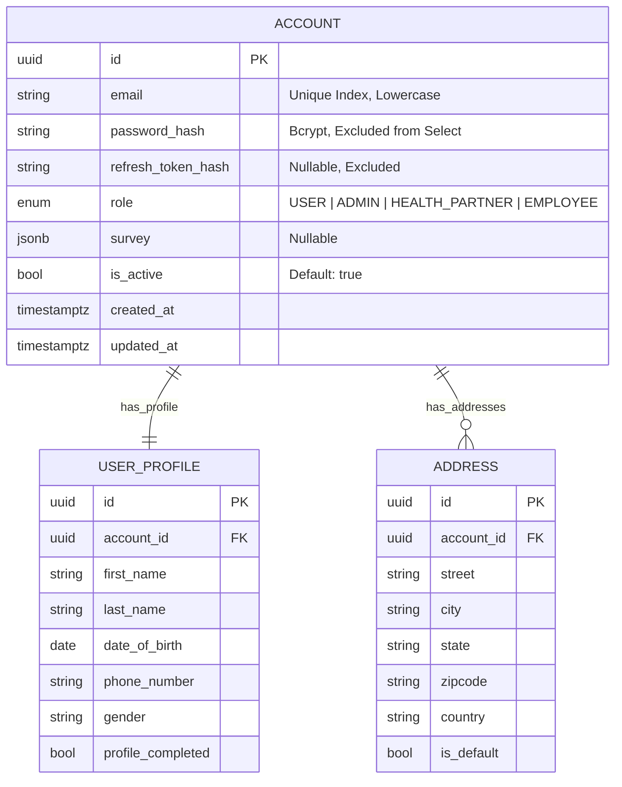

# Account Module (Enterprise Architecture)

## 1. Module Overview
The **Account Module** serves as the foundation for user identity and profile management. It decouples authentication credentials (`Account`) from personal information (`UserProfile`) and survey data, complying with privacy-by-design principles.

### Key Capabilities
*   **Identity Persistence**: Secure storage of credentials and audit timestamps.
*   **Profile Management**: Managing PII (Personal Identifiable Information) separate from auth logic.
*   **Survey Data**: Storage for user onboarding questionnaires (e.g., skin type, health goals).
*   **Token Security**: Manages hashed refresh tokens for secure session rotation.

---

## 2. Architecture & Patterns
Adheres to **Clean Architecture** with strict separation of concerns.

### Component Layers
1.  **Transport Layer (`AccountController`)**:
    *   **Responsibility**: Survey endpoints and self-service account management.
    *   **Access Control**: Strictly guarded by `JwtAuthGuard` and `RolesGuard`.
2.  **Domain Layer (`AccountService`)**:
    *   **Responsibility**: User creation, Profile updates, Token hashing.
    *   **Integration**: Used heavily by `AuthService` for credential validation.
3.  **Persistence Layer**:
    *   **Entities**: `Account`, `UserProfile`, `Address`.

---

## 3. Domain Model
The database schema utilizes strict 1:1 relationships to compartmentalize data.

### Domain Invariants
1.  **Email Uniqueness**: Emails are normalized to lowercase and must be unique across the system.
2.  **Role Immutability**: Roles are critical security parameters and cannot be changed via standard update endpoints.
3.  **Profile Synchronization**: Creation of an `Account` typically triggers creation of a `UserProfile`.

---

## 4. API Interface

### Authorization Matrix
| Role | View Own Profile | Update Own Survey | View All Accounts |
|:-----|:----------------:|:-----------------:|:-----------------:|
| `User` | ✅ | ✅ | ❌ |
| `Admin` | ✅ | ✅ | ✅ |

### Endpoints Summary

#### User Operations
*   `GET /account/survey`: Retrieve the currently logged-in user's survey data.
*   `POST /account/survey`: Submit or update the one-shot onboarding survey.

#### Internal Service API (Not exposed via HTTP)
*   `create()`: Atomic user creation.
*   `setRefreshTokenHash()`: Session management.
*   `findByEmail()`: Credential lookup.

---

## 5. Operations & Performance

### Database Indexing
| Column | Index Type | Purpose |
|:-------|:-----------|:--------|
| `email` | UNIQUE | Fast login lookups. |
| `id` | PK | Primary clustered index. |

### Security Notes
*   **Password Storage**: Bcrypt with salt rounds = 10.
*   **PII Protection**: `UserProfile` table isolates sensitive data, allowing simpler access controls for the `Account` table (which is accessed frequently for auth).
*   **Refresh Tokens**: Stored only as hashes. Even if the DB is leaked, active sessions cannot be hijacked without the raw token from the user's device.
