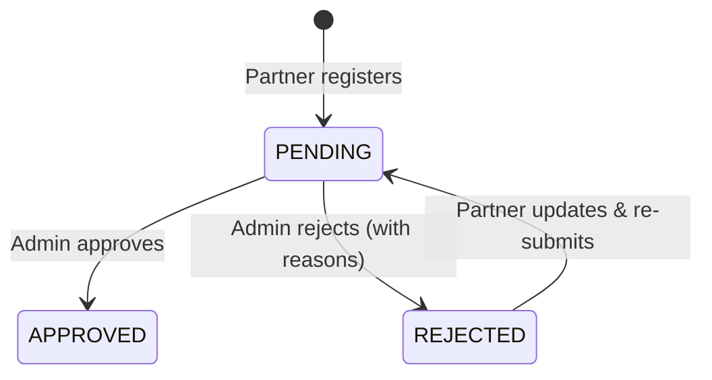
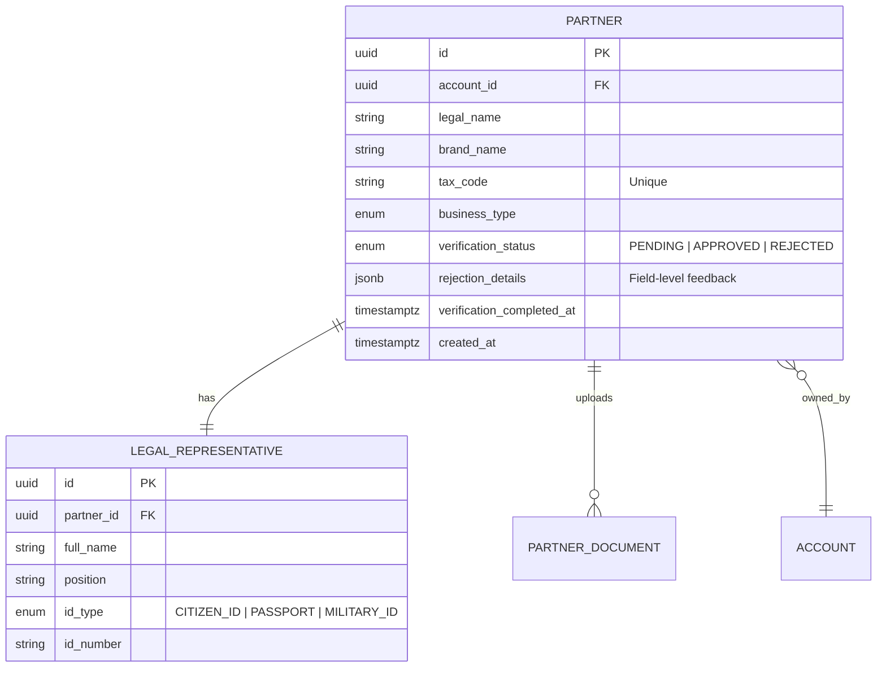

# Admin Partners Module (Enterprise Architecture)

## 1. Module Overview
The **Admin Partners Module** provides administrative capabilities for managing business partners. It enables admins to view, review, approve, or reject partner registrations and their submitted documents.

### Key Capabilities
*   **Partner Listing**: Search and filter registered partners.
*   **Detailed View**: Full partner profile with documents and legal representative info.
*   **Verification Workflow**: Approve or reject partners with field-level feedback.
*   **Document Review**: Approve or reject individual documents with reasons.
*   **Audit Integration**: All review actions are automatically logged.

---

## 2. Architecture & Patterns

### Component Layers
1.  **Transport Layer (`AdminPartnersController`)**:
    *   **Responsibility**: Admin-only partner management endpoints.
    *   **Access Control**: Strictly `ADMIN` role with JWT authentication.
    *   **Audit Logging**: Uses `@Audit` decorator for action tracking.
2.  **Domain Layer (`AdminPartnersService`)**:
    *   **Responsibility**: Partner queries, status updates, rejection handling.
3.  **Integration**:
    *   **DocumentsService**: For document-related operations.
    *   **AuditInterceptor**: Automatic audit log creation.

### Partner Verification Flow


---

## 3. Domain Model



### Verification Statuses
| Status | Description |
|:-------|:------------|
| `PENDING` | Awaiting admin review |
| `APPROVED` | Partner approved to operate |
| `REJECTED` | Partner rejected with feedback |

---

## 4. API Interface

### Authorization Matrix
| Role | List Partners | View Details | Review Partner | Review Document |
|:-----|:-------------:|:------------:|:--------------:|:---------------:|
| Admin | ✅ | ✅ | ✅ | ✅ |
| Partner | ❌ | ❌ | ❌ | ❌ |

### Endpoints Summary

#### Partner Management
*   **GET** `/admin/partners`: List all partners with search/filter.
*   **GET** `/admin/partners/:id`: Get detailed partner information.
*   **PUT** `/admin/partners/:id/review`: Approve or reject partner.

#### Document Management
*   **GET** `/admin/partners/:partnerId/documents`: Get partner's document status.
*   **GET** `/admin/partners/:partnerId/documents/:documentId/url`: Get document view URL.
*   **PUT** `/admin/partners/:partnerId/documents/:documentId/review`: Review document.

---

## 5. API Details

### 5.1 List All Partners

```http
GET /admin/partners
Authorization: Bearer <accessToken>
```

**Query Parameters:**
| Param | Type | Required | Description |
|:------|:-----|:---------|:------------|
| `search` | String | No | Search by name, brand, tax code |
| `verificationStatus` | String | No | Filter by status |
| `page` | Number | No | Page number (default: 1) |
| `limit` | Number | No | Items per page (default: 10) |

**Response:** `200 OK`
```json
{
  "data": [
    {
      "id": "uuid",
      "legalName": "CÔNG TY TNHH SPA HÀ NỘI",
      "brandName": "Hanoi Spa",
      "businessType": "SPA",
      "taxCode": "0101234567",
      "verificationStatus": "PENDING",
      "createdAt": "2024-01-15T10:30:00Z"
    }
  ],
  "meta": {
    "total": 50,
    "page": 1,
    "limit": 10,
    "totalPages": 5
  }
}
```

---

### 5.2 Get Partner Details

```http
GET /admin/partners/:id
Authorization: Bearer <accessToken>
```

**Response:** `200 OK`
```json
{
  "id": "uuid",
  "legalName": "CÔNG TY TNHH SPA HÀ NỘI",
  "brandName": "Hanoi Spa",
  "businessType": "SPA",
  "taxCode": "0101234567",
  "verificationStatus": "PENDING",
  "address": {
    "province": "Hà Nội",
    "district": "Quận Ba Đình",
    "ward": "Phường Phúc Xá",
    "streetAddress": "123 Đường Nguyễn Huệ"
  },
  "legalRepresentative": {
    "fullName": "NGUYỄN VĂN A",
    "position": "Giám đốc",
    "idType": "CITIZEN_ID",
    "idNumber": "079090******"
  },
  "documents": [
    {
      "id": "uuid",
      "documentType": "BUSINESS_LICENSE",
      "status": "PENDING",
      "submittedAt": "2024-01-15T10:30:00Z"
    }
  ],
  "rejectionDetails": null,
  "createdAt": "2024-01-15T10:30:00Z"
}
```

---

### 5.3 Review Partner (Approve/Reject)

```http
PUT /admin/partners/:id/review
Authorization: Bearer <accessToken>
```

**Request - Approve:**
```json
{
  "decision": "APPROVED",
  "generalComment": "Looks good"
}
```

**Request - Changes Required / Reject:**
```json
{
  "decision": "CHANGES_REQUIRED",
  "generalComment": "Please fix the brand name and re-upload the license.",
  "items": [
    {
      "type": "FIELD",
      "fieldName": "brandName",
      "isValid": false,
      "reason": "Brand name contains inappropriate content"
    },
    {
      "type": "DOCUMENT",
      "documentId": "uuid",
      "isValid": false,
      "reason": "Image is blurry, please re-upload"
    }
  ]
}
```

**Response:** `200 OK`
```json
{
  "message": "Review submitted successfully"
}
```

> [!NOTE]
> This endpoint is automatically audited with action `PARTNER_REVIEW`.
> If `items` contains invalid entries, the partner status will be set to `REQUIRED_RESUBMIT`.

---

### 5.4 Get Partner Document Status

```http
GET /admin/partners/:partnerId/documents
Authorization: Bearer <accessToken>
```

**Response:** `200 OK`
```json
{
  "partner": {
    "id": "uuid",
    "verificationStatus": "PENDING"
  },
  "documents": [
    {
      "id": "uuid",
      "documentType": "BUSINESS_LICENSE",
      "status": "PENDING",
      "submittedAt": "2024-01-15T10:30:00Z"
    }
  ],
  "requiredDocuments": ["BUSINESS_LICENSE", "TAX_REGISTRATION"]
}
```

---

### 5.5 Get Document View URL

```http
GET /admin/partners/:partnerId/documents/:documentId/url
Authorization: Bearer <accessToken>
```

**Response:** `200 OK`
```json
{
  "url": "https://r2.cloudflarestorage.com/...",
  "expiresIn": 3600
}
```

---

### 5.6 Review Document

```http
PUT /admin/partners/:partnerId/documents/:documentId/review
Authorization: Bearer <accessToken>
```

**Request - Approve:**
```json
{
  "status": "APPROVED"
}
```

**Request - Reject:**
```json
{
  "status": "REJECTED",
  "rejectionReason": "Document is expired, please upload a valid one"
}
```

**Response:** `200 OK`
```json
{
  "id": "uuid",
  "documentType": "BUSINESS_LICENSE",
  "status": "APPROVED",
  "reviewedAt": "2024-01-16T09:00:00Z",
  "reviewedBy": "uuid"
}
```

> [!NOTE]
> This endpoint is automatically audited with action `DOCUMENT_REVIEW`.

---

## 6. Operations & Performance

### Database Indexing
| Column | Index Type | Purpose |
|:-------|:-----------|:--------|
| `partner.verification_status` | INDEX | Fast status filtering. |
| `partner.tax_code` | UNIQUE | Tax code lookups. |
| `partner.legal_name` | INDEX | Name search optimization. |

### Security Considerations
*   **ID Masking**: Legal representative ID numbers are partially masked in responses.
*   **Audit Trail**: All review actions are logged for compliance.
*   **Role Enforcement**: Strict ADMIN-only access via `RolesGuard`.
