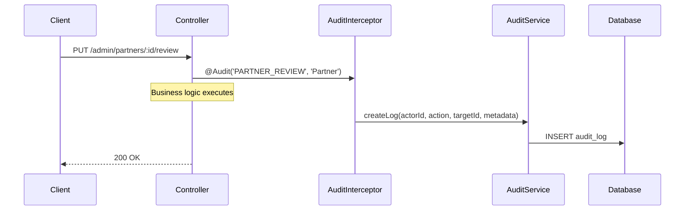
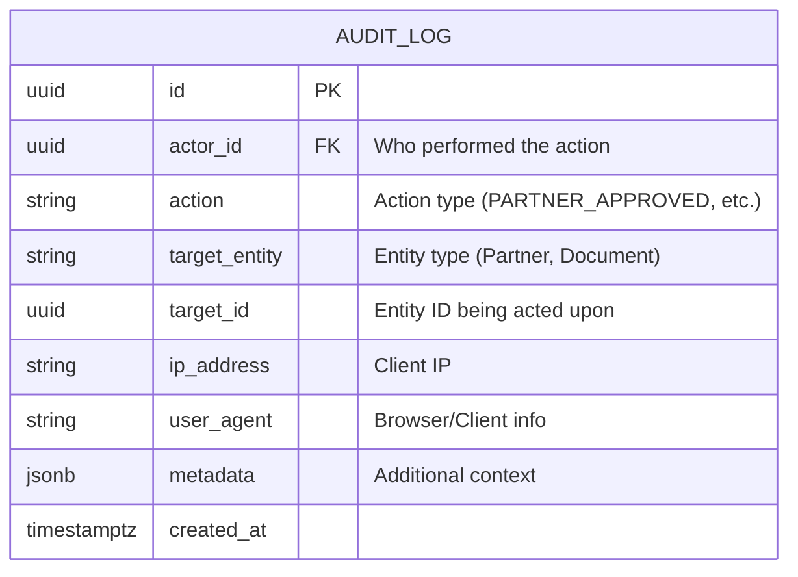

# Audit Module (Enterprise Architecture)

## 1. Module Overview
The **Audit Module** provides comprehensive action logging for sensitive administrative operations. It captures who did what, when, and on which entity, enabling compliance tracking and security auditing.

### Key Capabilities
*   **Action Tracking**: Records all admin actions with actor, target, and metadata.
*   **Automatic Logging**: Uses interceptor + decorator pattern for non-intrusive logging.
*   **Query Filtering**: Filter logs by actor, target, or action type.
*   **IP & User Agent**: Captures request context for security analysis.

---

## 2. Architecture & Patterns

### Component Layers
1.  **Transport Layer (`AuditController`)**:
    *   **Responsibility**: Query endpoints for viewing audit logs.
    *   **Access Control**: Strictly `ADMIN` role only.
2.  **Domain Layer (`AuditService`)**:
    *   **Responsibility**: Creating and querying audit records.
3.  **Infrastructure Layer**:
    *   **`@Audit` Decorator**: Marks controller methods for automatic logging.
    *   **`AuditInterceptor`**: Intercepts requests and logs actions post-execution.

### Logging Flow


---

## 3. Domain Model



### Common Actions
| Action | Description |
|:-------|:------------|
| `PARTNER_REVIEW` | Admin reviewed partner profile |
| `PARTNER_APPROVED` | Partner verification approved |
| `PARTNER_REJECTED` | Partner verification rejected |
| `DOCUMENT_REVIEW` | Admin reviewed a document |
| `DOCUMENT_APPROVED` | Document approved |
| `DOCUMENT_REJECTED` | Document rejected |

---

## 4. API Interface

### Authorization Matrix
| Role | View Audit Logs | Create Logs |
|:-----|:---------------:|:-----------:|
| Admin | ✅ | ✅ (Automatic) |
| Partner | ❌ | ❌ |
| User | ❌ | ❌ |

### Endpoints Summary

#### Admin Operations
*   **GET** `/audit-logs`: Query audit logs with optional filters.

---

## 5. API Details

### 5.1 Get Audit Logs

```http
GET /audit-logs
Authorization: Bearer <accessToken>
```

**Query Parameters:**
| Param | Type | Required | Description |
|:------|:-----|:---------|:------------|
| `targetId` | UUID | No | Filter by target entity ID |
| `actorId` | UUID | No | Filter by actor (admin) ID |
| `action` | String | No | Filter by action type |

**Response:** `200 OK`
```json
[
  {
    "id": "uuid",
    "actorId": "uuid",
    "action": "PARTNER_APPROVED",
    "targetEntity": "Partner",
    "targetId": "uuid",
    "ipAddress": "192.168.1.1",
    "userAgent": "Mozilla/5.0...",
    "metadata": {
      "previousStatus": "PENDING",
      "newStatus": "VERIFIED"
    },
    "createdAt": "2024-01-15T10:30:00Z"
  }
]
```

---

## 6. Usage Examples

### Using the @Audit Decorator

```typescript
@Put(':id/review')
@Audit('PARTNER_REVIEW', 'Partner')
async reviewPartner(
    @Param('id') id: string,
    @Body() dto: ReviewPartnerProfileDto,
    @Req() req
): Promise<ReviewPartnerResponseDto> {
    // Business logic here
    // Audit log is created automatically by interceptor
}
```

### Applying the Interceptor

```typescript
@Controller('admin/partners')
@UseInterceptors(AuditInterceptor)
export class AdminPartnersController {
    // All methods in this controller can use @Audit
}
```

---

## 7. Operations & Performance

### Database Indexing
| Column | Index Type | Purpose |
|:-------|:-----------|:--------|
| `actor_id` | INDEX | Fast actor-based queries. |
| `target_id` | INDEX | Fast target-based queries. |
| `action` | INDEX | Filter by action type. |
| `created_at` | INDEX | Time-range queries. |

### Retention Policy
Consider implementing log rotation or archival for compliance (e.g., retain 2 years, archive to cold storage).
