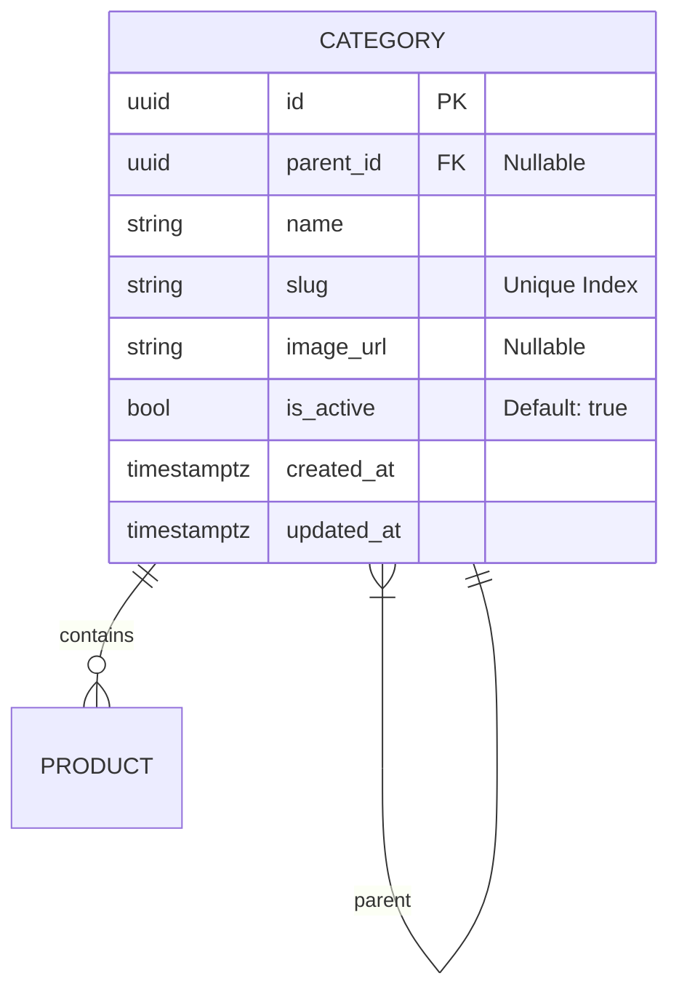

# Categories Module (Enterprise Architecture)

## 1. Module Overview
The **Categories Module** provides a classification taxonomy for Products and Services. It supports a hierarchical (tree-based) structure, allowing for sub-categories (e.g., "Skincare" -> "Moisturizers").

### Key Capabilities
*   **Hierarchical Organization**: Unlimited nesting depth via self-referencing relationship.
*   **Slug Navigation**: URL-friendly identifiers for SEO-optimized filtering.
*   **Root Isolation**: Optimized queries to fetch top-level navigation items.

---

## 2. Architecture & Patterns

### Component Layers
1.  **Transport Layer (`CategoriesController`)**:
    *   **Responsibility**: CRUD operations.
    *   **Access Control**: Read is `Public`, Write is `Admin` only.
2.  **Domain Layer (`CategoriesService`)**:
    *   **Responsibility**: Management of the Category tree.
    *   **Initialization**: Seeds default categories on module startup.

---

## 3. Domain Model
The logical schema uses an **Adjacency List** pattern for the hierarchy.

### Domain Invariants
1.  **Slug Uniqueness**: Slugs must be unique across the entire table.
2.  **Hierarchy Integrity**: A category can have only one parent (Single Inheritance tree).
3.  **Cyclic Prevention**: (Future) Ensure a category cannot be its own ancestor.

---

## 4. API Interface

### Authorization Matrix
| Role | Read (List/Detail) | Create | Update | Delete |
|:-----|:------------------:|:------:|:------:|:------:|
| `Public` | ✅ | ❌ | ❌ | ❌ |
| `Admin` | ✅ | ✅ | ✅ | ✅ |

### Endpoints Summary

#### Query
*   `GET /categories`: List all categories (flat list with relation expansion).
    *   **Query Param**: `rootsOnly=true` -> Returns only top-level categories (where `parentId` is NULL).
*   `GET /categories/:id`: Detail view.
*   `GET /categories/slug/:slug`: Public navigation lookup.

#### Mutation (Admin Only)
*   `POST /categories`: Create new category.
*   `PATCH /categories/:id`: Update name/parent/slug.
*   `DELETE /categories/:id`: Remove category. *Note: Behavior on children deletion should be defined (Cascade vs Set Null).*

---

## 5. Operations & Performance

### Database Indexing
| Column | Index Type | Purpose |
|:-------|:-----------|:--------|
| `slug` | UNIQUE | Fast public lookup. |
| `parent_id` | BTREE | Performance for fetching children/tree traversal. |

### Seeding Strategy
The module includes an `onModuleInit()` hook that checks for an empty table and automatically populates standard categories (Skincare, Massage, etc.) to ensure the application is usable out-of-the-box.
