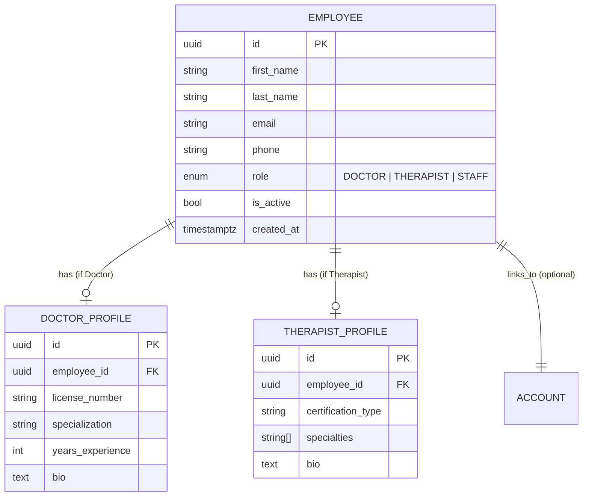

# Employees Module (Enterprise Architecture)

## 1. Module Overview
The **Employees Module** manages the professional staff within the platform. It handles the hiring/creation of specialized roles (Doctors, Therapists) and manages their professional profiles, which are distinct from their authentication accounts.

### Key Capabilities
*   **Role Specialization**: Distinct flows and data profiles for `Doctor` vs `Therapist`.
*   **Profile Management**: Polymorphic association of professional details.
*   **Staff Registry**: Centralized pool of employees available for service assignment.

---

## 2. Architecture & Patterns

### Component Layers
1.  **Transport Layer (`EmployeesController`)**:
    *   **Responsibility**: Specialized creation endpoints (`/doctors`, `/therapists`) and generic management.
    *   **Access Control**: strictly `ADMIN_ROLES` (Admin, Manager).
2.  **Domain Layer (`EmployeesService`)**:
    *   **Responsibility**: Orchestrating the creation of the base `Employee` record and its corresponding profile (`DoctorProfile` or `TherapistProfile`) in a single execution flow.

---

## 3. Domain Model
The logical schema uses a **Polymorphic Profile** pattern. All staff are `Employees`, but they link to specific detail tables based on their role.

### Domain Invariants
1.  **Role-Profile Logic**: An employee with role `DOCTOR` **MUST** have a `DoctorProfile`. A `Therapist` **MUST** have a `TherapistProfile`.
2.  **Single Role**: An employee cannot be both a Doctor and a Therapist simultaneously (in this model).

---

## 4. API Interface

### Authorization Matrix
| Role | Read All | Create Doctor | Create Therapist | Update | Delete |
|:-----|:--------:|:-------------:|:----------------:|:------:|:------:|
| `Admin` | ✅ | ✅ | ✅ | ✅ | ✅ |
| `Staff` | ❌ | ❌ | ❌ | ❌ | ❌ |

### Endpoints Summary

#### Creation (Specialized Factories)
*   **POST** `/employees/doctors`: Creates an Employee (Role=DOCTOR) + DoctorProfile.
*   **POST** `/employees/therapists`: Creates an Employee (Role=THERAPIST) + TherapistProfile.

#### Management
*   **GET** `/employees`: List all staff. Supports filtering by query params.
*   **GET** `/employees/:id`: Get detailed profile.
*   **PATCH** `/employees/:id`: Update basic info or profile details.
*   **DELETE** `/employees/:id`: Remove employee record.

---

## 5. Operations & Performance

### Data Integrity
*   **Transactional Creation**: The service handles the creation of the base `Employee` and the specific profile sequentially. Ideally, this should be wrapped in a transaction to prevent "zombie" records if the profile creation fails.

### extensibility
This pattern allows for easy addition of new staff types (e.g., `Nutritionist`) by adding a new role enum and a corresponding profile table without altering the core `Employee` table.
