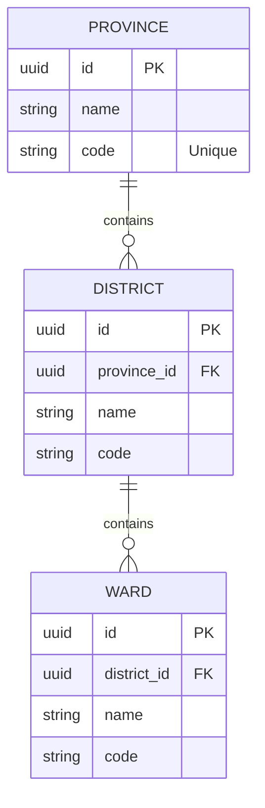

# Locations Module (Enterprise Architecture)

## 1. Module Overview
The **Locations Module** provides Vietnam administrative division data for address selection in forms. It handles provinces, districts, and wards hierarchy with data sourced from the `vn-provinces` library.

### Key Capabilities
*   **Administrative Hierarchy**: Provinces → Districts → Wards cascading structure.
*   **Public Access**: No authentication required for address lookups.
*   **Data Seeding**: One-time population from official Vietnam divisions data.

---

## 2. Architecture & Patterns

### Component Layers
1.  **Transport Layer (`LocationsController`)**:
    *   **Responsibility**: Public endpoints for fetching provinces, districts, wards.
    *   **Access Control**: All endpoints are **PUBLIC** (no authentication).
2.  **Domain Layer (`LocationsService`)**:
    *   **Responsibility**: Querying administrative divisions with relationship loading.
3.  **Persistence Layer**:
    *   **Entities**: `Province`, `District`, `Ward`.
    *   **Relationships**: Cascading one-to-many relationships.

---

## 3. Domain Model



### Domain Invariants
1.  **Hierarchy Validation**: Ward must belong to a valid District, which must belong to a valid Province.
2.  **Cascade Deletion**: Deleting a Province cascades to its Districts and Wards.

---

## 4. API Interface

### Authorization Matrix
| Role | Get Provinces | Get Districts | Get Wards | Seed Data |
|:-----|:-------------:|:-------------:|:---------:|:---------:|
| Public | ✅ | ✅ | ✅ | ❌ |
| Admin | ✅ | ✅ | ✅ | ✅ |

### Endpoints Summary

#### Public Endpoints
*   **GET** `/locations/provinces`: Get all 63 provinces/cities in Vietnam.
*   **GET** `/locations/provinces/:provinceId/districts`: Get districts within a province.
*   **GET** `/locations/districts/:districtId/wards`: Get wards within a district.

#### Admin Operations
*   **POST** `/locations/seed`: Seed Vietnam administrative divisions data.

---

## 5. API Details

### 5.1 Get All Provinces

```http
GET /locations/provinces
```

**Response:** `200 OK`
```json
{
  "provinces": [
    { "id": "uuid", "name": "Hà Nội", "code": "01" },
    { "id": "uuid", "name": "TP. Hồ Chí Minh", "code": "79" },
    { "id": "uuid", "name": "Đà Nẵng", "code": "48" }
  ]
}
```

---

### 5.2 Get Districts by Province

```http
GET /locations/provinces/:provinceId/districts
```

| Param | Type | Description |
|:------|:-----|:------------|
| `provinceId` | UUID | Province ID |

**Response:** `200 OK`
```json
{
  "districts": [
    { "id": "uuid", "name": "Quận Ba Đình", "provinceId": "uuid" },
    { "id": "uuid", "name": "Quận Hoàn Kiếm", "provinceId": "uuid" }
  ]
}
```

**Error:** `404 Not Found` - Province not found.

---

### 5.3 Get Wards by District

```http
GET /locations/districts/:districtId/wards
```

| Param | Type | Description |
|:------|:-----|:------------|
| `districtId` | UUID | District ID |

**Response:** `200 OK`
```json
{
  "wards": [
    { "id": "uuid", "name": "Phường Phúc Xá", "districtId": "uuid" },
    { "id": "uuid", "name": "Phường Trúc Bạch", "districtId": "uuid" }
  ]
}
```

**Error:** `404 Not Found` - District not found.

---

## 6. Operations & Performance

### Database Indexing
| Column | Index Type | Purpose |
|:-------|:-----------|:--------|
| `province.code` | UNIQUE | Fast lookups by code. |
| `district.province_id` | FOREIGN KEY | Efficient district queries. |
| `ward.district_id` | FOREIGN KEY | Efficient ward queries. |

### Data Population
Run the seeding script after initial deployment:
```bash
npm run seed:locations
```

This populates all 63 provinces, hundreds of districts, and thousands of wards.
