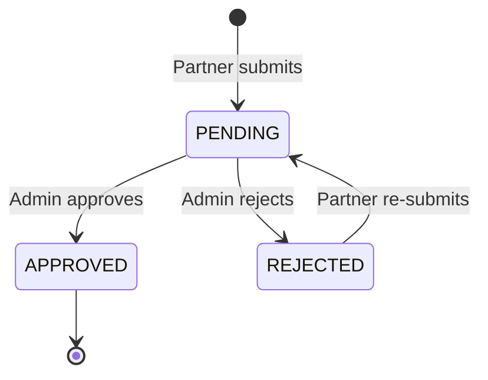
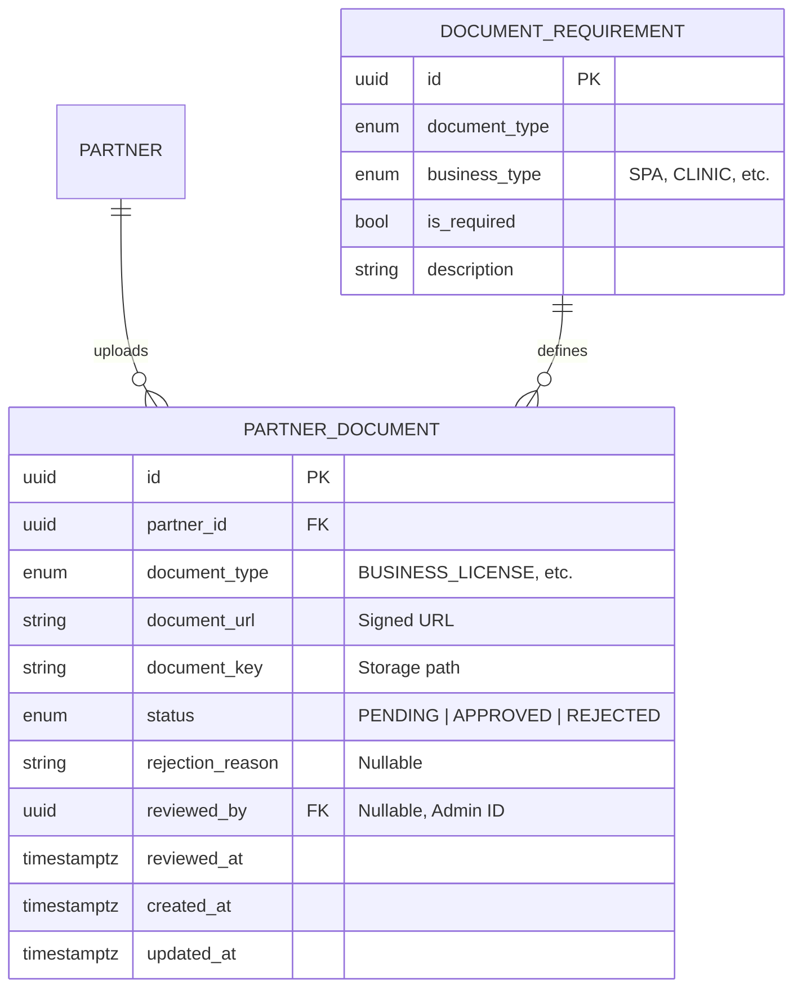

# Partner Documents Module (Enterprise Architecture)

## 1. Module Overview
The **Partner Documents Module** manages the document upload and verification workflow for business partners. It handles document submission, storage (via R2/S3), and provides admin review capabilities.

### Key Capabilities
*   **Document Submissions**: Partners upload required business documents.
*   **Presigned URLs**: Secure direct uploads to cloud storage.
*   **Verification Workflow**: Pending → Approved/Rejected status transitions.
*   **Business Type Rules**: Dynamic document requirements based on partner type.

---

## 2. Architecture & Patterns

### Component Layers
1.  **Transport Layer (`DocumentsController`)**:
    *   **Responsibility**: Partner-facing document management endpoints.
    *   **Access Control**: `HEALTH_PARTNER` role with JWT authentication.
2.  **Domain Layer (`DocumentsService`)**:
    *   **Responsibility**: Document CRUD, status management, URL generation.
3.  **Infrastructure Layer**:
    *   **S3Service**: Handles presigned URL generation and file operations.
    *   **Cloud Storage**: Cloudflare R2 or AWS S3 for document storage.

### Document Verification Flow


---

## 3. Domain Model



### Document Types
| Type | Description | Required For | Storage |
|:-----|:------------|:-------------|:--------|
| `BUSINESS_LICENSE` | Business registration certificate | All | PartnerDocument |
| `TAX_REGISTRATION` | Tax registration document | All | PartnerDocument |
| `IDENTITY_CARD_FRONT` | ID card front side | All | LegalRepresentative |
| `IDENTITY_CARD_BACK` | ID card back side | All | LegalRepresentative |
| `AUTHORIZATION_LETTER` | Authorization for non-owner | If not owner | LegalRepresentative |
| `MEDICAL_LICENSE` | Medical practice license | CLINIC, HOSPITAL | PartnerDocument |

> [!NOTE]
> Identity documents (`IDENTITY_CARD_*`, `AUTHORIZATION_LETTER`) are collected during registration and stored directly in the `LegalRepresentative` entity. They do not appear in the standard `PartnerDocument` list but are visible in the Partner Profile.

---

## 4. API Interface

### Authorization Matrix
| Role | View Own Docs | Upload Docs | View Any Docs | Review Docs |
|:-----|:-------------:|:-----------:|:-------------:|:-----------:|
| Partner | ✅ | ✅ | ❌ | ❌ |
| Admin | ✅ | ❌ | ✅ | ✅ |

### Endpoints Summary

#### Partner Operations
*   **GET** `/partners/me/documents`: Get own document status.
*   **POST** `/partners/me/documents/upload-url`: Get presigned upload URL.
*   **POST** `/partners/me/documents`: Submit document metadata after upload.
*   **POST** `/partners/me/documents/upload`: Direct file upload (multipart).
*   **GET** `/partners/me/documents/:id/url`: Get signed URL to view document.

---

## 5. API Details

### 5.1 Get Document Status

```http
GET /partners/me/documents
Authorization: Bearer <accessToken>
```

**Response:** `200 OK`
```json
{
  "partner": {
    "id": "uuid",
    "verificationStatus": "PENDING"
  },
  "documents": [
    {
      "id": "uuid",
      "documentType": "BUSINESS_LICENSE",
      "status": "APPROVED",
      "submittedAt": "2024-01-15T10:30:00Z",
      "reviewedAt": "2024-01-16T09:00:00Z"
    },
    {
      "id": "uuid",
      "documentType": "TAX_REGISTRATION",
      "status": "REJECTED",
      "submittedAt": "2024-01-15T10:35:00Z",
      "rejectionReason": "Document is blurry"
    }
  ],
  "requiredDocuments": [
    "BUSINESS_LICENSE",
    "TAX_REGISTRATION",
    "IDENTITY_CARD_FRONT",
    "IDENTITY_CARD_BACK"
  ]
}
```

---

### 5.2 Get Presigned Upload URL

```http
POST /partners/me/documents/upload-url
Authorization: Bearer <accessToken>
```

**Request Body:**
```json
{
  "fileName": "business_license.pdf",
  "contentType": "application/pdf"
}
```

**Response:** `200 OK`
```json
{
  "uploadUrl": "https://r2.cloudflarestorage.com/bucket/...",
  "fileKey": "documents/uuid/1234567890.pdf",
  "expiresIn": 3600
}
```

---

### 5.3 Submit Document

```http
POST /partners/me/documents
Authorization: Bearer <accessToken>
```

**Request Body:**
```json
{
  "documentType": "BUSINESS_LICENSE",
  "documentUrl": "https://r2.cloudflarestorage.com/...",
  "documentKey": "documents/uuid/1234567890.pdf"
}
```

**Response:** `201 Created`
```json
{
  "id": "uuid",
  "documentType": "BUSINESS_LICENSE",
  "status": "PENDING",
  "createdAt": "2024-01-15T10:30:00Z"
}
```

---

### 5.4 Direct Upload (Multipart)

```http
POST /partners/me/documents/upload
Authorization: Bearer <accessToken>
Content-Type: multipart/form-data
```

**Form Data:**
| Field | Type | Description |
|:------|:-----|:------------|
| `file` | File | Document file (JPEG, PNG, PDF) |
| `documentType` | String | Document type enum value |

**Constraints:**
*   Max file size: 5MB
*   Allowed types: `image/jpeg`, `image/png`, `application/pdf`

**Response:** `201 Created`
```json
{
  "id": "uuid",
  "documentType": "BUSINESS_LICENSE",
  "status": "PENDING",
  "createdAt": "2024-01-15T10:30:00Z"
}
```

---

### 5.5 Get Document View URL

```http
GET /partners/me/documents/:id/url
Authorization: Bearer <accessToken>
```

**Response:** `200 OK`
```json
{
  "url": "https://r2.cloudflarestorage.com/...",
  "expiresIn": 3600
}
```

**Error:** `404 Not Found` - Document not found or not owned by partner.

---

## 6. Operations & Performance

### Storage Strategy
*   **Path Pattern**: `documents/{partnerId}/{documentType}/{timestamp}.{ext}`
*   **URL Expiration**: Presigned URLs valid for 1 hour.
*   **UPSERT Logic**: Re-submitting same document type updates existing record.

### Database Indexing
| Column | Index Type | Purpose |
|:-------|:-----------|:--------|
| `partner_id` | INDEX | Fast partner document lookups. |
| `document_type` | INDEX | Filter by type. |
| `status` | INDEX | Filter by verification status. |
