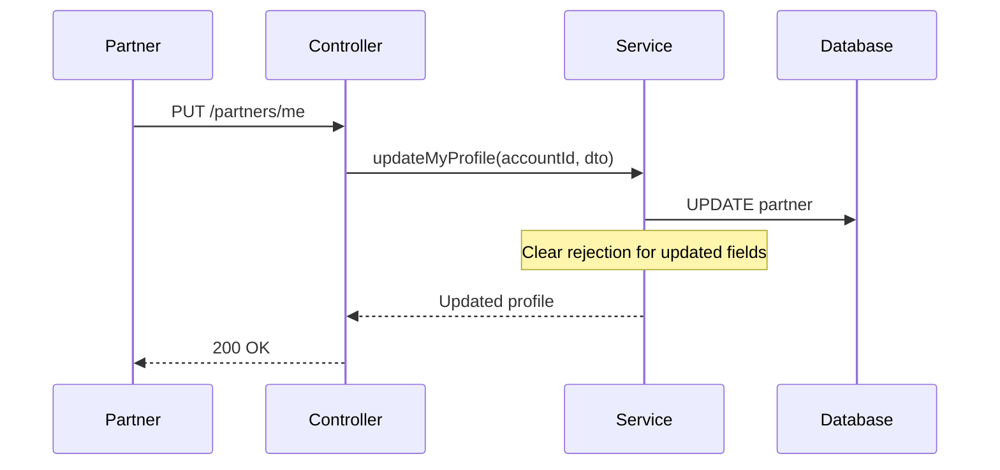
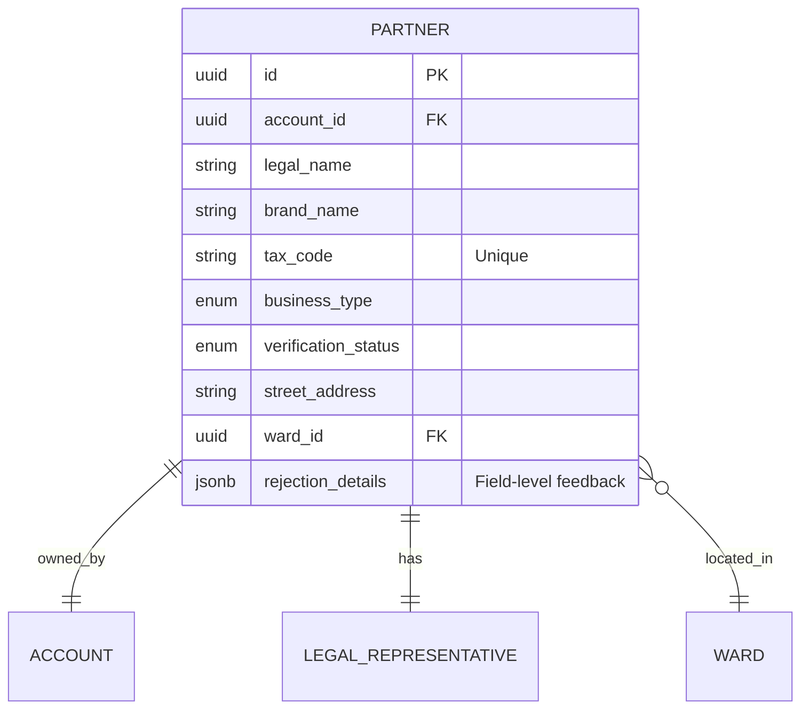

# Partners Module (Enterprise Architecture)

## 1. Module Overview
The **Partners Module** handles partner self-service operations including profile management and business information updates. It also provides public endpoints for business type selection during registration.

### Key Capabilities
*   **Profile Retrieval**: Partners view their own business profile.
*   **Profile Updates**: Limited field updates while maintaining audit trail.
*   **Business Types**: Public enumeration for registration forms.
*   **Rejection Clearing**: Automatic clearing of field rejections on update.

---

## 2. Architecture & Patterns

### Component Layers
1.  **Transport Layer (`PartnersController`)**:
    *   **Responsibility**: Partner self-service and public endpoints.
    *   **Access Control**: Mix of public and `HEALTH_PARTNER` protected endpoints.
2.  **Domain Layer (`PartnersService`)**:
    *   **Responsibility**: Profile CRUD, business type enumeration.
    *   **Integration**: Coordinates with `DocumentsService` for verification status.

### Update Flow


---

## 3. Domain Model



### Business Types
| Value | Label |
|:------|:------|
| `SPA` | Spa |
| `CLINIC` | Phòng khám |
| `HOSPITAL` | Bệnh viện |
| `WELLNESS_CENTER` | Trung tâm sức khỏe |
| `REHABILITATION_CENTER` | Trung tâm phục hồi |
| `MEDICAL_CENTER` | Trung tâm y tế |
| `BEAUTY_SALON` | Salon làm đẹp |
| `FITNESS_CENTER` | Trung tâm thể dục |

---

## 4. API Interface

### Authorization Matrix
| Role | Get Business Types | View Own Profile | Update Own Profile |
|:-----|:------------------:|:----------------:|:------------------:|
| Public | ✅ | ❌ | ❌ |
| Partner | ✅ | ✅ | ✅ |
| Admin | ✅ | ❌ | ❌ |

### Endpoints Summary

#### Public Endpoints
*   **GET** `/partners/business-types`: Get all business type options.

#### Partner Self-Service
*   **GET** `/partners/me`: Get own business profile.
*   **PUT** `/partners/me`: Update own business profile.

---

## 5. API Details

### 5.1 Get Business Types (Public)

```http
GET /partners/business-types
```

**Response:** `200 OK`
```json
{
  "businessTypes": [
    { "value": "SPA", "label": "Spa" },
    { "value": "CLINIC", "label": "Phòng khám" },
    { "value": "HOSPITAL", "label": "Bệnh viện" },
    { "value": "WELLNESS_CENTER", "label": "Trung tâm sức khỏe" },
    { "value": "REHABILITATION_CENTER", "label": "Trung tâm phục hồi" },
    { "value": "MEDICAL_CENTER", "label": "Trung tâm y tế" },
    { "value": "BEAUTY_SALON", "label": "Salon làm đẹp" },
    { "value": "FITNESS_CENTER", "label": "Trung tâm thể dục" }
  ]
}
```

---

### 5.2 Get Own Profile

```http
GET /partners/me
Authorization: Bearer <accessToken>
```

**Response:** `200 OK`
```json
{
  "id": "uuid",
  "legalName": "CÔNG TY TNHH SPA HÀ NỘI",
  "brandName": "Hanoi Spa",
  "businessType": "SPA",
  "taxCode": "0101234567",
  "verificationStatus": "PENDING",
  "address": {
    "province": "Hà Nội",
    "district": "Quận Ba Đình",
    "ward": "Phường Phúc Xá",
    "streetAddress": "123 Đường Nguyễn Huệ"
  },
  "legalRepresentative": {
    "fullName": "NGUYỄN VĂN A",
    "position": "Giám đốc"
  },
  "rejectionDetails": {
    "brandName": "Brand name contains inappropriate content"
  },
  "createdAt": "2024-01-15T10:30:00Z"
}
```

---

### 5.3 Update Own Profile

```http
PUT /partners/me
Authorization: Bearer <accessToken>
```

**Request Body:**
```json
{
  "brandName": "Hanoi Spa Premium",
  "streetAddress": "456 Đường Lý Thường Kiệt"
}
```

**Updatable Fields:**
| Field | Description |
|:------|:------------|
| `brandName` | Trading/display name |
| `streetAddress` | Business address |
| `wardId` | Location ward UUID |
| `description` | Business description |

**Response:** `200 OK`
```json
{
  "id": "uuid",
  "legalName": "CÔNG TY TNHH SPA HÀ NỘI",
  "brandName": "Hanoi Spa Premium",
  "businessType": "SPA",
  "verificationStatus": "PENDING",
  "address": {
    "streetAddress": "456 Đường Lý Thường Kiệt"
  },
  "rejectionDetails": null,
  "updatedAt": "2024-01-16T10:00:00Z"
}
```

> [!NOTE]
> When a partner updates a field that was previously rejected, the rejection for that field is automatically cleared from `rejectionDetails`.

---

## 6. Operations & Performance

### Database Indexing
| Column | Index Type | Purpose |
|:-------|:-----------|:--------|
| `account_id` | UNIQUE | Fast profile lookup by auth. |
| `tax_code` | UNIQUE | Tax code validation. |
| `verification_status` | INDEX | Status filtering. |

### Security Considerations
*   **Immutable Fields**: `legalName`, `taxCode`, `businessType` cannot be changed via update.
*   **Ownership Check**: Partners can only access their own profile.
*   **Rejection Auto-Clear**: Encourages partners to fix issues and re-submit.
