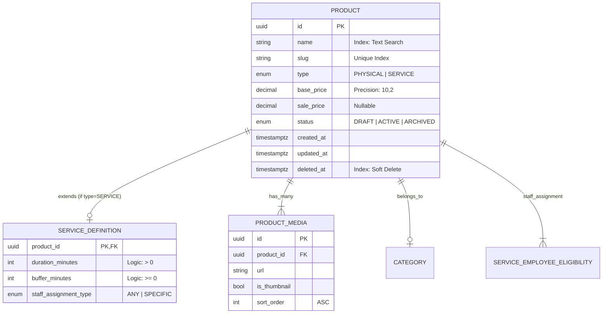

# Product Module (Enterprise Architecture)

## 1. Module Overview
The **Product Module** acts as the central catalog authority for the platform, managing the lifecycle of both tangible goods (Retail) and intangible services (Appointments). It implements a polymorphic architecture to handle diverse product types while maintaining a unified interface for inventory, pricing, and availability.

### Key Capabilities
*   **Unified Catalog:** Single entry point for all sellable items.
*   **Polymorphic Definitions:** Extensible schema for specific product types (`Physical` vs `Service`).
*   **Media Management:** Orderable, multi-format media gallery per product.
*   **Staff Eligibility:** Role-based qualification tracking for service execution.
*   **Soft Deletion:** Audit-compliant data removal strategy.

---

## 2. Architecture & Patterns
The module adheres to **Clean Architecture** principles within the NestJS framework, enforcing strict separation of concerns.

### Component Layers
1.  **Transport Layer (`ProductsController`)**:
    *   **Responsibility**: Request validation (DTOs), Authentication (Guards), Response Serialization (Interceptors).
    *   **Pattern**: Dumb adapter; no business logic allowed.
2.  **Domain Layer (`ProductsService`)**:
    *   **Responsibility**: Business rules, Transaction management (ACID), Event orchestration.
    *   **Pattern**: Rich Domain Models; logic resides in Entities where possible.
3.  **Persistence Layer (`TypeORM Repositories`)**:
    *   **Responsibility**: Direct database access, raw queries for complex reporting.

---

## 3. Domain Model
The database schema utilizes a **Table-Per-Type** inheritance strategy (logical) via strict 1:1 relationships.

### Domain Invariants (Golden Rules)
1.  **Product Type Immutability:** A product's `type` cannot be changed after creation (e.g., Physical cannot become Service).
2.  **Service Definition Integrity:** If `type == SERVICE`, a `ServiceDefinition` record **MUST** exist within the same transaction.
3.  **Slug Uniqueness:** Slugs must be globally unique and URL-friendly (regex: `^[a-z0-9]+(?:-[a-z0-9]+)*$`).
4.  **Price Precision:** All monetary values are stored as `DECIMAL(10,2)` to prevent floating-point errors.

---

## 4. API Interface (REST Level 2)

### Security & Versioning
*   **Versioning**: URI Versioning `/v1/products`
*   **Authentication**: Bearer Token (JWT)
*   **Rate Limiting**: 100 req/min for Public GET; 20 req/min for Admin Writes.

### Authorization Matrix
| Role | Create | Read (Public) | Read (Admin) | Update | Archive |
|:-----|:------:|:-------------:|:------------:|:------:|:-------:|
| `Anonymous` | ❌ | ✅ | ❌ | ❌ | ❌ |
| `Customer` | ❌ | ✅ | ❌ | ❌ | ❌ |
| `Staff` | ❌ | ✅ | ✅ | ❌ | ❌ |
| `Admin` | ✅ | ✅ | ✅ | ✅ | ✅ |

### Endpoints Summary

#### Query
*   `GET /products`: List products with pagination (`limit`, `offset`) and filtering (`category`, `type`).
*   `GET /products/:id`: Retrieve full product details including media and service rules.
*   `GET /products/slug/:slug`: Public-facing display endpoint.

#### Mutation (Transactional)
*   `POST /products`: Atomic creation of Product + Media + ServiceDefinition.
*   `PATCH /products/:id`: Partial update. Note: Media updates are **Full Replacement** operations.
*   `DELETE /products/:id`: Soft delete only. Preserves relational integrity for historical orders.

---

## 5. Operations & Performance

### Database Indexing Strategy
| Column | Index Type | Purpose |
|:-------|:-----------|:--------|
| `slug` | UNIQUE | Fast lookup for public URLs. |
| `category_id` | BTREE | Filtering products by category. |
| `deleted_at` | BTREE | Fast exclusion of archived products. |
| `name` | GIN (trigram) | Fuzzy search (future implementation). |

### Telemetry & Logging
*   **Context**: All logs must include `trace_id` and `context: ProductsService`.
*   **Levels**:
    *   `INFO`: "Product {uuid} created by User {uuid}"
    *   `WARN`: "Stock inventory low for Product {uuid}"
    *   `ERROR`: "Failed to sync media for Product {uuid}" - **Alert Trigger**

### Refactoring Checklist
- [ ] Ensure all DTOs use `class-validator` with strict whitelisting.
- [ ] Verify that `createdAt` and `updatedAt` are managed automatically by TypeORM.
- [ ] Confirm `decimal` types are returned as numbers (via transformation) or strings to frontend, handled consistently.
- [ ] Check that `ServiceDefinition` is lazy-loaded or eagerly loaded only when necessary to optimize query cost.
