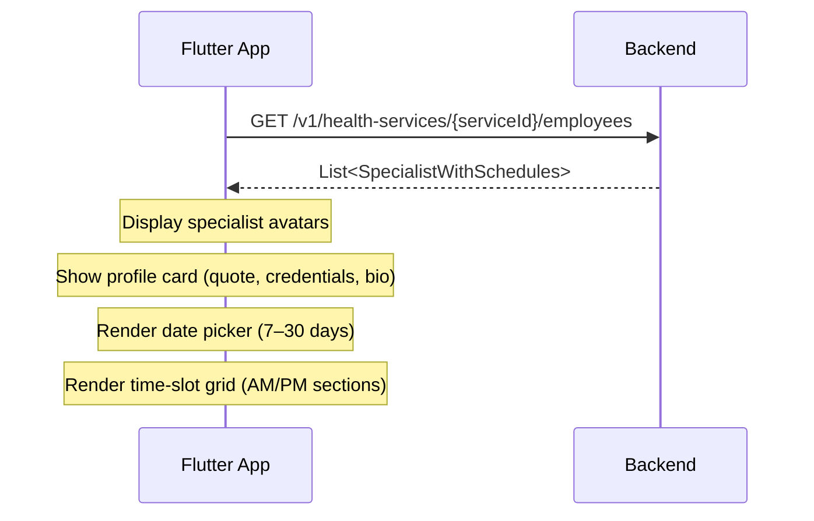

# Frontend Integration Guide — Get Specialists by Service

> **Base URL**: `http://localhost:8080/v1`
> **Auth**: Public endpoint — no auth required
> **Swagger UI**: `http://localhost:8080/api/docs` (tag: *Health Services*)

---

## Data Flow

```
Service Details Screen
  └─► GET /v1/health-services/{serviceId}/employees
        └─► List<Specialist> with daySchedules[]
              ├─► Specialist Section (specialist_section.widget.dart)
              └─► Select Specialist Screen (select_specialist.screen.dart)
```



---

## Endpoint

```
GET /v1/health-services/{serviceId}/employees
```

| Param       | Location | Type | Required | Notes |
|-------------|----------|------|----------|-------|
| `serviceId` | path     | UUID | ✅       | Health service ID |

### Error Responses

| Code | When |
|------|------|
| `404` | `serviceId` does not exist |
| `400` | `serviceId` is not a valid UUID |

---

## Response

```json
[
  {
    "id": "emp-sarah-lin",
    "name": "Dr. Sarah Lin",
    "role": "Dermatologist",
    "imageUrl": "https://example.com/photos/sarah-lin.jpg",
    "isSelected": true,
    "quote": "Specializing in cosmetic laser procedures.",
    "degrees": "MD, PhD",
    "languages": "Vietnamese, English",
    "experience": "12 years",
    "specializations": ["Laser Therapy", "Acne Treatment"],
    "bio": "Dr. Sarah Lin graduated top of her class.",
    "daySchedules": [
      {
        "date": "2026-03-25",
        "isAvailable": true,
        "timeSlots": [
          { "label": "09:00 AM", "isAvailable": true },
          { "label": "09:30 AM", "isAvailable": false },
          { "label": "10:00 AM", "isAvailable": true },
          { "label": "02:00 PM", "isAvailable": true }
        ]
      },
      {
        "date": "2026-03-26",
        "isAvailable": false,
        "timeSlots": []
      }
    ]
  }
]
```

---

## Frontend Mapping

### Specialist Object

| API Field | → Entity Field | Notes |
|-----------|---------------|-------|
| `id` | `SpecialistEntity.id` | UUID |
| `name` | `SpecialistEntity.name` | Full display name |
| `role` | `SpecialistEntity.role` | Shown below avatar in UPPERCASE |
| `imageUrl` | `SpecialistEntity.imageUrl` | Nullable — may be SVG (DiceBear) or raster. Use `NetworkImageAuto` widget |
| `isSelected` | `SpecialistEntity.isSelected` | Pre-select indicator. Exactly **one** specialist is `true` |
| `quote` | `SpecialistEntity.quote` | Nullable — shown in italic card |
| `degrees` | `SpecialistEntity.degrees` | Nullable — e.g. `"MD, PhD"` |
| `languages` | `SpecialistEntity.languages` | Nullable — comma-separated |
| `experience` | `SpecialistEntity.experience` | Nullable — e.g. `"12 years"` |
| `specializations` | `SpecialistEntity.specializations` | `string[]` — rendered as chips. Defaults to `[]` |
| `bio` | `SpecialistEntity.bio` | Nullable — shown in expandable "Show More" panel |
| `daySchedules` | `SpecialistEntity.daySchedules` | `DaySchedule[]` — may be empty `[]` |

### DaySchedule Object

| API Field | → Entity Field | Notes |
|-----------|---------------|-------|
| `date` | `DaySchedule.date` | `YYYY-MM-DD` string. Parse with `DateTime.tryParse()` |
| `isAvailable` | `DaySchedule.isAvailable` | `false` → gray out in calendar |
| `timeSlots` | `DaySchedule.timeSlots` | Empty `[]` when `isAvailable` is `false` |

### TimeSlot Object

| API Field | → Entity Field | Notes |
|-----------|---------------|-------|
| `label` | `TimeSlot.label` | 12h format: `"09:00 AM"`, `"02:30 PM"`. Split on AM/PM for Morning ☀️ / Afternoon 🌅 sections |
| `isAvailable` | `TimeSlot.isAvailable` | `false` → show as grayed-out / disabled chip |

---

## Schedule Behavior

| Behavior | Detail |
|----------|--------|
| **Range** | 30 days from today |
| **Slot duration** | 30 minutes |
| **Closed days** | `isAvailable: false`, `timeSlots: []` — still included so the calendar can gray them out |
| **Booked slots** | `isAvailable: false` — shown as disabled, giving visual sense of demand |
| **Time format** | 12h with AM/PM suffix |
| **No schedule** | Employee has no work schedule → `daySchedules` is 30 entries all with `isAvailable: false` |

---

## Dart Integration Example

### Remote Datasource

```dart
@override
Future<List<SpecialistDto>> getSpecialistsByService(String serviceId) async {
  final response = await dio.get('/v1/health-services/$serviceId/employees');
  return (response.data as List)
      .map((json) => SpecialistDto.fromJson(json as Map<String, dynamic>))
      .toList();
}
```

### DTO → Entity Mapping

```dart
SpecialistEntity mapSpecialist(SpecialistDto dto) {
  return SpecialistEntity(
    id: dto.id,
    name: dto.name,
    role: dto.role,
    imageUrl: dto.imageUrl,
    isSelected: dto.isSelected,
    quote: dto.quote,
    degrees: dto.degrees,
    languages: dto.languages,
    experience: dto.experience,
    specializations: dto.specializations ?? [],
    bio: dto.bio,
    daySchedules: (dto.daySchedules ?? []).map((ds) => DaySchedule(
      date: DateTime.tryParse(ds.date) ?? DateTime.now(),
      isAvailable: ds.isAvailable,
      timeSlots: (ds.timeSlots ?? []).map((ts) => TimeSlot(
        label: ts.label,
        isAvailable: ts.isAvailable,
      )).toList(),
    )).toList(),
  );
}
```

### UI Time-Slot Grouping

```dart
// Split slots into Morning / Afternoon sections
final morningSlots = timeSlots.where((s) => s.label.endsWith('AM')).toList();
final afternoonSlots = timeSlots.where((s) => s.label.endsWith('PM')).toList();
```

---

## OpenAPI Client Regeneration

After starting the backend dev server, regenerate the Dart client:

```bash
dart run build_runner build --delete-conflicting-outputs
```

Generated method: `healthServicesControllerGetProductEmployees(id)`

---

## Quick Checklist

- [ ] Map all specialist fields including nullable ones (`imageUrl`, `quote`, `degrees`, `languages`, `experience`, `bio`)
- [ ] Handle `imageUrl: null` — use fallback avatar
- [ ] Handle SVG avatars (DiceBear URLs) — use `NetworkImageAuto` widget
- [ ] Parse `date` as `YYYY-MM-DD` string, not ISO timestamp
- [ ] Default specialist selection: find the one with `isSelected: true`
- [ ] Split time slots by AM/PM for Morning ☀️ / Afternoon 🌅 sections
- [ ] Show booked slots (`isAvailable: false`) as grayed-out chips
- [ ] Gray out closed days (`isAvailable: false`) in the date picker
- [ ] Handle empty `daySchedules: []` (no work schedule configured)
- [ ] Handle empty response `[]` (no specialists assigned to this service)
- [ ] `specializations` defaults to `[]` — render as tag chips if non-empty
