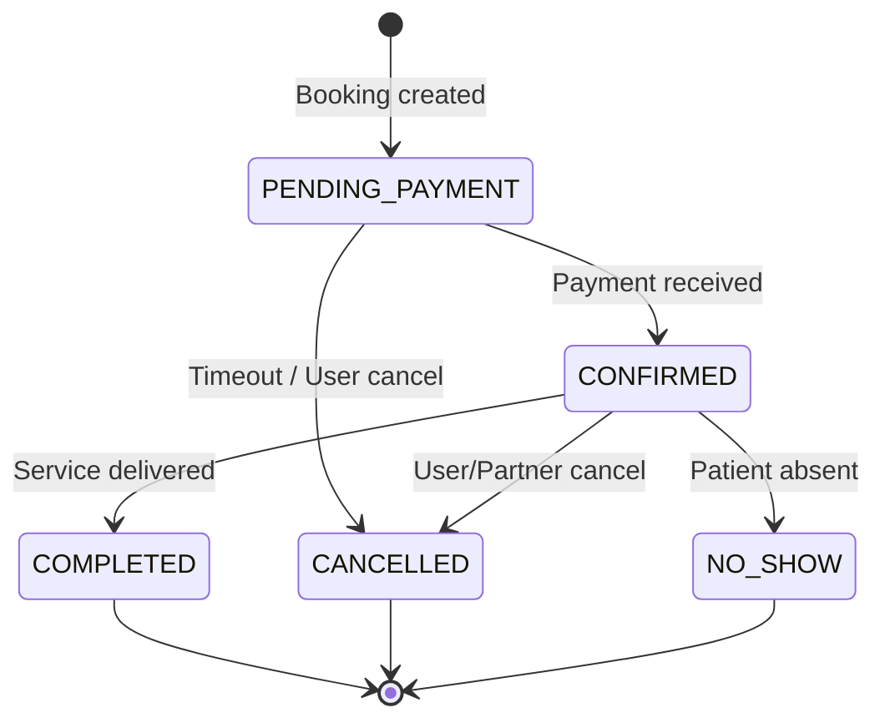
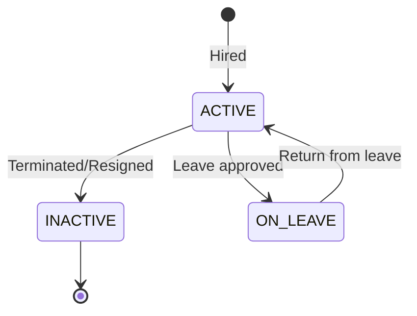
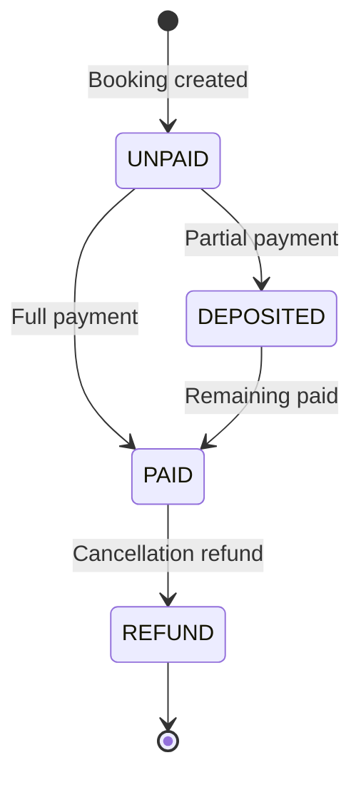
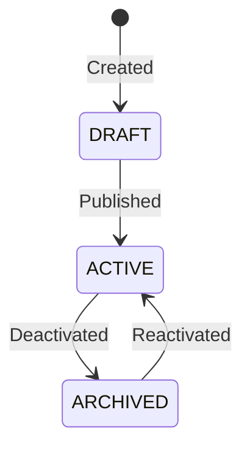
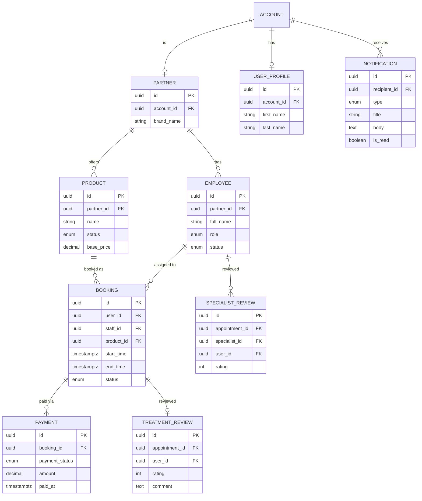

# Partner Dashboard — Backend Implementation Guide

> **Scope**: All APIs required by `admin_panel/lib/features/partner/dashboard`
> **Framework**: NestJS (TypeORM, PostgreSQL)
> **Auth**: `@PartnerApi` composite decorator → JWT + `HEALTH_PARTNER` role guard
> **Route Prefix**: `GET /v1/partner/dashboard/...`

---

## Table of Contents

1. [API Inventory](#1-api-inventory)
2. [State Machines](#2-state-machines)
3. [DTO Designs](#3-dto-designs)
4. [Execution Flows](#4-execution-flows)
5. [Module Wiring](#5-module-wiring)
6. [OpenAPI & Codegen](#6-openapi--codegen)

---

## 1. API Inventory

| # | Frontend Method | HTTP | Path | Query Params | Source Tables | Response DTO |
|---|----------------|------|------|-------------|---------------|--------------|
| 1 | `getDashboardStats()` | `GET` | `/stats` | `period?` | `bookings`, `payments`, `products`, `employees`, `treatment_reviews`, `specialist_reviews` | `DashboardStatsResponseDto` |
| 2 | `getRevenueData(period)` | `GET` | `/revenue` | `period` (required) | `bookings`, `payments` | `RevenueDataPointDto[]` |
| 3 | `getUpcomingAppointments(limit)` | `GET` | `/appointments/upcoming` | `limit?` (default: 5) | `bookings`, `products`, `employees`, `user_profile` | `UpcomingAppointmentDto[]` |
| 4 | `getServicePerformance()` | `GET` | `/services/performance` | — | `bookings`, `products`, `payments`, `treatment_reviews` | `ServicePerformanceDto[]` |
| 5 | `getEmployeeDistribution()` | `GET` | `/employees/distribution` | — | `employees` | `EmployeeDistributionDto[]` |
| 6 | `getRecentReviews(limit)` | `GET` | `/reviews/recent` | `limit?` (default: 5) | `product_treatment_reviews`, `specialist_reviews`, `bookings`, `user_profile` | `DashboardReviewDto[]` |
| 7 | `getStaffSchedule(date)` | `GET` | `/staff/schedule` | `date` (required, ISO date) | `bookings`, `employees`, `products`, `user_profile` | `StaffScheduleEntryDto[]` |
| 8 | `getNotifications(limit)` | `GET` | `/notifications` | `limit?` (default: 10) | `notifications` | `DashboardNotificationDto[]` |
| 9 | `getInventoryAlerts()` | `GET` | `/inventory/alerts` | — | *(future: `inventory` table)* | `InventoryAlertDto[]` |

> [!IMPORTANT]
> All endpoints are scoped to the authenticated partner via `@CurrentUser('id')`. The partner's `id` is resolved from `partnerId` via `Partner.accountId = currentUser.id`.

---

## 2. State Machines

These state machines govern the data that feeds the dashboard aggregations. Understanding them is critical for writing correct WHERE clauses.

### 2.1 BookingStatus



| Status | DB Value | Dashboard KPI Mapping |
|--------|----------|----------------------|
| `PENDING_PAYMENT` | `'PENDING_PAYMENT'` | `pendingAppointments` |
| `CONFIRMED` | `'CONFIRMED'` | `pendingAppointments` (upcoming) |
| `COMPLETED` | `'COMPLETED'` | `completedAppointments` |
| `CANCELLED` | `'CANCELLED'` | `cancelledAppointments` |
| `NO_SHOW` | `'NO_SHOW'` | `cancelledAppointments` |

### 2.2 EmployeeStatus



| Status | DB Value | Distribution Chart |
|--------|----------|--------------------|
| `ACTIVE` | `'ACTIVE'` | Counted by `role` |
| `INACTIVE` | `'INACTIVE'` | Excluded from active count |
| `ON_LEAVE` | `'ON_LEAVE'` | Separate "On Leave" segment |

### 2.3 PaymentStatus



| Status | Revenue Inclusion |
|--------|-------------------|
| `PAID` | ✅ Full amount |
| `DEPOSITED` | ✅ Deposited amount |
| `REFUND` | ❌ Excluded (or subtracted) |
| `UNPAID` | ❌ Excluded |

### 2.4 HealthServiceStatus



| Status | Dashboard Treatment |
|--------|---------------------|
| `ACTIVE` | Counted in `activeServices` |
| `DRAFT` | Counted in `totalServices` only |
| `ARCHIVED` | Counted in `totalServices` only |

---

## 3. DTO Designs

### 3.1 Query DTOs (Request)

#### `DashboardPeriodQueryDto`

Used by `GET /stats` and `GET /revenue`.

```typescript
import { ApiPropertyOptional } from '@nestjs/swagger';
import { IsEnum, IsOptional } from 'class-validator';

export enum DashboardTimePeriod {
  TODAY = 'today',
  THIS_WEEK = 'this_week',
  THIS_MONTH = 'this_month',
  THIS_QUARTER = 'this_quarter',
  THIS_YEAR = 'this_year',
}

export class DashboardPeriodQueryDto {
  @ApiPropertyOptional({
    enum: DashboardTimePeriod,
    default: DashboardTimePeriod.THIS_MONTH,
    description: 'Time period filter for revenue and KPI aggregation',
  })
  @IsOptional()
  @IsEnum(DashboardTimePeriod)
  period?: DashboardTimePeriod = DashboardTimePeriod.THIS_MONTH;
}
```

#### `DashboardLimitQueryDto`

Used by `GET /appointments/upcoming`, `GET /reviews/recent`, `GET /notifications`.

```typescript
import { ApiPropertyOptional } from '@nestjs/swagger';
import { IsInt, IsOptional, Max, Min } from 'class-validator';
import { Type } from 'class-transformer';

export class DashboardLimitQueryDto {
  @ApiPropertyOptional({
    default: 5,
    minimum: 1,
    maximum: 50,
    description: 'Maximum number of items to return',
  })
  @IsOptional()
  @IsInt()
  @Min(1)
  @Max(50)
  @Type(() => Number)
  limit?: number = 5;
}
```

#### `StaffScheduleQueryDto`

Used by `GET /staff/schedule`.

```typescript
import { ApiProperty } from '@nestjs/swagger';
import { IsDateString } from 'class-validator';

export class StaffScheduleQueryDto {
  @ApiProperty({
    example: '2026-04-09',
    description: 'Target date for schedule lookup (ISO 8601 date)',
  })
  @IsDateString()
  date: string;
}
```

---

### 3.2 Response DTOs

#### `DashboardStatsResponseDto`

Maps to frontend `DashboardStats` entity.

```typescript
import { ApiProperty } from '@nestjs/swagger';
import { Expose } from 'class-transformer';

export class DashboardStatsResponseDto {
  // ── Appointment Metrics ────────────────────
  @ApiProperty({ example: 342 })
  @Expose()
  totalAppointments: number;

  @ApiProperty({ example: 285 })
  @Expose()
  completedAppointments: number;

  @ApiProperty({ example: 18 })
  @Expose()
  cancelledAppointments: number;

  @ApiProperty({ example: 39 })
  @Expose()
  pendingAppointments: number;

  // ── Revenue Metrics ────────────────────────
  @ApiProperty({ example: 48750000, description: 'Total revenue in VND' })
  @Expose()
  totalRevenue: number;

  @ApiProperty({ example: 12.5, description: 'Revenue growth % vs previous period' })
  @Expose()
  revenueGrowthPercent: number;

  // ── Service Metrics ────────────────────────
  @ApiProperty({ example: 24 })
  @Expose()
  totalServices: number;

  @ApiProperty({ example: 18 })
  @Expose()
  activeServices: number;

  // ── Employee Metrics ───────────────────────
  @ApiProperty({ example: 15 })
  @Expose()
  totalEmployees: number;

  @ApiProperty({ example: 12 })
  @Expose()
  activeEmployees: number;

  // ── Rating Metrics ─────────────────────────
  @ApiProperty({ example: 4.7, description: 'Weighted average rating' })
  @Expose()
  averageRating: number;

  @ApiProperty({ example: 156 })
  @Expose()
  totalReviews: number;
}
```

#### `RevenueDataPointDto`

Maps to frontend `RevenueDataPoint` entity.

```typescript
import { ApiProperty } from '@nestjs/swagger';
import { Expose } from 'class-transformer';

export class RevenueDataPointDto {
  @ApiProperty({ example: '2026-04-01T00:00:00.000Z' })
  @Expose()
  date: string;

  @ApiProperty({ example: 1500000, description: 'Revenue amount in VND' })
  @Expose()
  revenue: number;
}
```

#### `UpcomingAppointmentDto`

Maps to frontend `UpcomingAppointment` entity.

```typescript
import { ApiProperty } from '@nestjs/swagger';
import { Expose } from 'class-transformer';

export class UpcomingAppointmentDto {
  @ApiProperty({ example: '550e8400-e29b-41d4-a716-446655440000' })
  @Expose()
  id: string;

  @ApiProperty({ example: 'Nguyễn Văn An' })
  @Expose()
  patientName: string;

  @ApiProperty({ example: 'Full Body Massage' })
  @Expose()
  serviceName: string;

  @ApiProperty({ example: 'Dr. Trần Minh' })
  @Expose()
  employeeName: string;

  @ApiProperty({ example: '2026-04-09T09:00:00.000Z' })
  @Expose()
  scheduledAt: string;

  @ApiProperty({
    example: 'confirmed',
    enum: ['confirmed', 'pending'],
    description: 'Mapped from BookingStatus',
  })
  @Expose()
  status: string;
}
```

#### `ServicePerformanceDto`

Maps to frontend `ServicePerformance` entity.

```typescript
import { ApiProperty } from '@nestjs/swagger';
import { Expose } from 'class-transformer';

export class ServicePerformanceDto {
  @ApiProperty({ example: 'Full Body Massage' })
  @Expose()
  serviceName: string;

  @ApiProperty({ example: 85 })
  @Expose()
  bookingCount: number;

  @ApiProperty({ example: 12750000, description: 'Total revenue in VND' })
  @Expose()
  revenue: number;

  @ApiProperty({ example: 4.8 })
  @Expose()
  averageRating: number;
}
```

#### `EmployeeDistributionDto`

Maps to frontend `EmployeeDistribution` entity.

```typescript
import { ApiProperty } from '@nestjs/swagger';
import { Expose } from 'class-transformer';

export class EmployeeDistributionDto {
  @ApiProperty({ example: 'Doctor', enum: ['DOCTOR', 'THERAPIST', 'RECEPTIONIST', 'MANAGER'] })
  @Expose()
  role: string;

  @ApiProperty({ example: 4 })
  @Expose()
  count: number;

  @ApiProperty({ example: 'active', enum: ['active', 'on_leave'] })
  @Expose()
  status: string;
}
```

#### `DashboardReviewDto`

Maps to frontend `ReviewEntity`.

```typescript
import { ApiProperty, ApiPropertyOptional } from '@nestjs/swagger';
import { Expose } from 'class-transformer';

export class DashboardReviewDto {
  @ApiProperty({ example: 'Nguyễn Văn Hùng' })
  @Expose()
  reviewerName: string;

  @ApiPropertyOptional({ example: 'https://example.com/avatar.jpg' })
  @Expose()
  avatarUrl?: string;

  @ApiProperty({ example: 5 })
  @Expose()
  rating: number;

  @ApiProperty({ example: 'published', enum: ['published', 'hidden'] })
  @Expose()
  status: string;

  @ApiProperty({ example: '2026-04-09T12:00:00.000Z' })
  @Expose()
  date: string;

  @ApiProperty({ example: 'Dịch vụ tuyệt vời! Nhân viên rất chuyên nghiệp.' })
  @Expose()
  text: string;

  @ApiProperty({ type: [String], example: [] })
  @Expose()
  imageUrls: string[];
}
```

#### `StaffScheduleEntryDto`

Maps to frontend `StaffScheduleEntry` entity.

```typescript
import { ApiProperty, ApiPropertyOptional } from '@nestjs/swagger';
import { Expose } from 'class-transformer';

export class StaffScheduleEntryDto {
  @ApiProperty({ example: '550e8400-e29b-41d4-a716-446655440000' })
  @Expose()
  employeeId: string;

  @ApiProperty({ example: 'Dr. Trần Minh' })
  @Expose()
  employeeName: string;

  @ApiProperty({ example: 'Doctor' })
  @Expose()
  role: string;

  @ApiProperty({ example: '2026-04-09T08:00:00.000Z' })
  @Expose()
  startTime: string;

  @ApiProperty({ example: '2026-04-09T09:00:00.000Z' })
  @Expose()
  endTime: string;

  @ApiProperty({ example: 'General Consultation' })
  @Expose()
  serviceName: string;

  @ApiPropertyOptional({ example: 'Nguyễn Văn An' })
  @Expose()
  patientName?: string;
}
```

#### `DashboardNotificationDto`

Maps to frontend `DashboardNotification` entity.

```typescript
import { ApiProperty } from '@nestjs/swagger';
import { Expose } from 'class-transformer';

export class DashboardNotificationDto {
  @ApiProperty({ example: '550e8400-e29b-41d4-a716-446655440000' })
  @Expose()
  id: string;

  @ApiProperty({ example: 'New Appointment' })
  @Expose()
  title: string;

  @ApiProperty({ example: 'Nguyễn Văn An booked a Full Body Massage.' })
  @Expose()
  message: string;

  @ApiProperty({
    example: 'appointment',
    enum: ['appointment', 'review', 'system', 'alert'],
  })
  @Expose()
  type: string;

  @ApiProperty({ example: '2026-04-09T08:45:00.000Z' })
  @Expose()
  createdAt: string;

  @ApiProperty({ example: false })
  @Expose()
  isRead: boolean;
}
```

#### `InventoryAlertDto`

Maps to frontend `InventoryAlert` entity.

```typescript
import { ApiProperty } from '@nestjs/swagger';
import { Expose } from 'class-transformer';

export class InventoryAlertDto {
  @ApiProperty({ example: '550e8400-e29b-41d4-a716-446655440000' })
  @Expose()
  id: string;

  @ApiProperty({ example: 'Essential Oil — Lavender' })
  @Expose()
  productName: string;

  @ApiProperty({
    example: 'low_stock',
    enum: ['low_stock', 'expiring', 'out_of_stock'],
  })
  @Expose()
  alertType: string;

  @ApiProperty({ example: 'Only 3 units remaining. Reorder threshold: 10.' })
  @Expose()
  message: string;

  @ApiProperty({ example: '2026-04-09T06:00:00.000Z' })
  @Expose()
  createdAt: string;

  @ApiProperty({
    example: 'warning',
    enum: ['info', 'warning', 'critical'],
    default: 'warning',
  })
  @Expose()
  severity: string;
}
```

---

## 4. Execution Flows

Each handler follows the project's established pattern:
- `@Injectable()` class with `DataSource` injected
- Single `execute(...)` method
- TypeORM `QueryBuilder` for complex queries, `Repository` for simple ones
- Static `fromEntity()` mapping on DTOs

---

### 4.1 `GetDashboardStatsHandler`

**Purpose**: Aggregated KPI statistics for the partner.

```
┌─────────────────────────────────────────────────────────────────────┐
│                     GetDashboardStatsHandler                        │
├─────────────────────────────────────────────────────────────────────┤
│                                                                     │
│  Input: partnerId: string, period: DashboardTimePeriod              │
│                                                                     │
│  Step 1: Resolve date range from period                             │
│  ┌───────────────────────────────────────────────────────────────┐  │
│  │  const { startDate, endDate } = resolveDateRange(period);     │  │
│  │                                                               │  │
│  │  today      → 00:00 today ... 23:59:59 today                 │  │
│  │  this_week  → Monday 00:00 ... Sunday 23:59:59               │  │
│  │  this_month → 1st 00:00 ... last day 23:59:59                │  │
│  │  this_quarter → Q start ... Q end                            │  │
│  │  this_year  → Jan 1 ... Dec 31                               │  │
│  └───────────────────────────────────────────────────────────────┘  │
│                                                                     │
│  Step 2: Appointment aggregation (single query)                     │
│  ┌───────────────────────────────────────────────────────────────┐  │
│  │  SELECT                                                       │  │
│  │    COUNT(*)                              AS total,             │  │
│  │    COUNT(*) FILTER (WHERE status = 'COMPLETED')               │  │
│  │                                          AS completed,        │  │
│  │    COUNT(*) FILTER (WHERE status IN ('CANCELLED','NO_SHOW'))  │  │
│  │                                          AS cancelled,        │  │
│  │    COUNT(*) FILTER (WHERE status IN                            │  │
│  │      ('PENDING_PAYMENT','CONFIRMED'))    AS pending            │  │
│  │  FROM bookings b                                              │  │
│  │  JOIN employees e ON b.staff_id = e.id                        │  │
│  │  WHERE e.partner_id = :partnerId                              │  │
│  │    AND b.start_time BETWEEN :startDate AND :endDate           │  │
│  │    AND b.deleted_at IS NULL                                   │  │
│  └───────────────────────────────────────────────────────────────┘  │
│                                                                     │
│  Step 3: Revenue aggregation                                        │
│  ┌───────────────────────────────────────────────────────────────┐  │
│  │  -- Current period                                            │  │
│  │  SELECT COALESCE(SUM(p.amount), 0) AS current_revenue         │  │
│  │  FROM payments p                                              │  │
│  │  JOIN bookings b ON p.booking_id = b.id                       │  │
│  │  JOIN employees e ON b.staff_id = e.id                        │  │
│  │  WHERE e.partner_id = :partnerId                              │  │
│  │    AND p.payment_status IN ('PAID', 'DEPOSITED')              │  │
│  │    AND p.paid_at BETWEEN :startDate AND :endDate              │  │
│  │                                                               │  │
│  │  -- Previous period (same duration, shifted back)             │  │
│  │  SELECT COALESCE(SUM(p.amount), 0) AS previous_revenue        │  │
│  │  FROM payments p                                              │  │
│  │  JOIN bookings b ON p.booking_id = b.id                       │  │
│  │  JOIN employees e ON b.staff_id = e.id                        │  │
│  │  WHERE e.partner_id = :partnerId                              │  │
│  │    AND p.payment_status IN ('PAID', 'DEPOSITED')              │  │
│  │    AND p.paid_at BETWEEN :prevStart AND :prevEnd              │  │
│  │                                                               │  │
│  │  growthPercent = previous > 0                                 │  │
│  │    ? ((current - previous) / previous) * 100                  │  │
│  │    : 0                                                        │  │
│  └───────────────────────────────────────────────────────────────┘  │
│                                                                     │
│  Step 4: Service counts                                             │
│  ┌───────────────────────────────────────────────────────────────┐  │
│  │  SELECT                                                       │  │
│  │    COUNT(*)                              AS total,             │  │
│  │    COUNT(*) FILTER (WHERE status = 'active') AS active        │  │
│  │  FROM products                                                │  │
│  │  WHERE partner_id = :partnerId                                │  │
│  │    AND deleted_at IS NULL                                     │  │
│  └───────────────────────────────────────────────────────────────┘  │
│                                                                     │
│  Step 5: Employee counts                                            │
│  ┌───────────────────────────────────────────────────────────────┐  │
│  │  SELECT                                                       │  │
│  │    COUNT(*)                              AS total,             │  │
│  │    COUNT(*) FILTER (WHERE status = 'ACTIVE') AS active        │  │
│  │  FROM employees                                               │  │
│  │  WHERE partner_id = :partnerId                                │  │
│  │    AND deleted_at IS NULL                                     │  │
│  └───────────────────────────────────────────────────────────────┘  │
│                                                                     │
│  Step 6: Rating aggregation                                         │
│  ┌───────────────────────────────────────────────────────────────┐  │
│  │  -- Treatment reviews                                         │  │
│  │  SELECT AVG(r.rating) AS avg, COUNT(*) AS cnt                 │  │
│  │  FROM product_treatment_reviews r                             │  │
│  │  JOIN bookings b ON r.appointment_id = b.id                   │  │
│  │  JOIN employees e ON b.staff_id = e.id                        │  │
│  │  WHERE e.partner_id = :partnerId                              │  │
│  │                                                               │  │
│  │  -- Specialist reviews                                        │  │
│  │  SELECT AVG(r.rating) AS avg, COUNT(*) AS cnt                 │  │
│  │  FROM specialist_reviews r                                    │  │
│  │  JOIN employees e ON r.specialist_id = e.id                   │  │
│  │  WHERE e.partner_id = :partnerId                              │  │
│  │                                                               │  │
│  │  -- Weighted average:                                         │  │
│  │  averageRating = (tAvg*tCnt + sAvg*sCnt) / (tCnt + sCnt)     │  │
│  │  totalReviews = tCnt + sCnt                                   │  │
│  └───────────────────────────────────────────────────────────────┘  │
│                                                                     │
│  Step 7: Assemble DTO                                               │
│  ┌───────────────────────────────────────────────────────────────┐  │
│  │  return new DashboardStatsResponseDto({                       │  │
│  │    totalAppointments, completedAppointments,                  │  │
│  │    cancelledAppointments, pendingAppointments,                │  │
│  │    totalRevenue, revenueGrowthPercent,                        │  │
│  │    totalServices, activeServices,                             │  │
│  │    totalEmployees, activeEmployees,                           │  │
│  │    averageRating, totalReviews                                │  │
│  │  });                                                          │  │
│  └───────────────────────────────────────────────────────────────┘  │
└─────────────────────────────────────────────────────────────────────┘
```

> [!TIP]
> **Optimization**: Run Steps 2–6 in parallel with `Promise.all()` since they are independent queries. This reduces wall-clock time from ~5 sequential roundtrips to ~1.

#### Date Range Resolution Helper

```typescript
interface DateRange {
  startDate: Date;
  endDate: Date;
  prevStartDate: Date;
  prevEndDate: Date;
}

function resolveDateRange(period: DashboardTimePeriod): DateRange {
  const now = new Date();
  let startDate: Date;
  let endDate: Date;

  switch (period) {
    case DashboardTimePeriod.TODAY:
      startDate = startOfDay(now);
      endDate = endOfDay(now);
      break;
    case DashboardTimePeriod.THIS_WEEK:
      startDate = startOfWeek(now, { weekStartsOn: 1 });
      endDate = endOfWeek(now, { weekStartsOn: 1 });
      break;
    case DashboardTimePeriod.THIS_MONTH:
      startDate = startOfMonth(now);
      endDate = endOfMonth(now);
      break;
    case DashboardTimePeriod.THIS_QUARTER:
      startDate = startOfQuarter(now);
      endDate = endOfQuarter(now);
      break;
    case DashboardTimePeriod.THIS_YEAR:
      startDate = startOfYear(now);
      endDate = endOfYear(now);
      break;
  }

  // Previous period: shift by the same duration
  const durationMs = endDate.getTime() - startDate.getTime();
  const prevEndDate = new Date(startDate.getTime() - 1);
  const prevStartDate = new Date(prevEndDate.getTime() - durationMs);

  return { startDate, endDate, prevStartDate, prevEndDate };
}
```

> [!NOTE]
> Use `date-fns` functions (`startOfDay`, `endOfMonth`, etc.) which are already used in the NestJS project for date manipulation.

---

### 4.2 `GetRevenueDataHandler`

**Purpose**: Time-series revenue data for area/line chart.

```
Input: partnerId, period
Output: RevenueDataPointDto[]

Step 1: Resolve date range + granularity
  ┌──────────────────────────────────────────┐
  │  today       → granularity: HOUR         │
  │  this_week   → granularity: DAY          │
  │  this_month  → granularity: DAY          │
  │  this_quarter → granularity: WEEK        │
  │  this_year   → granularity: MONTH        │
  └──────────────────────────────────────────┘

Step 2: Time-bucket aggregation query
  ┌──────────────────────────────────────────────────────────────┐
  │  SELECT                                                      │
  │    date_trunc(:granularity, p.paid_at) AS bucket,            │
  │    COALESCE(SUM(p.amount), 0)          AS revenue            │
  │  FROM payments p                                             │
  │  JOIN bookings b ON p.booking_id = b.id                      │
  │  JOIN employees e ON b.staff_id = e.id                       │
  │  WHERE e.partner_id = :partnerId                             │
  │    AND p.payment_status IN ('PAID', 'DEPOSITED')             │
  │    AND p.paid_at BETWEEN :startDate AND :endDate             │
  │    AND p.deleted_at IS NULL                                  │
  │  GROUP BY bucket                                             │
  │  ORDER BY bucket ASC                                         │
  └──────────────────────────────────────────────────────────────┘

Step 3: Fill gaps (zero-fill missing time buckets)
  ┌──────────────────────────────────────────────────────────────┐
  │  Generate complete series of expected time buckets            │
  │  Left-join with query results                                │
  │  Fill missing buckets with revenue = 0                       │
  │  This ensures the chart has continuous data points            │
  └──────────────────────────────────────────────────────────────┘

Step 4: Map to DTO array
  return buckets.map(b => ({
    date: b.bucket.toISOString(),
    revenue: parseFloat(b.revenue),
  }));
```

> [!WARNING]
> PostgreSQL `date_trunc` with `'week'` uses ISO weeks (Monday start). If the frontend expects a different start, adjust with `date_trunc('week', paid_at + interval '1 day') - interval '1 day'`.

---

### 4.3 `ListUpcomingAppointmentsHandler`

**Purpose**: Next N upcoming patient appointments.

```
Input: partnerId, limit (default: 5)
Output: UpcomingAppointmentDto[]

Step 1: Query upcoming bookings
  ┌─────────────────────────────────────────────────────────────────┐
  │  SELECT b.*, p.name AS service_name, e.full_name,               │
  │         up.first_name, up.last_name                             │
  │  FROM bookings b                                                │
  │  JOIN employees e ON b.staff_id = e.id                          │
  │  LEFT JOIN products p ON b.product_id = p.id                    │
  │  LEFT JOIN user_profile up ON b.user_id = up.account_id         │
  │  WHERE e.partner_id = :partnerId                                │
  │    AND b.status IN ('CONFIRMED', 'PENDING_PAYMENT')             │
  │    AND b.start_time >= NOW()                                    │
  │    AND b.deleted_at IS NULL                                     │
  │  ORDER BY b.start_time ASC                                      │
  │  LIMIT :limit                                                   │
  └─────────────────────────────────────────────────────────────────┘

Step 2: Map BookingStatus → display status
  ┌─────────────────────────────────────────────────────────────────┐
  │  CONFIRMED       → 'confirmed'                                  │
  │  PENDING_PAYMENT → 'pending'                                    │
  └─────────────────────────────────────────────────────────────────┘

Step 3: Map to DTO
  return bookings.map(b => ({
    id: b.id,
    patientName: buildName(up.firstName, up.lastName),
    serviceName: b.product?.name ?? 'Unknown Service',
    employeeName: b.staff.fullName,
    scheduledAt: b.startTime.toISOString(),
    status: mapStatus(b.status),
  }));
```

---

### 4.4 `GetServicePerformanceHandler`

**Purpose**: Per-service metrics for bar chart comparison.

```
Input: partnerId
Output: ServicePerformanceDto[]

Single aggregation query:
  ┌─────────────────────────────────────────────────────────────────┐
  │  SELECT                                                         │
  │    p.name                                  AS service_name,     │
  │    COUNT(b.id)                             AS booking_count,    │
  │    COALESCE(SUM(pay.amount), 0)            AS revenue,          │
  │    COALESCE(AVG(tr.rating), 0)             AS average_rating    │
  │  FROM products p                                                │
  │  LEFT JOIN bookings b ON b.product_id = p.id                    │
  │       AND b.deleted_at IS NULL                                  │
  │  LEFT JOIN payments pay ON pay.booking_id = b.id                │
  │       AND pay.payment_status IN ('PAID', 'DEPOSITED')           │
  │  LEFT JOIN product_treatment_reviews tr                         │
  │       ON tr.appointment_id = b.id                               │
  │  WHERE p.partner_id = :partnerId                                │
  │    AND p.status = 'active'                                      │
  │    AND p.deleted_at IS NULL                                     │
  │  GROUP BY p.id, p.name                                          │
  │  ORDER BY booking_count DESC                                    │
  └─────────────────────────────────────────────────────────────────┘

Map to DTO:
  return rows.map(r => ({
    serviceName: r.service_name,
    bookingCount: parseInt(r.booking_count),
    revenue: parseFloat(r.revenue),
    averageRating: parseFloat(r.average_rating) || 0,
  }));
```

---

### 4.5 `GetEmployeeDistributionHandler`

**Purpose**: Role/status breakdown for donut chart.

```
Input: partnerId
Output: EmployeeDistributionDto[]

Step 1: Active employees by role
  ┌─────────────────────────────────────────────────────────────────┐
  │  SELECT                                                         │
  │    role,                                                        │
  │    status,                                                      │
  │    COUNT(*) AS count                                            │
  │  FROM employees                                                 │
  │  WHERE partner_id = :partnerId                                  │
  │    AND deleted_at IS NULL                                       │
  │  GROUP BY role, status                                          │
  │  ORDER BY count DESC                                            │
  └─────────────────────────────────────────────────────────────────┘

Step 2: Map to chart-friendly segments
  ┌─────────────────────────────────────────────────────────────────┐
  │  Active employees:                                              │
  │    Group by role → { role: 'DOCTOR', count: 4, status: 'active'}│
  │                                                                 │
  │  On-leave employees:                                            │
  │    Collapse into → { role: 'On Leave', count: N,                │
  │                       status: 'on_leave' }                      │
  │                                                                 │
  │  Inactive excluded from donut (but included in total count)     │
  └─────────────────────────────────────────────────────────────────┘

Map to DTO:
  // Transform role enum to display labels
  const roleLabels = {
    DOCTOR: 'Doctor',
    THERAPIST: 'Spa Therapist',
    RECEPTIONIST: 'Receptionist',
    MANAGER: 'Manager',
  };
```

---

### 4.6 `ListRecentReviewsHandler`

**Purpose**: Latest customer reviews across treatment and specialist reviews.

```
Input: partnerId, limit (default: 5)
Output: DashboardReviewDto[]

Strategy: UNION of both review tables, sorted by created_at DESC

  ┌─────────────────────────────────────────────────────────────────┐
  │  (                                                              │
  │    SELECT                                                       │
  │      up.first_name || ' ' || up.last_name AS reviewer_name,    │
  │      NULL                                  AS avatar_url,       │
  │      tr.rating,                                                 │
  │      tr.comment                            AS text,             │
  │      tr.photo_urls                         AS image_urls,       │
  │      tr.created_at,                                             │
  │      'published'                           AS status            │
  │    FROM product_treatment_reviews tr                             │
  │    JOIN bookings b ON tr.appointment_id = b.id                  │
  │    JOIN employees e ON b.staff_id = e.id                        │
  │    JOIN user_profile up ON tr.user_id = up.account_id           │
  │    WHERE e.partner_id = :partnerId                              │
  │  )                                                              │
  │  UNION ALL                                                      │
  │  (                                                              │
  │    SELECT                                                       │
  │      up.first_name || ' ' || up.last_name AS reviewer_name,    │
  │      NULL                                  AS avatar_url,       │
  │      sr.rating,                                                 │
  │      sr.comment                            AS text,             │
  │      '[]'::jsonb                           AS image_urls,       │
  │      sr.created_at,                                             │
  │      'published'                           AS status            │
  │    FROM specialist_reviews sr                                    │
  │    JOIN employees e ON sr.specialist_id = e.id                  │
  │    JOIN user_profile up ON sr.user_id = up.account_id           │
  │    WHERE e.partner_id = :partnerId                              │
  │  )                                                              │
  │  ORDER BY created_at DESC                                       │
  │  LIMIT :limit                                                   │
  └─────────────────────────────────────────────────────────────────┘
```

> [!NOTE]
> If a `facility_reviews` table is added later, extend this UNION with a third SELECT block.

---

### 4.7 `GetStaffScheduleHandler`

**Purpose**: Calendar grid of employee bookings for a specific date.

```
Input: partnerId, date (ISO date string)
Output: StaffScheduleEntryDto[]

Step 1: Parse date and create day window
  ┌──────────────────────────────────────────────────────┐
  │  const dayStart = startOfDay(parseISO(date));        │
  │  const dayEnd   = endOfDay(parseISO(date));          │
  └──────────────────────────────────────────────────────┘

Step 2: Query bookings for that day
  ┌─────────────────────────────────────────────────────────────────┐
  │  SELECT                                                         │
  │    e.id         AS employee_id,                                 │
  │    e.full_name  AS employee_name,                               │
  │    e.role,                                                      │
  │    b.start_time,                                                │
  │    b.end_time,                                                  │
  │    p.name       AS service_name,                                │
  │    CONCAT(up.first_name, ' ', up.last_name) AS patient_name    │
  │  FROM bookings b                                                │
  │  JOIN employees e ON b.staff_id = e.id                          │
  │  LEFT JOIN products p ON b.product_id = p.id                    │
  │  LEFT JOIN user_profile up ON b.user_id = up.account_id         │
  │  WHERE e.partner_id = :partnerId                                │
  │    AND b.start_time >= :dayStart                                │
  │    AND b.start_time <= :dayEnd                                  │
  │    AND b.status IN ('CONFIRMED', 'COMPLETED')                   │
  │    AND b.deleted_at IS NULL                                     │
  │  ORDER BY e.full_name ASC, b.start_time ASC                    │
  └─────────────────────────────────────────────────────────────────┘

Step 3: Map role enum to display label
  ┌──────────────────────────────────────────────────────┐
  │  DOCTOR       → 'Doctor'                             │
  │  THERAPIST    → 'Spa Therapist' / 'Massage Therapist'│
  │  RECEPTIONIST → 'Receptionist'                       │
  │  MANAGER      → 'Manager'                            │
  └──────────────────────────────────────────────────────┘

Step 4: Map to DTO array
```

---

### 4.8 `ListDashboardNotificationsHandler`

**Purpose**: Partner-scoped notifications for the dashboard bell/center.

```
Input: partnerId (accountId), limit (default: 10)
Output: DashboardNotificationDto[]

Query:
  ┌─────────────────────────────────────────────────────────────────┐
  │  SELECT n.*                                                     │
  │  FROM notifications n                                           │
  │  WHERE (                                                        │
  │         n.recipient_id = :accountId                             │
  │      OR n.is_broadcast = true                                   │
  │       )                                                         │
  │    AND n.deleted_at IS NULL                                     │
  │    AND n.type IN (                                              │
  │      'booking_confirmed', 'booking_cancelled',                  │
  │      'booking_completed', 'appointment_reminder',               │
  │      'payment_success', 'partner_verified',                     │
  │      'partner_rejected', 'new_chat_message',                    │
  │      'system_broadcast'                                         │
  │    )                                                            │
  │  ORDER BY n.created_at DESC                                     │
  │  LIMIT :limit                                                   │
  └─────────────────────────────────────────────────────────────────┘

Mapping NotificationType → dashboard type:
  ┌──────────────────────────────────────────────────────┐
  │  booking_*            → 'appointment'                │
  │  payment_*            → 'system'                     │
  │  appointment_reminder → 'appointment'                │
  │  new_chat_message     → 'system'                     │
  │  partner_verified     → 'alert'                      │
  │  partner_rejected     → 'alert'                      │
  │  system_broadcast     → 'system'                     │
  └──────────────────────────────────────────────────────┘

isRead handling:
  - Targeted notifications: use n.is_read directly
  - Broadcasts: LEFT JOIN notification_reads to check
    per-user read status
```

---

### 4.9 `GetInventoryAlertsHandler`

**Purpose**: Low-stock and expiring product alerts.

> [!CAUTION]
> There is currently **no `inventory` table** in the database schema. This endpoint requires either:
> 1. **Creating a new `inventory` table** (recommended for production), or
> 2. **Returning static/mock data** from the handler (temporary approach)

#### Option A: New Inventory Table Design

```typescript
// inventory-item.entity.ts
@Entity('inventory_items')
export class InventoryItem {
  @PrimaryGeneratedColumn('uuid')
  id: string;

  @Column({ name: 'partner_id', type: 'uuid' })
  partnerId: string;

  @Column({ name: 'product_name', length: 200 })
  productName: string;

  @Column({ name: 'current_stock', type: 'int', default: 0 })
  currentStock: number;

  @Column({ name: 'reorder_threshold', type: 'int', default: 10 })
  reorderThreshold: number;

  @Column({ name: 'expiry_date', type: 'date', nullable: true })
  expiryDate: Date | null;

  @CreateDateColumn({ name: 'created_at', type: 'timestamptz' })
  createdAt: Date;

  @UpdateDateColumn({ name: 'updated_at', type: 'timestamptz' })
  updatedAt: Date;
}
```

#### Alert Generation Query (Option A)

```sql
SELECT
  i.id,
  i.product_name,
  CASE
    WHEN i.current_stock = 0 THEN 'out_of_stock'
    WHEN i.current_stock <= i.reorder_threshold THEN 'low_stock'
    WHEN i.expiry_date IS NOT NULL
     AND i.expiry_date <= CURRENT_DATE + INTERVAL '7 days'
    THEN 'expiring'
  END AS alert_type,
  CASE
    WHEN i.current_stock = 0
    THEN 'Out of stock. Urgent resupply needed.'
    WHEN i.current_stock <= i.reorder_threshold
    THEN FORMAT('%s units remaining. Reorder threshold: %s.',
               i.current_stock, i.reorder_threshold)
    WHEN i.expiry_date <= CURRENT_DATE + INTERVAL '7 days'
    THEN FORMAT('Batch expires in %s days.',
               i.expiry_date - CURRENT_DATE)
  END AS message,
  CASE
    WHEN i.current_stock = 0 THEN 'critical'
    WHEN i.expiry_date <= CURRENT_DATE + INTERVAL '3 days' THEN 'critical'
    WHEN i.current_stock <= i.reorder_threshold THEN 'warning'
    ELSE 'info'
  END AS severity,
  i.updated_at AS created_at
FROM inventory_items i
WHERE i.partner_id = :partnerId
  AND (
    i.current_stock <= i.reorder_threshold
    OR (i.expiry_date IS NOT NULL
        AND i.expiry_date <= CURRENT_DATE + INTERVAL '7 days')
  )
ORDER BY
  CASE
    WHEN severity = 'critical' THEN 0
    WHEN severity = 'warning'  THEN 1
    ELSE 2
  END ASC,
  i.updated_at DESC;
```

#### Option B: Mock Handler (Temporary)

```typescript
@Injectable()
export class GetInventoryAlertsHandler {
  async execute(partnerId: string): Promise<InventoryAlertDto[]> {
    // TODO: Replace with real inventory table query
    return [];
  }
}
```

---

## 5. Module Wiring

### 5.1 File Structure

```
src/partners/
├── dashboard/
│   ├── dto/
│   │   ├── query/
│   │   │   ├── dashboard-period-query.dto.ts
│   │   │   ├── dashboard-limit-query.dto.ts
│   │   │   └── staff-schedule-query.dto.ts
│   │   └── response/
│   │       ├── dashboard-stats-response.dto.ts
│   │       ├── revenue-data-point.dto.ts
│   │       ├── upcoming-appointment.dto.ts
│   │       ├── service-performance.dto.ts
│   │       ├── employee-distribution.dto.ts
│   │       ├── dashboard-review.dto.ts
│   │       ├── staff-schedule-entry.dto.ts
│   │       ├── dashboard-notification.dto.ts
│   │       └── inventory-alert.dto.ts
│   ├── handlers/
│   │   ├── get-dashboard-stats.handler.ts
│   │   ├── get-revenue-data.handler.ts
│   │   ├── list-upcoming-appointments.handler.ts
│   │   ├── get-service-performance.handler.ts
│   │   ├── get-employee-distribution.handler.ts
│   │   ├── list-recent-reviews.handler.ts
│   │   ├── get-staff-schedule.handler.ts
│   │   ├── list-dashboard-notifications.handler.ts
│   │   └── get-inventory-alerts.handler.ts
│   ├── helpers/
│   │   └── date-range.helper.ts
│   ├── partner-dashboard.controller.ts
│   └── partner-dashboard.service.ts
```

### 5.2 Controller

```typescript
import { Get, Query } from '@nestjs/common';
import { ApiOperation, ApiOkResponse } from '@nestjs/swagger';
import { PartnerApi } from '@/common/decorators/api/partner-api.decorator';
import { CurrentUser } from '@/common/decorators/auth/current-user.decorator';
import { PartnerDashboardService } from './partner-dashboard.service';
// ... import DTOs

@PartnerApi('dashboard')
export class PartnerDashboardController {
  constructor(
    private readonly dashboardService: PartnerDashboardService,
  ) {}

  @Get('stats')
  @ApiOperation({ summary: 'Get aggregated KPI statistics' })
  @ApiOkResponse({ type: DashboardStatsResponseDto })
  getStats(
    @CurrentUser('id') userId: string,
    @Query() query: DashboardPeriodQueryDto,
  ) {
    return this.dashboardService.getStats(userId, query.period);
  }

  @Get('revenue')
  @ApiOperation({ summary: 'Get revenue time-series data' })
  @ApiOkResponse({ type: [RevenueDataPointDto] })
  getRevenue(
    @CurrentUser('id') userId: string,
    @Query() query: DashboardPeriodQueryDto,
  ) {
    return this.dashboardService.getRevenueData(userId, query.period);
  }

  @Get('appointments/upcoming')
  @ApiOperation({ summary: 'Get upcoming appointments' })
  @ApiOkResponse({ type: [UpcomingAppointmentDto] })
  getUpcomingAppointments(
    @CurrentUser('id') userId: string,
    @Query() query: DashboardLimitQueryDto,
  ) {
    return this.dashboardService.getUpcomingAppointments(
      userId, query.limit,
    );
  }

  @Get('services/performance')
  @ApiOperation({ summary: 'Get service performance metrics' })
  @ApiOkResponse({ type: [ServicePerformanceDto] })
  getServicePerformance(@CurrentUser('id') userId: string) {
    return this.dashboardService.getServicePerformance(userId);
  }

  @Get('employees/distribution')
  @ApiOperation({ summary: 'Get employee role distribution' })
  @ApiOkResponse({ type: [EmployeeDistributionDto] })
  getEmployeeDistribution(@CurrentUser('id') userId: string) {
    return this.dashboardService.getEmployeeDistribution(userId);
  }

  @Get('reviews/recent')
  @ApiOperation({ summary: 'Get recent customer reviews' })
  @ApiOkResponse({ type: [DashboardReviewDto] })
  getRecentReviews(
    @CurrentUser('id') userId: string,
    @Query() query: DashboardLimitQueryDto,
  ) {
    return this.dashboardService.getRecentReviews(
      userId, query.limit,
    );
  }

  @Get('staff/schedule')
  @ApiOperation({ summary: 'Get staff schedule for a date' })
  @ApiOkResponse({ type: [StaffScheduleEntryDto] })
  getStaffSchedule(
    @CurrentUser('id') userId: string,
    @Query() query: StaffScheduleQueryDto,
  ) {
    return this.dashboardService.getStaffSchedule(userId, query.date);
  }

  @Get('notifications')
  @ApiOperation({ summary: 'Get dashboard notifications' })
  @ApiOkResponse({ type: [DashboardNotificationDto] })
  getNotifications(
    @CurrentUser('id') userId: string,
    @Query() query: DashboardLimitQueryDto,
  ) {
    return this.dashboardService.getNotifications(
      userId, query.limit,
    );
  }

  @Get('inventory/alerts')
  @ApiOperation({ summary: 'Get inventory alerts' })
  @ApiOkResponse({ type: [InventoryAlertDto] })
  getInventoryAlerts(@CurrentUser('id') userId: string) {
    return this.dashboardService.getInventoryAlerts(userId);
  }
}
```

### 5.3 Service Facade

```typescript
@Injectable()
export class PartnerDashboardService {
  private readonly logger = new Logger(PartnerDashboardService.name);

  constructor(
    private readonly getStatsHandler: GetDashboardStatsHandler,
    private readonly getRevenueHandler: GetRevenueDataHandler,
    private readonly listAppointmentsHandler: ListUpcomingAppointmentsHandler,
    private readonly getPerformanceHandler: GetServicePerformanceHandler,
    private readonly getDistributionHandler: GetEmployeeDistributionHandler,
    private readonly listReviewsHandler: ListRecentReviewsHandler,
    private readonly getScheduleHandler: GetStaffScheduleHandler,
    private readonly listNotificationsHandler: ListDashboardNotificationsHandler,
    private readonly getAlertsHandler: GetInventoryAlertsHandler,
    private readonly partnersService: PartnersService,
  ) {}

  /** Resolves partner ID from the JWT account ID */
  private async resolvePartnerId(accountId: string): Promise<string> {
    const partner = await this.partnersService.getPartnerProfile(accountId);
    return partner.id;
  }

  async getStats(accountId: string, period?: DashboardTimePeriod) {
    const partnerId = await this.resolvePartnerId(accountId);
    return this.getStatsHandler.execute(
      partnerId, period ?? DashboardTimePeriod.THIS_MONTH,
    );
  }

  async getRevenueData(accountId: string, period?: DashboardTimePeriod) {
    const partnerId = await this.resolvePartnerId(accountId);
    return this.getRevenueHandler.execute(
      partnerId, period ?? DashboardTimePeriod.THIS_MONTH,
    );
  }

  // ... remaining methods follow the same pattern:
  //     resolvePartnerId → delegate to handler
}
```

### 5.4 Module Registration

```typescript
// partner-dashboard.module.ts
@Module({
  imports: [
    TypeOrmModule.forFeature([
      Booking, Employee, Product, Payment,
      TreatmentReview, SpecialistReview,
      Notification, UserProfile,
      // InventoryItem (when ready)
    ]),
  ],
  controllers: [PartnerDashboardController],
  providers: [
    PartnerDashboardService,
    GetDashboardStatsHandler,
    GetRevenueDataHandler,
    ListUpcomingAppointmentsHandler,
    GetServicePerformanceHandler,
    GetEmployeeDistributionHandler,
    ListRecentReviewsHandler,
    GetStaffScheduleHandler,
    ListDashboardNotificationsHandler,
    GetInventoryAlertsHandler,
  ],
})
export class PartnerDashboardModule {}

// Register in partners.module.ts imports
// OR register directly in app.module.ts
```

---

## 6. OpenAPI & Codegen

### Spec Generation

After implementing the controller, the NestJS Swagger module auto-generates the OpenAPI spec at `/api-docs`. The important configuration:

```typescript
// main.ts — already configured
const config = new DocumentBuilder()
  .setTitle('Healytics API')
  .setVersion('1')
  .addBearerAuth()
  .build();
```

### Frontend Integration Checklist

After the backend is deployed:

1. **Regenerate OpenAPI client**:
   ```bash
   cd healytic_fe/admin_panel
   # Run the OpenAPI generator against the updated spec
   ```

2. **Update `DashboardRemoteDataSourceImpl`**:
   Replace the `TODO` comments and mock data calls with real API calls using the generated client:

   ```dart
   class DashboardRemoteDataSourceImpl
       implements DashboardRemoteDataSource {
     final PartnerDashboardApi _api;

     DashboardRemoteDataSourceImpl(this._api);

     @override
     Future<DashboardStats> getDashboardStats() async {
       final dto = await _api.partnerDashboardControllerGetStats();
       return _mapStatsDto(dto);
     }
     // ... etc
   }
   ```

3. **DTO-to-Entity mapping** in the datasource follows the project's established defensive pattern:
   ```dart
   DashboardStats _mapStatsDto(DashboardStatsResponseDto dto) {
     return DashboardStats(
       totalAppointments: dto.totalAppointments ?? 0,
       completedAppointments: dto.completedAppointments ?? 0,
       // ... defensive null-coalescing for every field
     );
   }
   ```

---

## Appendix: Entity Relationship Diagram (Query Paths)


