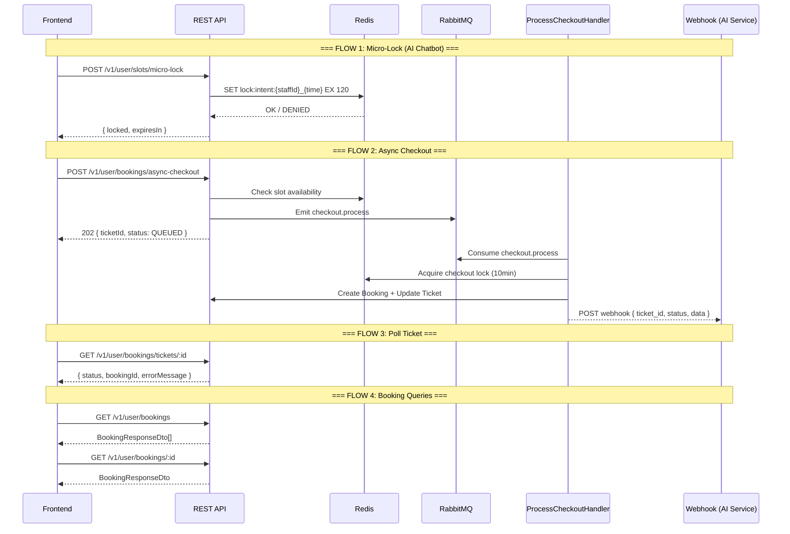
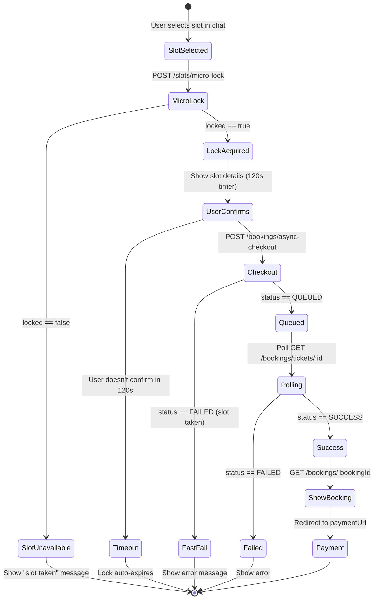
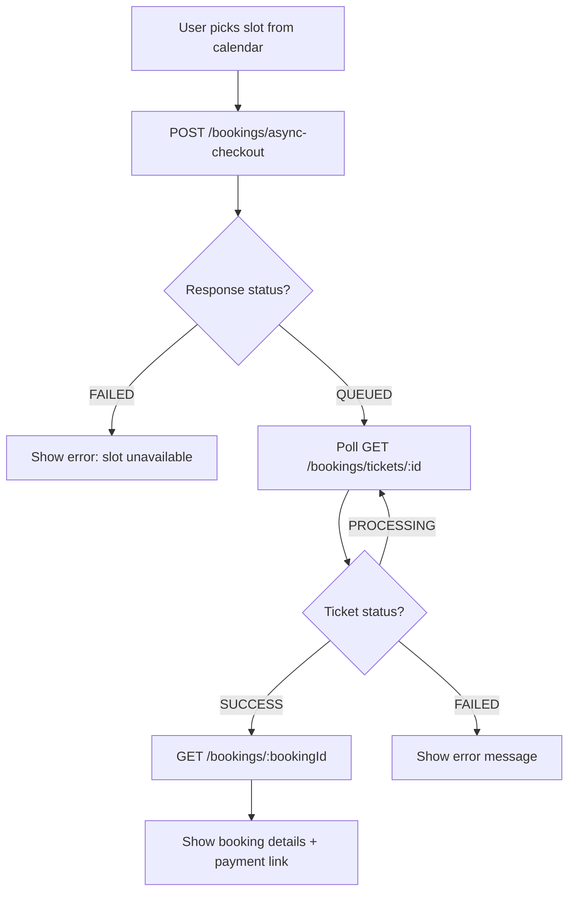
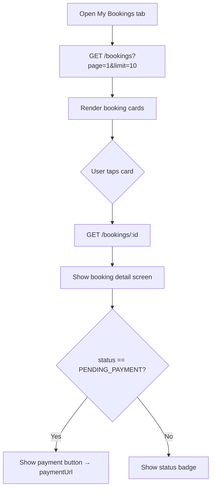
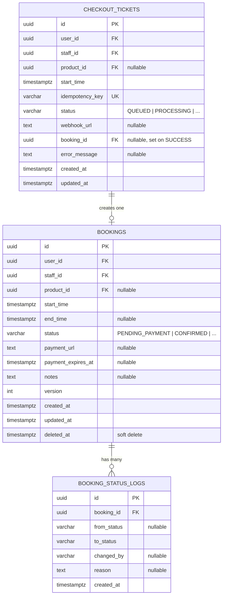

# Booking Module — Frontend Integration Guide

> Complete API reference and flow guide for integrating the Booking module into the frontend application.

---

## Architecture Overview



---

## Base URL & Auth

| Item | Value |
|------|-------|
| Base URL | `/v1/user` |
| Auth | JWT Bearer token (User role) |
| Decorator | `@UserApi` — all endpoints require authenticated user |

---

## Enums

### `BookingStatus`

| Value | Description |
|-------|-------------|
| `PENDING_PAYMENT` | Booking created, awaiting payment |
| `CONFIRMED` | Payment received, booking confirmed |
| `CANCELLED` | Booking cancelled |
| `COMPLETED` | Service completed |
| `NO_SHOW` | Customer did not show up |

### `CheckoutTicketStatus`

| Value | Description |
|-------|-------------|
| `QUEUED` | Ticket created, waiting for worker |
| `PROCESSING` | Worker is processing the checkout |
| `SUCCESS` | Booking created successfully |
| `FAILED` | Checkout failed (slot taken / error) |

---

## API Endpoints

### 1. Acquire Micro-Lock

Temporarily reserves a time slot while the user decides (used by AI chatbot).

```
POST /v1/user/slots/micro-lock
```

**Request Body** — `MicroLockDto`

| Field | Type | Required | Description |
|-------|------|----------|-------------|
| `staffId` | `UUID` | ✅ | Staff/employee UUID |
| `startTime` | `ISO 8601 string` | ✅ | Desired slot start time |
| `productId` | `UUID` | ❌ | Product/service UUID |

**Response** `200 OK` — `MicroLockResponseDto`

```json
{
  "locked": true,
  "expiresIn": 120
}
```

| Field | Type | Description |
|-------|------|-------------|
| `locked` | `boolean` | Whether the lock was acquired |
| `expiresIn` | `number` | Lock TTL in seconds (0 if denied) |

> [!NOTE]
> Lock TTL is **120 seconds**. If `locked: false`, the slot is already held by another user. The frontend should show a "slot unavailable" message and suggest alternative times.

---

### 2. Start Async Checkout

Initiates an asynchronous booking checkout. Returns immediately with a ticket ID.

```
POST /v1/user/bookings/async-checkout
```

**Response Code:** `202 Accepted`

**Request Body** — `AsyncCheckoutDto`

| Field | Type | Required | Description |
|-------|------|----------|-------------|
| `userId` | `UUID` | ✅ | User account UUID |
| `staffId` | `UUID` | ✅ | Staff/employee UUID |
| `startTime` | `ISO 8601 string` | ✅ | Desired slot start time |
| `productId` | `UUID` | ❌ | Product/service UUID |
| `idempotencyKey` | `string` (max 255) | ✅ | Unique key to prevent duplicates |
| `webhookUrl` | `URL string` | ❌ | Webhook URL for result notification |

**Response** `202 Accepted` — `AsyncCheckoutResponseDto`

```json
{
  "ticketId": "TICKET_ABCD123",
  "status": "QUEUED",
  "message": "Your booking request is being processed. You will be notified via webhook."
}
```

> [!IMPORTANT]
> **Idempotency**: If the same `idempotencyKey` is sent again, the API returns the existing ticket instead of creating a new one. Use a unique key per checkout attempt (e.g., `chat_session_{sessionId}_msg_{msgId}`).

> [!TIP]
> **Fast-Fail**: If the slot is already taken, the API returns immediately with `status: "FAILED"` and `message: "Slot is no longer available."` — no need to poll in this case.

---

### 3. Get Checkout Ticket Status

Poll this endpoint to track the progress of an async checkout.

```
GET /v1/user/bookings/tickets/:id
```

**Path Params**

| Param | Type | Description |
|-------|------|-------------|
| `id` | `UUID` | Ticket ID from async checkout response |

**Response** `200 OK` — `CheckoutTicketResponseDto`

```json
{
  "id": "TICKET_ABCD123",
  "userId": "...",
  "staffId": "...",
  "startTime": "2023-10-25T14:00:00Z",
  "status": "SUCCESS",
  "idempotencyKey": "ai_chat_session_888_msg_12",
  "bookingId": "BK_555",
  "errorMessage": null,
  "createdAt": "...",
  "updatedAt": "..."
}
```

| Field | Type | Description |
|-------|------|-------------|
| `id` | `string` | Ticket UUID |
| `userId` | `string` | User UUID |
| `staffId` | `string` | Staff UUID |
| `startTime` | `Date` | Requested time slot |
| `status` | `CheckoutTicketStatus` | Current status |
| `idempotencyKey` | `string` | Original idempotency key |
| `bookingId` | `string \| null` | Populated on `SUCCESS` |
| `errorMessage` | `string \| null` | Populated on `FAILED` |
| `createdAt` | `Date` | — |
| `updatedAt` | `Date` | — |

**Error**: `404 Not Found` if ticket ID does not exist.

---

### 4. List My Bookings

Returns the authenticated user's bookings with pagination, sorted by start time (newest first).

```
GET /v1/user/bookings?page=1&limit=10
```

**Query Params**

| Param | Type | Default | Description |
|-------|------|---------|-------------|
| `page` | `number` | `1` | Page number |
| `limit` | `number` | `10` | Items per page |

**Response** `200 OK` — `BookingResponseDto[]`

```json
[
  {
    "id": "BK_555",
    "userId": "...",
    "staffId": "...",
    "productId": "...",
    "startTime": "2023-10-25T14:00:00Z",
    "endTime": "2023-10-25T15:00:00Z",
    "status": "PENDING_PAYMENT",
    "paymentUrl": "https://payment.gateway.com/pay/BK_555",
    "paymentExpiresAt": "2023-10-25T14:10:00Z",
    "notes": null,
    "createdAt": "...",
    "updatedAt": "..."
  }
]
```

---

### 5. Get Booking by ID

```
GET /v1/user/bookings/:id
```

**Path Params**

| Param | Type | Description |
|-------|------|-------------|
| `id` | `UUID` | Booking ID |

**Response** `200 OK` — `BookingResponseDto`

| Field | Type | Description |
|-------|------|-------------|
| `id` | `string` | Booking UUID |
| `userId` | `string` | User UUID |
| `staffId` | `string` | Staff UUID |
| `productId` | `string \| null` | Product UUID |
| `startTime` | `Date` | Slot start time |
| `endTime` | `Date \| null` | Calculated from product duration |
| `status` | `BookingStatus` | Current status |
| `paymentUrl` | `string \| null` | Payment gateway URL |
| `paymentExpiresAt` | `Date \| null` | Payment deadline (10 min window) |
| `notes` | `string \| null` | — |
| `createdAt` | `Date` | — |
| `updatedAt` | `Date` | — |

**Error**: `404 Not Found` if booking ID does not exist.

---

## Webhook Payload (Reference)

When a `webhookUrl` is provided during checkout, the backend sends a `POST` with:

```json
// ── SUCCESS ──
{
  "ticket_id": "TICKET_ABCD123",
  "status": "SUCCESS",
  "data": {
    "booking_id": "BK_555",
    "payment_url": "",
    "expires_at": "2023-10-25T14:10:00Z"
  },
  "error": null
}
```

```json
// ── FAILED ──
{
  "ticket_id": "TICKET_ABCD123",
  "status": "FAILED",
  "data": null,
  "error": "Slot already taken by another booking"
}
```

> [!NOTE]
> Webhook delivery retries up to **3 times** with exponential backoff (1s, 2s, 3s). It is fire-and-forget — never blocks the checkout flow.

---

## Frontend Integration Flows

### Flow A: AI Chatbot Booking (Full Flow)



**Implementation Steps:**

1. **Lock the slot** — `POST /v1/user/slots/micro-lock`
   - If `locked: false` → show "slot unavailable", suggest alternatives
   - If `locked: true` → show confirmation UI with a 120s countdown timer
2. **Start checkout** — `POST /v1/user/bookings/async-checkout`
   - Generate `idempotencyKey` as `chat_{sessionId}_msg_{messageId}`
   - If response `status == "FAILED"` → show error immediately (fast-fail)
3. **Poll for result** — `GET /v1/user/bookings/tickets/:ticketId`
   - Poll every **2 seconds**, max **30 attempts** (60s timeout)
   - Stop when `status` is `SUCCESS` or `FAILED`
4. **On SUCCESS** — fetch `GET /v1/user/bookings/:bookingId`, redirect to payment
5. **On FAILED** — display `errorMessage` to user

---

### Flow B: Direct Booking (No AI)



> [!TIP]
> For direct booking (no chatbot), you can skip the micro-lock step and go straight to async checkout. The checkout handler performs its own slot availability check.

---

### Flow C: My Bookings List



---

## Polling Strategy (Recommended)

```typescript
async function pollTicket(ticketId: string): Promise<CheckoutTicketResponse> {
  const MAX_ATTEMPTS = 30;
  const INTERVAL_MS = 2000;

  for (let i = 0; i < MAX_ATTEMPTS; i++) {
    const ticket = await api.get(`/v1/user/bookings/tickets/${ticketId}`);

    if (ticket.status === 'SUCCESS' || ticket.status === 'FAILED') {
      return ticket;
    }

    await new Promise((r) => setTimeout(r, INTERVAL_MS));
  }

  throw new Error('Checkout polling timed out');
}
```

---

## Error Handling Quick Reference

| Scenario | HTTP Code | How to Handle |
|----------|-----------|---------------|
| Micro-lock denied | `200` (`locked: false`) | Show "slot busy" + suggest alternatives |
| Slot pre-check fail | `202` (`status: FAILED`) | Show error inline, no need to poll |
| Ticket not found | `404` | Retry or show generic error |
| Booking not found | `404` | Navigate back to list |
| Duplicate idempotency key | `202` (returns existing) | Safe — use returned ticket |
| Poll timeout | — | Show "taking too long" message |

---

## Database Schema (Reference)


