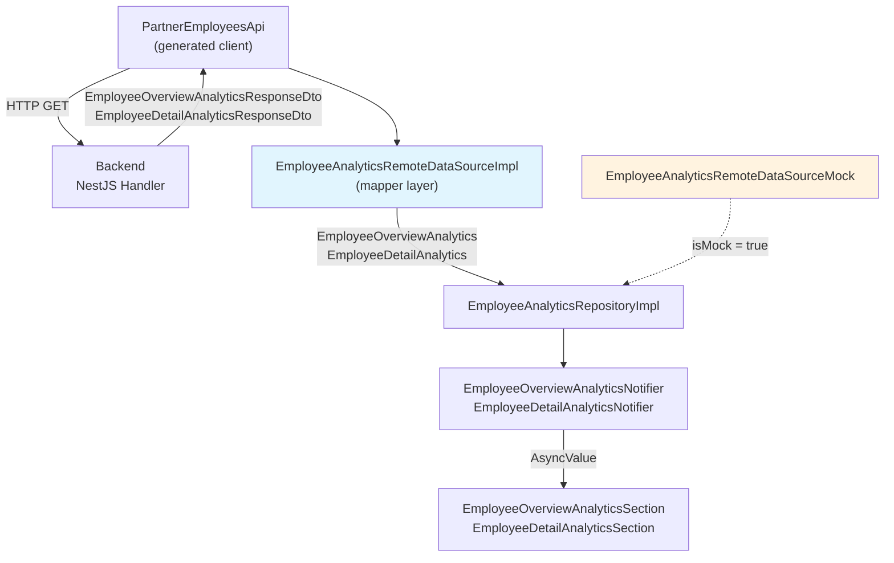

# Employee Analytics — Frontend Integration Guide

> **Audience:** Flutter admin_panel frontend team
> **Status:** OpenAPI client already regenerated — DTOs are available in `admin_openapi`
> **Reference impl:** [product_analytics_remote.datasource.dart](file:///Volumes/WD850X/Users/workspace/datn/Healytics/healytic_fe/admin_panel/lib/features/partner/products/data/product_analytics_remote.datasource.dart) (same pattern)

---

## 1. Generated Client — What You Have

The OpenAPI generator has created these artifacts in `admin_panel/openapi/`:

### API Methods (on `PartnerEmployeesApi`)

```dart
// Access via: apiService.employeesApi
late PartnerEmployeesApi employeesApi; // line 67 of api.service.dart
```

| Method | Returns | Parameters |
|--------|---------|------------|
| `partnerEmployeesControllerGetOverviewAnalytics` | `EmployeeOverviewAnalyticsResponseDto?` | `{DashboardTimePeriod? period}` |
| `partnerEmployeesControllerGetDetailAnalytics` | `EmployeeDetailAnalyticsResponseDto?` | `String employeeId, {DashboardTimePeriod? period}` |

### Generated DTO Classes

| Class | Key Fields |
|-------|------------|
| `EmployeeOverviewAnalyticsResponseDto` | `totalEmployees`, `activeEmployees`, `onLeaveEmployees`, `inactiveEmployees`, `utilizationRate`, `utilizationDelta`, `averageRating`, `ratingDelta`, `reviewCount`, `trendPoints`, `roleDistribution`, `topPerformers`, `complianceItems` |
| `EmployeeDetailAnalyticsResponseDto` | `employeeId`, `completedSessions`, `sessionsDelta`, `contributionValue`, `contributionDelta`, `utilizationRate`, `utilizationDelta`, `averageRating`, `reviewCount`, `trendPoints`, `mixMetrics`, `scheduleLoad`, `qualityMetrics`, `complianceItems` |
| `EmployeeTrendPointDto` | `label`, `sessions`, `contributionValue` |
| `EmployeeRoleDistributionDto` | `role`, `count` |
| `EmployeePerformanceSummaryDto` | `employeeName`, `roleLabel`, `rating`, `utilizationRate`, `contributionValue` |
| `EmployeeComplianceItemDto` | `title`, `detail`, `tone` |
| `EmployeeMixMetricDto` | `label`, `value`, `share` |
| `EmployeeScheduleLoadDto` | `label`, `availableHours`, `bookedHours` |
| `EmployeeQualityMetricDto` | `label`, `value` (String), `detail`, `tone` |

> [!WARNING]
> The generated `DashboardTimePeriod` enum from OpenAPI **conflicts** with the existing domain enum at `dashboard_time_period.dart`. You must hide it:
> ```dart
> import 'package:admin_openapi/api.dart' hide DashboardTimePeriod;
> ```
> This is already done in the product analytics datasource (line 1).

---

## 2. Domain Entities (Already Created)

All domain entities are defined in [employee_analytics.entity.dart](file:///Volumes/WD850X/Users/workspace/datn/Healytics/healytic_fe/admin_panel/lib/features/partner/employee/domain/employee_analytics.entity.dart). They match the API 1:1.

### Overview: DTO → Entity Mapping

| DTO Field | Entity Field | Type Conversion |
|-----------|-------------|-----------------|
| `dto.totalEmployees` | `totalEmployees` | `.toInt()` |
| `dto.activeEmployees` | `activeEmployees` | `.toInt()` |
| `dto.onLeaveEmployees` | `onLeaveEmployees` | `.toInt()` |
| `dto.inactiveEmployees` | `inactiveEmployees` | `.toInt()` |
| `dto.utilizationRate` | `utilizationRate` | `.toDouble()` |
| `dto.utilizationDelta` | `utilizationDelta` | `.toDouble()` |
| `dto.averageRating` | `averageRating` | `.toDouble()` |
| `dto.ratingDelta` | `ratingDelta` | `.toDouble()` |
| `dto.reviewCount` | `reviewCount` | `.toInt()` |
| `dto.trendPoints` | `trendPoints` | `.map(_mapTrendPoint).toList()` |
| `dto.roleDistribution` | `roleDistribution` | `.map(_mapRoleDistribution).toList()` |
| `dto.topPerformers` | `topPerformers` | `.map(_mapPerformanceSummary).toList()` |
| `dto.complianceItems` | `complianceItems` | `.map(_mapComplianceItem).toList()` |

### Detail: DTO → Entity Mapping

| DTO Field | Entity Field | Type Conversion |
|-----------|-------------|-----------------|
| `dto.employeeId` | `employeeId` | `EmployeeId(dto.employeeId)` |
| `dto.completedSessions` | `completedSessions` | `.toInt()` |
| `dto.sessionsDelta` | `sessionsDelta` | `.toDouble()` |
| `dto.contributionValue` | `contributionValue` | `.toDouble()` |
| `dto.contributionDelta` | `contributionDelta` | `.toDouble()` |
| `dto.utilizationRate` | `utilizationRate` | `.toDouble()` |
| `dto.utilizationDelta` | `utilizationDelta` | `.toDouble()` |
| `dto.averageRating` | `averageRating` | `.toDouble()` |
| `dto.reviewCount` | `reviewCount` | `.toInt()` |
| `dto.trendPoints` | `trendPoints` | `.map(_mapTrendPoint).toList()` |
| `dto.mixMetrics` | `mixMetrics` | `.map(_mapMixMetric).toList()` |
| `dto.scheduleLoad` | `scheduleLoad` | `.map(_mapScheduleLoad).toList()` |
| `dto.qualityMetrics` | `qualityMetrics` | `.map(_mapQualityMetric).toList()` |
| `dto.complianceItems` | `complianceItems` | `.map(_mapComplianceItem).toList()` |

---

## 3. What Needs to Change

The current [employee_analytics_remote.datasource.dart](file:///Volumes/WD850X/Users/workspace/datn/Healytics/healytic_fe/admin_panel/lib/features/partner/employee/data/employee_analytics_remote.datasource.dart) constructs analytics **from mock employee entities** (lines 27–57). It needs to call the real API instead.

### Files to Modify

| File | Change |
|------|--------|
| `employee_analytics_remote.datasource.dart` | Rewrite `Impl` class to call API + add mappers |
| No other files change | Repository, provider, and widgets are untouched |

### Files That Stay the Same ✅

| File | Why |
|------|-----|
| [employee_analytics.entity.dart](file:///Volumes/WD850X/Users/workspace/datn/Healytics/healytic_fe/admin_panel/lib/features/partner/employee/domain/employee_analytics.entity.dart) | Entity fields match API response 1:1 |
| [employee_analytics_impl.repository.dart](file:///Volumes/WD850X/Users/workspace/datn/Healytics/healytic_fe/admin_panel/lib/features/partner/employee/data/employee_analytics_impl.repository.dart) | Delegates to datasource (no change) |
| [employee_analytics.provider.dart](file:///Volumes/WD850X/Users/workspace/datn/Healytics/healytic_fe/admin_panel/lib/features/partner/employee/presentation/providers/employee_analytics.provider.dart) | Calls repository (no change) |
| [employee_overview_analytics.widget.dart](file:///Volumes/WD850X/Users/workspace/datn/Healytics/healytic_fe/admin_panel/lib/features/partner/employee/presentation/widgets/employee_analytics/employee_overview_analytics.widget.dart) | Reads from provider (no change) |
| [employee_detail_analytics.widget.dart](file:///Volumes/WD850X/Users/workspace/datn/Healytics/healytic_fe/admin_panel/lib/features/partner/employee/presentation/widgets/employee_analytics/employee_detail_analytics.widget.dart) | Reads from provider (no change) |

---

## 4. Datasource Refactoring — Step by Step

### Step 1: Update Imports

```diff
+import 'package:admin_openapi/api.dart' hide DashboardTimePeriod;
+import 'package:admin_panel/core/providers/api.provider.dart';
+import 'package:admin_panel/core/services/api.service.dart';
 import 'package:admin_panel/core/entities/analytics_status_tone.dart';
```

### Step 2: Rewrite `EmployeeAnalyticsRemoteDataSourceImpl`

Replace the current implementation that uses `EmployeeRepository` with API calls:

```dart
class EmployeeAnalyticsRemoteDataSourceImpl
    implements EmployeeAnalyticsRemoteDataSource {
  EmployeeAnalyticsRemoteDataSourceImpl({required this.apiService});

  final ApiService apiService;

  PartnerEmployeesApi get _api => apiService.employeesApi;

  @override
  Future<EmployeeOverviewAnalytics> getOverviewAnalytics({
    required DashboardTimePeriod period,
  }) async {
    final response = await _api
        .partnerEmployeesControllerGetOverviewAnalytics(
          period: period.value,
        );

    if (response == null) {
      throw EmployeeAnalyticsDataException(
        'Failed to load overview analytics',
      );
    }

    return _mapOverviewResponse(response);
  }

  @override
  Future<EmployeeDetailAnalytics> getDetailAnalytics({
    required EmployeeId employeeId,
    required DashboardTimePeriod period,
  }) async {
    final response = await _api
        .partnerEmployeesControllerGetDetailAnalytics(
          employeeId.value,
          period: period.value,
        );

    if (response == null) {
      throw EmployeeAnalyticsDataException(
        'Failed to load detail analytics',
      );
    }

    return _mapDetailResponse(response);
  }

  // ── Private DTO → Entity Mappers ──────────────

  EmployeeOverviewAnalytics _mapOverviewResponse(
    EmployeeOverviewAnalyticsResponseDto dto,
  ) {
    return EmployeeOverviewAnalytics(
      totalEmployees: dto.totalEmployees.toInt(),
      activeEmployees: dto.activeEmployees.toInt(),
      onLeaveEmployees: dto.onLeaveEmployees.toInt(),
      inactiveEmployees: dto.inactiveEmployees.toInt(),
      utilizationRate: dto.utilizationRate.toDouble(),
      utilizationDelta: dto.utilizationDelta.toDouble(),
      averageRating: dto.averageRating.toDouble(),
      ratingDelta: dto.ratingDelta.toDouble(),
      reviewCount: dto.reviewCount.toInt(),
      trendPoints: dto.trendPoints.map(_mapTrendPoint).toList(),
      roleDistribution:
          dto.roleDistribution.map(_mapRoleDistribution).toList(),
      topPerformers:
          dto.topPerformers.map(_mapPerformanceSummary).toList(),
      complianceItems:
          dto.complianceItems.map(_mapComplianceItem).toList(),
    );
  }

  EmployeeDetailAnalytics _mapDetailResponse(
    EmployeeDetailAnalyticsResponseDto dto,
  ) {
    return EmployeeDetailAnalytics(
      employeeId: EmployeeId(dto.employeeId),
      completedSessions: dto.completedSessions.toInt(),
      sessionsDelta: dto.sessionsDelta.toDouble(),
      contributionValue: dto.contributionValue.toDouble(),
      contributionDelta: dto.contributionDelta.toDouble(),
      utilizationRate: dto.utilizationRate.toDouble(),
      utilizationDelta: dto.utilizationDelta.toDouble(),
      averageRating: dto.averageRating.toDouble(),
      reviewCount: dto.reviewCount.toInt(),
      trendPoints: dto.trendPoints.map(_mapTrendPoint).toList(),
      mixMetrics: dto.mixMetrics.map(_mapMixMetric).toList(),
      scheduleLoad: dto.scheduleLoad.map(_mapScheduleLoad).toList(),
      qualityMetrics:
          dto.qualityMetrics.map(_mapQualityMetric).toList(),
      complianceItems:
          dto.complianceItems.map(_mapComplianceItem).toList(),
    );
  }

  EmployeeTrendPoint _mapTrendPoint(EmployeeTrendPointDto dto) {
    return EmployeeTrendPoint(
      label: dto.label,
      sessions: dto.sessions.toDouble(),
      contributionValue: dto.contributionValue.toDouble(),
    );
  }

  EmployeeRoleDistribution _mapRoleDistribution(
    EmployeeRoleDistributionDto dto,
  ) {
    return EmployeeRoleDistribution(
      role: dto.role,
      count: dto.count.toInt(),
    );
  }

  EmployeePerformanceSummary _mapPerformanceSummary(
    EmployeePerformanceSummaryDto dto,
  ) {
    return EmployeePerformanceSummary(
      employeeName: dto.employeeName,
      roleLabel: dto.roleLabel,
      rating: dto.rating.toDouble(),
      utilizationRate: dto.utilizationRate.toDouble(),
      contributionValue: dto.contributionValue.toDouble(),
    );
  }

  EmployeeComplianceItem _mapComplianceItem(
    EmployeeComplianceItemDto dto,
  ) {
    return EmployeeComplianceItem(
      title: dto.title,
      detail: dto.detail,
      tone: _parseTone(dto.tone.value),
    );
  }

  EmployeeMixMetric _mapMixMetric(EmployeeMixMetricDto dto) {
    return EmployeeMixMetric(
      label: dto.label,
      value: dto.value.toInt(),
      share: dto.share.toDouble(),
    );
  }

  EmployeeScheduleLoad _mapScheduleLoad(
    EmployeeScheduleLoadDto dto,
  ) {
    return EmployeeScheduleLoad(
      label: dto.label,
      availableHours: dto.availableHours.toDouble(),
      bookedHours: dto.bookedHours.toDouble(),
    );
  }

  EmployeeQualityMetric _mapQualityMetric(
    EmployeeQualityMetricDto dto,
  ) {
    return EmployeeQualityMetric(
      label: dto.label,
      value: dto.value, // Already a String
      detail: dto.detail,
      tone: _parseTone(dto.tone.value),
    );
  }

  AnalyticsStatusTone _parseTone(String value) {
    return switch (value) {
      'positive' => AnalyticsStatusTone.positive,
      'warning' => AnalyticsStatusTone.warning,
      'critical' => AnalyticsStatusTone.critical,
      _ => AnalyticsStatusTone.neutral,
    };
  }
}
```

### Step 3: Update the Provider

```diff
 @riverpod
 EmployeeAnalyticsRemoteDataSource employeeAnalyticsRemoteDataSource(Ref ref) {
   final isMock = Store.get(StoreKey.mockFlag, false);
   if (isMock) {
     return EmployeeAnalyticsRemoteDataSourceMock();
   }
 
-  final repository = ref.read(employeeRepositoryProvider);
-  return EmployeeAnalyticsRemoteDataSourceImpl(repository: repository);
+  final apiService = ref.read(apiServiceProvider);
+  return EmployeeAnalyticsRemoteDataSourceImpl(apiService: apiService);
 }
```

### Step 4: Add Custom Exception

```dart
class EmployeeAnalyticsDataException implements Exception {
  const EmployeeAnalyticsDataException(this.message);
  final String message;

  @override
  String toString() => 'EmployeeAnalyticsDataException: $message';
}
```

### Step 5: Keep Mock Class Intact

The existing `EmployeeAnalyticsRemoteDataSourceMock` and all its helper functions (`_buildEmployeeOverviewAnalytics`, etc.) should remain unchanged — they're used when `StoreKey.mockFlag` is `true`.

---

## 5. Widget → API Field Binding Matrix

### Overview Widget (`EmployeeOverviewAnalyticsSection`)

| Widget | API Field | Display |
|--------|-----------|---------|
| KPI Card: "Total staff" | `totalEmployees` | `"12"` |
| KPI Card: "Total staff" helper | `activeEmployees` | `"10 active teammates"` |
| KPI Card: "Active / on leave" | `activeEmployees` / `onLeaveEmployees` | `"10 / 1"` |
| KPI Card: "Active / on leave" helper | `inactiveEmployees` | `"1 inactive profiles"` |
| KPI Card: "Utilization" | `utilizationRate` | `"74.5%"` |
| KPI Card: "Utilization" trend | `utilizationDelta` | `+6.2%` arrow |
| KPI Card: "Quality signal" | `averageRating` | `"4.7/5"` |
| KPI Card: "Quality signal" helper | `reviewCount` | `"86 reviews"` |
| KPI Card: "Quality signal" trend | `ratingDelta` | `+1.4` arrow |
| `_RoleDistributionPanel` | `roleDistribution[].role`, `.count` | Pie chart + legend |
| `_WorkloadTrendPanel` | `trendPoints[].label`, `.sessions`, `.contributionValue` | Bar chart |
| `_TopPerformersPanel` | `topPerformers[].employeeName`, `.roleLabel`, `.rating`, `.utilizationRate`, `.contributionValue` | Table rows |
| `_CompliancePanel` | `complianceItems[].title`, `.detail`, `.tone` | Status badges |

### Detail Widget (`EmployeeDetailAnalyticsSection`)

| Widget | API Field | Display |
|--------|-----------|---------|
| KPI Card: "Completed sessions" | `completedSessions` | `"26"` |
| KPI Card: "Completed sessions" trend | `sessionsDelta` | `+8.3%` arrow |
| KPI Card: "Contribution" | `contributionValue` | `"15.6M₫"` |
| KPI Card: "Contribution" trend | `contributionDelta` | `+10.1%` arrow |
| KPI Card: "Utilization" | `utilizationRate` | `"77.4%"` |
| KPI Card: "Utilization" trend | `utilizationDelta` | `+4.8%` arrow |
| KPI Card: "Average rating" | `averageRating` | `"4.8/5"` |
| KPI Card: "Average rating" helper | `reviewCount` | `"18 reviews"` |
| `_EmployeeTrendPanel` | `trendPoints[].label`, `.sessions`, `.contributionValue` | Line chart (2 series) |
| `_EmployeeMixPanel` | `mixMetrics[].label`, `.value`, `.share` | Progress bars |
| `_ScheduleLoadPanel` | `scheduleLoad[].label`, `.availableHours`, `.bookedHours` | Grid of utilization tiles |
| `_QualityAndCompliancePanel` | `qualityMetrics[].label`, `.value`, `.detail`, `.tone` | Status badges + text |
| `_QualityAndCompliancePanel` (bottom) | `complianceItems[].title`, `.detail`, `.tone` | Status badges + text |

---

## 6. `DashboardTimePeriod` — Period Value Mapping

The domain enum must map to the API query string:

| Domain Enum | `.value` String | API Query |
|-------------|----------------|-----------|
| `DashboardTimePeriod.today` | `'today'` | `?period=today` |
| `DashboardTimePeriod.thisWeek` | `'this_week'` | `?period=this_week` |
| `DashboardTimePeriod.thisMonth` | `'this_month'` | `?period=this_month` |
| `DashboardTimePeriod.thisQuarter` | `'this_quarter'` | `?period=this_quarter` |
| `DashboardTimePeriod.thisYear` | `'this_year'` | `?period=this_year` |

The provider already passes `period.value` to the API call (same as product analytics).

---

## 7. `tone` Field Parsing

Both `EmployeeComplianceItemDto.tone` and `EmployeeQualityMetricDto.tone` are generated as enum types. Access the raw string via `.value`:

```dart
// ✅ Correct
tone: _parseTone(dto.tone.value)

// ❌ Wrong — dto.tone is an enum object, not a string
tone: _parseTone(dto.tone)
```

The parser:

```dart
AnalyticsStatusTone _parseTone(String value) {
  return switch (value) {
    'positive' => AnalyticsStatusTone.positive,
    'warning'  => AnalyticsStatusTone.warning,
    'critical' => AnalyticsStatusTone.critical,
    _          => AnalyticsStatusTone.neutral,
  };
}
```

---

## 8. Architecture Flow Diagram



---

## 9. Verification Checklist

After refactoring:

- [ ] `import 'package:admin_openapi/api.dart' hide DashboardTimePeriod;` present
- [ ] `EmployeeAnalyticsRemoteDataSourceImpl` uses `ApiService` (not `EmployeeRepository`)
- [ ] Provider switches correctly between `Impl` and `Mock`
- [ ] `dart run build_runner build` succeeds (regenerates `.g.dart` files)
- [ ] Overview widget loads with period filter working (try `this_week`, `this_quarter`)
- [ ] Detail widget loads for a specific employee UUID
- [ ] Period switching shows loading indicator, then updates data
- [ ] Empty states render correctly (new partner with 0 employees)
- [ ] Mock mode still works (toggle `StoreKey.mockFlag`)

---

## 10. Common Pitfalls

| Pitfall | Solution |
|---------|----------|
| `DashboardTimePeriod` ambiguous import | `hide DashboardTimePeriod` from `admin_openapi` |
| `dto.tone` used as `String` | Use `dto.tone.value` (it's a generated enum) |
| `num` from DTO not accepted as `int`/`double` | Always call `.toInt()` or `.toDouble()` |
| `null` response from API | Throw `EmployeeAnalyticsDataException` |
| `dto.value` on `EmployeeQualityMetricDto` | This is already `String` — no conversion needed |
| `period.value` type mismatch | The domain enum's `.value` returns `String` matching the generated enum |
