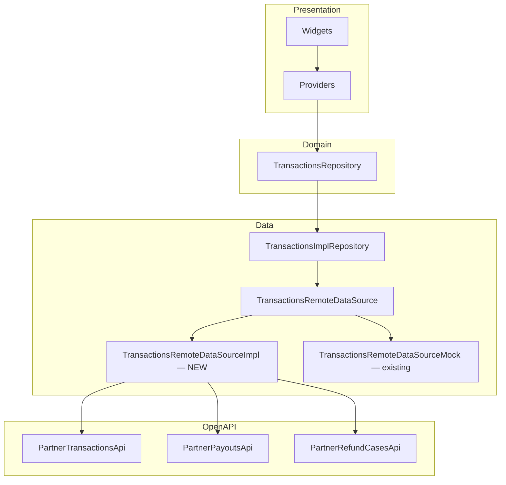

# Partner Finance — Frontend API Integration Guide

> **Target**: `admin_panel/lib/features/partner/transactions/`
> **Generated APIs**: `admin_panel/openapi/lib/api/partner_transactions_api.dart`, `partner_payouts_api.dart`, `partner_refund_cases_api.dart`

---

## Architecture Overview



**No changes needed** in Domain, Repository interface, Providers, or Widgets. The only files that need modification are:

| File | Action |
|------|--------|
| `api.service.dart` | Register 3 new API instances |
| `transactions_remote.datasource.dart` | Add real implementation class + mock switching provider |

---

## Phase 1 — Register APIs in ApiService

### File: [api.service.dart](file:///Volumes/WD850X/Users/workspace/datn/Healytics/healytic_fe/admin_panel/lib/core/services/api.service.dart)

**Step 1.1** — Add `late` fields (after line 70):

```diff
  late PartnerDashboardApi partnerDashboardApi;
+
+ // ── Partner Finance ────────────────────────────
+ late PartnerTransactionsApi partnerTransactionsApi;
+ late PartnerPayoutsApi partnerPayoutsApi;
+ late PartnerRefundCasesApi partnerRefundCasesApi;
```

**Step 1.2** — Initialize in `setEndpoint()` (after line 159):

```diff
    partnerDashboardApi = PartnerDashboardApi(backend);
+   partnerTransactionsApi = PartnerTransactionsApi(backend);
+   partnerPayoutsApi = PartnerPayoutsApi(backend);
+   partnerRefundCasesApi = PartnerRefundCasesApi(backend);
```

---

## Phase 2 — Build Real DataSource Implementation

### File: [transactions_remote.datasource.dart](file:///Volumes/WD850X/Users/workspace/datn/Healytics/healytic_fe/admin_panel/lib/features/partner/transactions/data/transactions_remote.datasource.dart)

Replace the current `TransactionsRemoteDataSourceImpl` (mock-based, lines 49–433) with the real API implementation and rename the old one to `TransactionsRemoteDataSourceMock`.

### 2.1 — Imports to Add

```dart
import 'dart:convert';
import 'package:admin_openapi/api.dart' as openapi;
import 'package:admin_panel/core/entities/store.entity.dart';
import 'package:admin_panel/core/models/store.model.dart';
import 'package:admin_panel/core/providers/api.provider.dart';
import 'package:admin_panel/core/services/api.service.dart';
```

### 2.2 — Enum Conversion Helpers

The domain enums in `finance_models.dart` map 1:1 to generated OpenAPI enums but are different Dart types. Use these converters:

| Domain Enum | Generated OpenAPI Enum | Converter |
|---|---|---|
| `FinancePeriod` | `openapi.PartnerFinancePeriod` | `_toApiPeriod()` |
| `CommerceSourceType` | `openapi.PartnerCommerceSourceType` | `_toApiSourceType()` |
| `TransactionType` | `openapi.PartnerTransactionType` | `_toApiTxnType()` |
| `TransactionStatus` | `openapi.PartnerTransactionStatus` | `_toApiTxnStatus()` |
| `SettlementStatus` | `openapi.PartnerSettlementStatus` | `_toApiSettlement()` |
| `PayoutStatus` | `openapi.PartnerPayoutStatus` | `_toApiPayout()` |

```dart
openapi.PartnerFinancePeriod _toApiPeriod(FinancePeriod p) =>
    switch (p) {
      FinancePeriod.sevenDays  => openapi.PartnerFinancePeriod.sevenDays,
      FinancePeriod.thirtyDays => openapi.PartnerFinancePeriod.thirtyDays,
      FinancePeriod.ninetyDays => openapi.PartnerFinancePeriod.ninetyDays,
    };

// Same pattern for all 6 enums — match by name
```

**Reverse converters** (API → Domain) for mapping responses:

```dart
TransactionType _fromApiTxnType(openapi.PartnerTransactionType t) =>
    TransactionType.values.firstWhere(
      (e) => e.name == t.value,
      orElse: () => TransactionType.charge,
    );
// Same pattern for all status enums
```

### 2.3 — Real Implementation Class

> [!IMPORTANT]
> The generated `getTransactions`, `getPayouts`, and `getRefundCases` methods return `Future<void>` because the OpenAPI spec's `200` response has no schema body. **You must use the `WithHttpInfo` variants** and manually deserialize the JSON response.

```dart
class TransactionsRemoteDataSourceImpl
    implements TransactionsRemoteDataSource {
  TransactionsRemoteDataSourceImpl({required ApiService apiService})
      : _txnApi = apiService.partnerTransactionsApi,
        _payApi = apiService.partnerPayoutsApi,
        _refApi = apiService.partnerRefundCasesApi;

  final openapi.PartnerTransactionsApi _txnApi;
  final openapi.PartnerPayoutsApi _payApi;
  final openapi.PartnerRefundCasesApi _refApi;
```

### 2.4 — Method-by-Method Mapping

#### `getFinanceSummary` — Has typed return ✅

```dart
@override
Future<FinanceSummary> getFinanceSummary(
  FinanceFilter filter, FinancePeriod period,
) async {
  final dto = await _txnApi.partnerTransactionsControllerGetSummary(
    search: filter.searchQuery.isEmpty ? null : filter.searchQuery,
    startDate: filter.startDate?.toIso8601String().split('T').first,
    endDate: filter.endDate?.toIso8601String().split('T').first,
    period: _toApiPeriod(period),
    sourceType: filter.sourceType != null ? _toApiSourceType(filter.sourceType!) : null,
    transactionType: filter.transactionType != null ? _toApiTxnType(filter.transactionType!) : null,
    transactionStatus: filter.transactionStatus != null ? _toApiTxnStatus(filter.transactionStatus!) : null,
    settlementStatus: filter.settlementStatus != null ? _toApiSettlement(filter.settlementStatus!) : null,
    payoutStatus: filter.payoutStatus != null ? _toApiPayout(filter.payoutStatus!) : null,
    currency: filter.currency,
  );
  if (dto == null) throw const TransactionsDataException('Summary was null');
  return _mapSummary(dto);
}
```

**Mapper:**
```dart
FinanceSummary _mapSummary(openapi.PartnerFinanceSummaryDto dto) {
  return FinanceSummary(
    grossVolume: dto.grossVolume.toDouble(),
    netSettled: dto.netSettled.toDouble(),
    pendingPayout: dto.pendingPayout.toDouble(),
    refundExposure: dto.refundExposure.toDouble(),
    availableBalance: dto.availableBalance.toDouble(),
    pendingBalance: dto.pendingBalance.toDouble(),
    currency: dto.currency,
    nextPayoutAt: dto.nextPayoutAt != null
        ? DateTime.tryParse(dto.nextPayoutAt!) : null,
    payoutMethod: dto.payoutMethod,
    payoutStatus: dto.payoutStatus != null
        ? _fromApiPayoutStatus(dto.payoutStatus!) : null,
  );
}
```

#### `getFinanceTrend` — Has typed return ✅

```dart
@override
Future<List<FinanceTrendPoint>> getFinanceTrend(
  FinanceFilter filter, FinancePeriod period,
) async {
  final dtos = await _txnApi.partnerTransactionsControllerGetTrend(
    /* same filter params as summary */
  );
  return dtos?.map(_mapTrendPoint).toList() ?? [];
}

FinanceTrendPoint _mapTrendPoint(openapi.PartnerFinanceTrendPointDto dto) {
  return FinanceTrendPoint(
    date: DateTime.tryParse(dto.date) ?? DateTime.now(),
    grossAmount: dto.grossAmount.toDouble(),
    netAmount: dto.netAmount.toDouble(),
    refundAmount: dto.refundAmount.toDouble(),
  );
}
```

#### `getTransactions` — ⚠️ Void return workaround

> [!WARNING]
> The generated method returns `Future<void>`. Use `WithHttpInfo` + manual JSON decode.

```dart
@override
Future<List<TransactionRecord>> getTransactions({
  required int startingAt,
  required int count,
  required FinanceFilter filter,
}) async {
  final page = (startingAt ~/ count) + 1;
  final response = await _txnApi
      .partnerTransactionsControllerGetTransactionsWithHttpInfo(
    search: filter.searchQuery.isEmpty ? null : filter.searchQuery,
    startDate: filter.startDate?.toIso8601String().split('T').first,
    endDate: filter.endDate?.toIso8601String().split('T').first,
    sourceType: filter.sourceType != null ? _toApiSourceType(filter.sourceType!) : null,
    transactionType: filter.transactionType != null ? _toApiTxnType(filter.transactionType!) : null,
    transactionStatus: filter.transactionStatus != null ? _toApiTxnStatus(filter.transactionStatus!) : null,
    settlementStatus: filter.settlementStatus != null ? _toApiSettlement(filter.settlementStatus!) : null,
    payoutStatus: filter.payoutStatus != null ? _toApiPayout(filter.payoutStatus!) : null,
    currency: filter.currency,
    page: page,
    limit: count,
  );
  if (response.statusCode >= 400) {
    throw TransactionsDataException('HTTP ${response.statusCode}');
  }
  final json = jsonDecode(response.body) as Map<String, dynamic>;
  final dataList = (json['data'] as List?) ?? [];
  return dataList
      .map((e) => _mapTransactionRecord(e as Map<String, dynamic>))
      .toList();
}
```

**Manual JSON mapper** (since we can't use the generated deserializer for the paginated wrapper):

```dart
TransactionRecord _mapTransactionRecord(Map<String, dynamic> j) {
  return TransactionRecord(
    id: TransactionRecordId(j['id'] as String),
    createdAt: DateTime.tryParse(j['createdAt'] as String? ?? '') ?? DateTime.now(),
    type: TransactionType.values.firstWhere(
      (e) => e.name == j['type'], orElse: () => TransactionType.charge),
    sourceType: CommerceSourceType.values.firstWhere(
      (e) => e.name == j['sourceType'], orElse: () => CommerceSourceType.serviceBooking),
    reference: j['reference'] as String? ?? '',
    customerName: j['customerName'] as String? ?? '',
    grossAmount: (j['grossAmount'] as num?)?.toDouble() ?? 0,
    feeAmount: (j['feeAmount'] as num?)?.toDouble() ?? 0,
    currency: j['currency'] as String? ?? 'VND',
    status: TransactionStatus.values.firstWhere(
      (e) => e.name == j['status'], orElse: () => TransactionStatus.pending),
    settlementStatus: SettlementStatus.values.firstWhere(
      (e) => e.name == j['settlementStatus'], orElse: () => SettlementStatus.unsettled),
    payoutStatus: PayoutStatus.values.firstWhere(
      (e) => e.name == j['payoutStatus'], orElse: () => PayoutStatus.notAssigned),
    paymentMethod: j['paymentMethod'] as String? ?? '',
    sourceTitle: j['sourceTitle'] as String? ?? '',
    sourceSubtitle: j['sourceSubtitle'] as String? ?? '',
    timeline: ((j['timeline'] as List?) ?? [])
        .map((t) => TransactionTimelineEvent(
              title: t['title'] as String? ?? '',
              description: t['description'] as String? ?? '',
              occurredAt: DateTime.tryParse(t['occurredAt'] as String? ?? '') ?? DateTime.now(),
            ))
        .toList(),
    flaggedForReview: j['flaggedForReview'] as bool? ?? false,
    notes: j['notes'] as String?,
    payoutId: j['payoutId'] != null ? PayoutRecordId(j['payoutId'] as String) : null,
  );
}
```

#### `getPayouts` — ⚠️ Same void-return workaround

```dart
@override
Future<List<PayoutRecord>> getPayouts({
  required int startingAt, required int count, required FinanceFilter filter,
}) async {
  final page = (startingAt ~/ count) + 1;
  final response = await _payApi
      .partnerPayoutsControllerGetPayoutsWithHttpInfo(
    /* same filter mapping */ page: page, limit: count,
  );
  if (response.statusCode >= 400) {
    throw TransactionsDataException('HTTP ${response.statusCode}');
  }
  final json = jsonDecode(response.body) as Map<String, dynamic>;
  final dataList = (json['data'] as List?) ?? [];
  return dataList.map((e) => _mapPayoutRecord(e as Map<String, dynamic>)).toList();
}

PayoutRecord _mapPayoutRecord(Map<String, dynamic> j) {
  return PayoutRecord(
    id: PayoutRecordId(j['id'] as String),
    periodLabel: j['periodLabel'] as String? ?? '',
    includedVolume: (j['includedVolume'] as num?)?.toDouble() ?? 0,
    feesAdjustments: (j['feesAdjustments'] as num?)?.toDouble() ?? 0,
    netPayout: (j['netPayout'] as num?)?.toDouble() ?? 0,
    scheduledDate: DateTime.tryParse(j['scheduledDate'] as String? ?? '') ?? DateTime.now(),
    method: j['method'] as String? ?? '',
    status: PayoutStatus.values.firstWhere(
      (e) => e.name == j['status'], orElse: () => PayoutStatus.notAssigned),
    currency: j['currency'] as String? ?? 'VND',
    includedTransactionIds: ((j['includedTransactionIds'] as List?) ?? [])
        .map((id) => TransactionRecordId(id as String)).toList(),
  );
}
```

#### `getRefundCases` — ⚠️ Same void-return workaround

```dart
@override
Future<List<RefundCaseRecord>> getRefundCases({
  required int startingAt, required int count, required FinanceFilter filter,
}) async {
  final page = (startingAt ~/ count) + 1;
  final response = await _refApi
      .partnerRefundCasesControllerGetRefundCasesWithHttpInfo(
    /* filter mapping */ page: page, limit: count,
  );
  // same decode pattern → _mapRefundCase
}

RefundCaseRecord _mapRefundCase(Map<String, dynamic> j) {
  return RefundCaseRecord(
    id: RefundCaseRecordId(j['id'] as String),
    transactionId: TransactionRecordId(j['transactionId'] as String),
    caseType: RefundCaseType.values.firstWhere(
      (e) => e.name == j['caseType'], orElse: () => RefundCaseType.refund),
    requestedAt: DateTime.tryParse(j['requestedAt'] as String? ?? '') ?? DateTime.now(),
    amount: (j['amount'] as num?)?.toDouble() ?? 0,
    currency: j['currency'] as String? ?? 'VND',
    reason: j['reason'] as String? ?? '',
    owner: j['owner'] as String? ?? '',
    status: RefundCaseStatus.values.firstWhere(
      (e) => e.name == j['status'], orElse: () => RefundCaseStatus.pending),
    slaHours: (j['slaHours'] as num?)?.toInt() ?? 0,
  );
}
```

#### `getTransactionById` — Has typed return ✅

```dart
@override
Future<TransactionDetail> getTransactionById(TransactionRecordId id) async {
  final dto = await _txnApi
      .partnerTransactionsControllerGetTransactionDetail(id.value);
  if (dto == null) throw TransactionsDataException('Detail was null');
  return _mapDetail(dto);
}

TransactionDetail _mapDetail(openapi.PartnerTransactionDetailDto dto) {
  return TransactionDetail(
    record: _mapTransactionRecordDto(dto.record),  // uses generated DTO
    payoutRecord: dto.payoutRecord != null
        ? _mapPayoutRecordDto(dto.payoutRecord!) : null,
    relatedRefundCases: dto.relatedRefundCases
        .map(_mapRefundCaseDto).toList(),
    sourceSummaryTitle: dto.sourceSummaryTitle,
    sourceSummarySubtitle: dto.sourceSummarySubtitle,
  );
}
```

#### Mutations — All have typed returns ✅

```dart
@override
Future<void> markTransactionSettled(TransactionRecordId id) async {
  await _txnApi.partnerTransactionsControllerMarkSettled(
    id.value,
    openapi.MarkSettlementDto(
      settlementStatus: openapi.PartnerSettlementStatus.settled,
    ),
  );
}

@override
Future<void> flagTransactionForReview(TransactionRecordId id) async {
  await _txnApi.partnerTransactionsControllerFlagForReview(
    id.value,
    openapi.FlagReviewDto(flaggedForReview: true),
  );
}

@override
Future<void> approveRefundCase(String caseId) async {
  await _refApi.partnerRefundCasesControllerApprove(
    caseId, openapi.RefundCaseActionDto(),
  );
}

@override
Future<void> rejectRefundCase(String caseId) async {
  await _refApi.partnerRefundCasesControllerReject(
    caseId, openapi.RefundCaseActionDto(),
  );
}

@override
Future<void> retryPayout(String payoutId) async {
  await _payApi.partnerPayoutsControllerRetryPayout(
    payoutId, openapi.RetryPayoutDto(),
  );
}
```

### 2.5 — Provider with Mock Switching

Replace the existing provider at the bottom of the file:

```dart
final transactionsRemoteDataSourceProvider =
    Provider<TransactionsRemoteDataSource>((ref) {
  final isMock = Store.get(StoreKey.mockFlag, false);
  if (isMock) {
    return TransactionsRemoteDataSourceMock();
  }
  final apiService = ref.read(apiServiceProvider);
  return TransactionsRemoteDataSourceImpl(apiService: apiService);
});
```

---

## Phase 3 — Pagination Offset → Page Conversion

The existing widgets use **offset-based** pagination (`startingAt` + `count`), while the backend uses **page-based** (`page` + `limit`).

**Conversion formula** (already shown in code above):
```dart
final page = (startingAt ~/ count) + 1;
```

The `TransactionsManagerNotifier.getTransactionsTotalRows()` currently fetches 1000 records to count. With the real API, this should be refactored to use the `meta.totalRows` from the paginated response. However, this requires a **repository interface change** and is a separate task.

> [!TIP]
> For the initial integration, keep the existing total-rows approach. The backend caps at 100 per page, so the `count: 1000` call will return at most 100 items. A future PR should add a dedicated `getTotalCount` method.

---

## Checklist

- [ ] **Phase 1**: Register `PartnerTransactionsApi`, `PartnerPayoutsApi`, `PartnerRefundCasesApi` in `api.service.dart`
- [ ] **Phase 2a**: Create `TransactionsRemoteDataSourceImpl` with 3 API dependencies
- [ ] **Phase 2b**: Implement `getFinanceSummary` with `_mapSummary`
- [ ] **Phase 2c**: Implement `getFinanceTrend` with `_mapTrendPoint`
- [ ] **Phase 2d**: Implement `getTransactions` with `WithHttpInfo` + JSON decode
- [ ] **Phase 2e**: Implement `getPayouts` with `WithHttpInfo` + JSON decode
- [ ] **Phase 2f**: Implement `getRefundCases` with `WithHttpInfo` + JSON decode
- [ ] **Phase 2g**: Implement `getTransactionById` with `_mapDetail`
- [ ] **Phase 2h**: Implement 5 mutation methods
- [ ] **Phase 2i**: Rename old impl to `TransactionsRemoteDataSourceMock`, update provider
- [ ] **Phase 3**: Verify pagination offset→page conversion works end-to-end
- [ ] **Verify**: Toggle mock flag off, confirm all 7 widgets load from real API

---

## Known Issues & Workarounds

| Issue | Impact | Workaround |
|-------|--------|------------|
| `getTransactions` returns `void` | Can't use generated deserializer | Use `WithHttpInfo` + `jsonDecode` |
| `getPayouts` returns `void` | Same | Same |
| `getRefundCases` returns `void` | Same | Same |
| Total row count | `getTotalRows` fetches all records | Backend returns `meta.totalRows` in the paginated response — extract from JSON |
| `PartnerFinancePeriod` naming | Generated enum ≠ domain enum | Use explicit `switch` converter, not `.name` matching |

> [!NOTE]
> The void-return issue occurs because the OpenAPI spec's `200` response for list endpoints uses `description` only without a `content.schema`. To fix permanently, add response schemas to the backend controllers' `@ApiOkResponse` decorators and regenerate.
