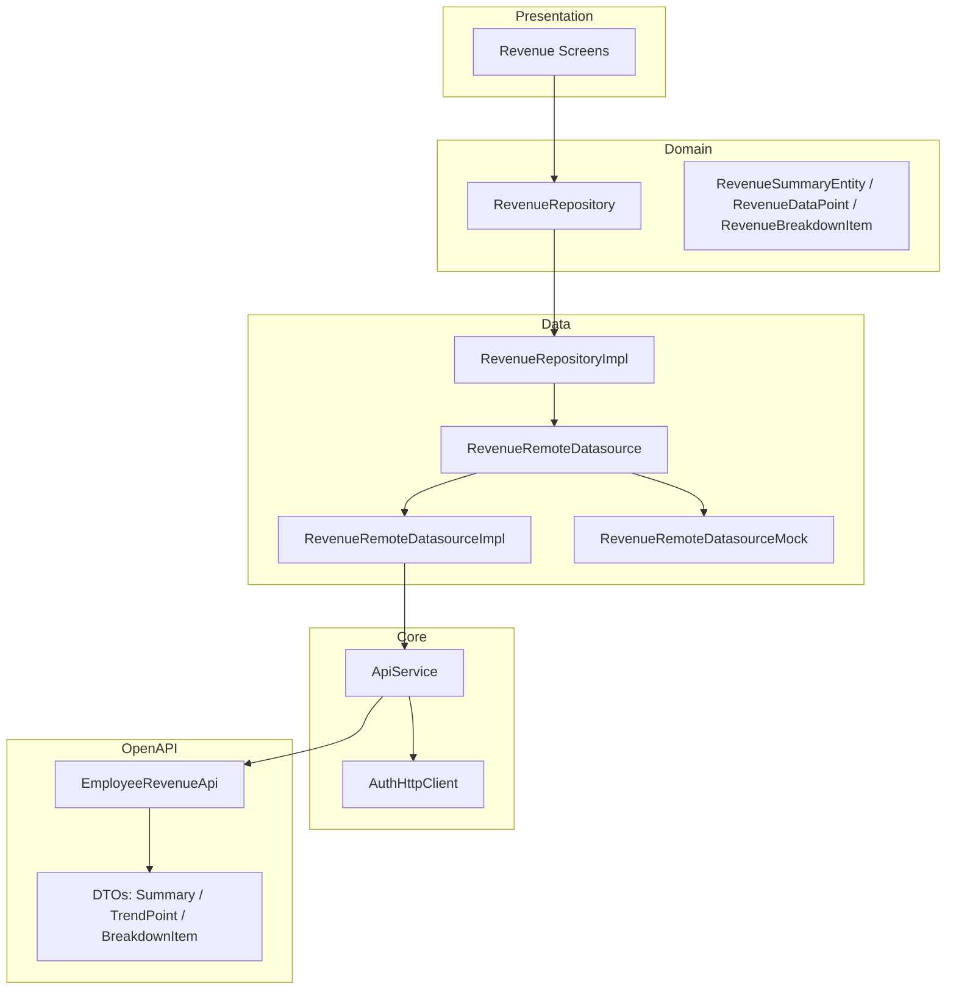

# Design Document: Revenue API Integration

## Overview

This design replaces the stub `RevenueRemoteDatasourceImpl` (which throws `UnimplementedError`) with a real implementation that delegates to the OpenAPI-generated `EmployeeRevenueApi`. The integration follows the established pattern from the appointments feature: `ApiService` holds the API client instance, the real datasource receives `ApiService` via constructor injection, and the Riverpod provider switches between mock and real based on `AppEnvironment`.

The scope is intentionally narrow — no new domain entities, no new screens, no new repository logic. The repository and UI layers remain unchanged; only the data layer's remote datasource and the `ApiService` registration are modified.

## Architecture



**Data flow (real mode):**
1. UI calls repository method (e.g., `getSummary`)
2. Repository delegates to `RevenueRemoteDatasource`
3. Provider resolves to `RevenueRemoteDatasourceImpl` (when `useMock == false`)
4. Impl maps domain `RevenuePeriod` → OpenAPI `EmployeeRevenuePeriod`
5. Impl formats optional `DateTime` → `String?` (yyyy-MM-dd)
6. Impl calls `EmployeeRevenueApi` method via `apiService.employeeRevenueApi`
7. Impl maps response DTO → domain entity (num→double, num→int)
8. Entity flows back up through repository to UI

## Components and Interfaces

### 1. ApiService (modified)

**File:** `lib/core/services/api.service.dart`

**Changes:**
- Add field: `late EmployeeRevenueApi employeeRevenueApi`
- In `setEndpoint()`, after existing backend API assignments, add:
  ```dart
  employeeRevenueApi = EmployeeRevenueApi(backend);
  ```

**Rationale:** Follows the exact pattern of `employeeAppointmentsApi`. All API clients share the same authenticated `ApiClient` instance.

### 2. RevenueRemoteDatasourceImpl (rewritten)

**File:** `lib/features/revenue/data/datasources/remote/revenue_remote_datasource.dart`

**Constructor:**
```dart
class RevenueRemoteDatasourceImpl implements RevenueRemoteDatasource {
  final ApiService apiService;
  RevenueRemoteDatasourceImpl({required this.apiService});
}
```

**Internal helpers:**
- `_mapPeriod(RevenuePeriod) → EmployeeRevenuePeriod` — exhaustive switch expression
- `_formatDate(DateTime?) → String?` — formats as yyyy-MM-dd or returns null
- `_mapPeriodBack(EmployeeRevenuePeriod) → RevenuePeriod` — reverse mapping for summary response

**Methods:**

| Method | API Call | Return Mapping |
|--------|----------|----------------|
| `getSummary` | `employeeRevenueControllerGetSummary(period, date)` | DTO → `RevenueSummaryEntity` |
| `getTrendData` | `employeeRevenueControllerGetTrend(period, date)` | `List<DTO>` → `List<RevenueDataPoint>` |
| `getBreakdown` | `employeeRevenueControllerGetBreakdown(period, date)` | `List<DTO>` → `List<RevenueBreakdownItem>` |

**Error handling pattern** (consistent with appointments):
```dart
try {
  // API call + mapping
} on ApiException catch (e) {
  log('Failed to fetch revenue summary: ${e.code}', name: 'RevenueRemoteDatasource');
  rethrow;
}
```

### 3. Provider Update

**Same file as datasource.**

```dart
@Riverpod(keepAlive: true)
RevenueRemoteDatasource revenueRemoteDatasource(Ref ref) {
  if (AppEnvironment.current.useMock) return RevenueRemoteDatasourceMock();
  final apiService = ref.read(apiServiceProvider);
  return RevenueRemoteDatasourceImpl(apiService: apiService);
}
```

**Rationale:** Mirrors the `employeeAppointmentRemoteDatasourceProvider` pattern exactly.

### 4. RevenueRemoteDatasourceMock (unchanged)

No modifications. Remains independently instantiable with no constructor arguments.

## Data Models

### Type Conversion Table

| DTO Field | DTO Type | Entity Field | Entity Type | Conversion |
|-----------|----------|--------------|-------------|------------|
| `totalRevenue` | `num` | `totalRevenue` | `double` | `.toDouble()` |
| `totalCommission` | `num` | `totalCommission` | `double` | `.toDouble()` |
| `netEarnings` | `num` | `netEarnings` | `double` | `.toDouble()` |
| `completedAppointments` | `num` | `completedAppointments` | `int` | `.toInt()` |
| `canceledAppointments` | `num` | `canceledAppointments` | `int` | `.toInt()` |
| `period` | `EmployeeRevenuePeriod` | `period` | `RevenuePeriod` | `_mapPeriodBack()` |
| `periodStart` | `DateTime` | `periodStart` | `DateTime` | direct |
| `periodEnd` | `DateTime` | `periodEnd` | `DateTime` | direct |
| `amount` (trend) | `num` | `amount` | `double` | `.toDouble()` |
| `date` (trend) | `DateTime` | `date` | `DateTime` | direct |
| `label` (trend) | `String` | `label` | `String` | direct |
| `serviceName` (breakdown) | `String` | `serviceName` | `String` | direct |
| `count` (breakdown) | `num` | `count` | `int` | `.toInt()` |
| `totalAmount` (breakdown) | `num` | `totalAmount` | `double` | `.toDouble()` |

### Enum Mapping

```dart
EmployeeRevenuePeriod _mapPeriod(RevenuePeriod period) => switch (period) {
  RevenuePeriod.day => EmployeeRevenuePeriod.day,
  RevenuePeriod.month => EmployeeRevenuePeriod.month,
  RevenuePeriod.year => EmployeeRevenuePeriod.year,
};

RevenuePeriod _mapPeriodBack(EmployeeRevenuePeriod period) => switch (period) {
  EmployeeRevenuePeriod.day => RevenuePeriod.day,
  EmployeeRevenuePeriod.month => RevenuePeriod.month,
  EmployeeRevenuePeriod.year => RevenuePeriod.year,
  _ => RevenuePeriod.day, // defensive fallback
};
```

### Date Formatting

```dart
String? _formatDate(DateTime? date) {
  if (date == null) return null;
  return '${date.year.toString().padLeft(4, '0')}-'
      '${date.month.toString().padLeft(2, '0')}-'
      '${date.day.toString().padLeft(2, '0')}';
}
```

**Design decision:** Using manual string formatting instead of `DateFormat` from `intl` to avoid importing a heavy package for a trivial operation. The format is fixed (yyyy-MM-dd) and doesn't require locale awareness.

## Correctness Properties

*A property is a characteristic or behavior that should hold true across all valid executions of a system — essentially, a formal statement about what the system should do. Properties serve as the bridge between human-readable specifications and machine-verifiable correctness guarantees.*

### Property 1: Period enum mapping is name-preserving

*For any* `RevenuePeriod` value, mapping it to `EmployeeRevenuePeriod` via `_mapPeriod` SHALL produce a value whose `.value` string equals the `RevenuePeriod` enum's `.name` property.

**Validates: Requirements 2.1, 2.2, 2.3**

### Property 2: Summary DTO mapping preserves numeric values

*For any* valid `EmployeeRevenueSummaryResponseDto` with arbitrary `num` field values, mapping it to `RevenueSummaryEntity` SHALL produce an entity where `totalRevenue == dto.totalRevenue.toDouble()`, `totalCommission == dto.totalCommission.toDouble()`, `netEarnings == dto.netEarnings.toDouble()`, `completedAppointments == dto.completedAppointments.toInt()`, `canceledAppointments == dto.canceledAppointments.toInt()`, and `periodStart`/`periodEnd` are preserved unchanged.

**Validates: Requirements 3.2**

### Property 3: Trend DTO list mapping preserves all data points

*For any* list of valid `EmployeeRevenueTrendPointDto` objects, mapping to `List<RevenueDataPoint>` SHALL produce a list of the same length where each element has `amount == dto.amount.toDouble()`, `date == dto.date`, and `label == dto.label`.

**Validates: Requirements 4.2**

### Property 4: Breakdown DTO list mapping preserves all items

*For any* list of valid `EmployeeRevenueBreakdownItemDto` objects, mapping to `List<RevenueBreakdownItem>` SHALL produce a list of the same length where each element has `serviceName == dto.serviceName`, `count == dto.count.toInt()`, and `totalAmount == dto.totalAmount.toDouble()`.

**Validates: Requirements 5.2**

### Property 5: Date formatting produces valid ISO 8601 date-only strings

*For any* non-null `DateTime` value (regardless of time component), `_formatDate` SHALL produce a string matching the pattern `^\d{4}-\d{2}-\d{2}$` where the year, month, and day components equal the original DateTime's `.year`, `.month`, and `.day` properties respectively.

**Validates: Requirements 8.1, 8.3**

## Error Handling

| Scenario | Behavior | Rationale |
|----------|----------|-----------|
| API returns valid DTO | Map to domain entity and return | Happy path |
| API returns `null` (204) on `getSummary` | Throw exception with descriptive message | Summary is required data; null means no data exists for the period |
| API returns `null` on `getTrendData` | Return empty `List<RevenueDataPoint>` | Trend can legitimately be empty (no data yet) |
| API returns `null` on `getBreakdown` | Return empty `List<RevenueBreakdownItem>` | Breakdown can legitimately be empty |
| API throws `ApiException` | Log error code with `dart:developer` `log()`, then `rethrow` | Preserves original exception for upstream handling; logging aids debugging |
| Network timeout / SocketException | Not caught at datasource level — propagates naturally | Repository or presentation layer handles connectivity errors |

**Logging convention:**
```dart
log('Failed to fetch revenue summary: ${e.code}', name: 'RevenueRemoteDatasource');
```

## Testing Strategy

### Unit Tests (example-based)

| Test Case | What it verifies |
|-----------|-----------------|
| `setEndpoint` initializes `employeeRevenueApi` | Requirement 1.2, 1.3 |
| `getSummary` passes correct mapped period to API | Requirement 2.5, 3.1 |
| `getSummary` formats date as yyyy-MM-dd | Requirement 8.1 |
| `getSummary` passes null when date is null | Requirement 8.2 |
| `getSummary` throws on null API response | Requirement 3.3 |
| `getSummary` logs and rethrows ApiException | Requirement 3.4 |
| `getTrendData` returns empty list on null response | Requirement 4.3 |
| `getTrendData` logs and rethrows ApiException | Requirement 4.4 |
| `getBreakdown` returns empty list on null response | Requirement 5.3 |
| `getBreakdown` logs and rethrows ApiException | Requirement 5.4 |
| Provider returns mock when `useMock == true` | Requirement 7.2 |
| Provider returns real impl with ApiService when `useMock == false` | Requirement 7.1 |
| Mock instantiates without ApiService | Requirement 6.3 |

### Property-Based Tests

**Library:** `test` + `dart_check` (or manual randomized generation with Dart's `Random`)

**Configuration:** Minimum 100 iterations per property test.

| Property | Tag | What it validates |
|----------|-----|-------------------|
| 1 | `Feature: revenue-api-integration, Property 1: Period enum mapping is name-preserving` | All RevenuePeriod values map correctly |
| 2 | `Feature: revenue-api-integration, Property 2: Summary DTO mapping preserves numeric values` | num→double/int conversions are lossless |
| 3 | `Feature: revenue-api-integration, Property 3: Trend DTO list mapping preserves all data points` | List mapping preserves length and values |
| 4 | `Feature: revenue-api-integration, Property 4: Breakdown DTO list mapping preserves all items` | List mapping preserves length and values |
| 5 | `Feature: revenue-api-integration, Property 5: Date formatting produces valid ISO 8601 date-only strings` | Date formatting correctness across all dates |

**Note:** Properties 2, 3, and 4 require generating random DTO instances. Since the OpenAPI DTOs use `num` fields, generators should produce both integer and floating-point values to exercise `.toDouble()` and `.toInt()` edge cases (e.g., `3.0` vs `3.7` for int conversion).

### Integration Tests

- End-to-end test with a running backend (manual or CI) verifying that the real datasource successfully fetches and maps data for each endpoint.
- Verify authenticated requests include the Bearer token header.
