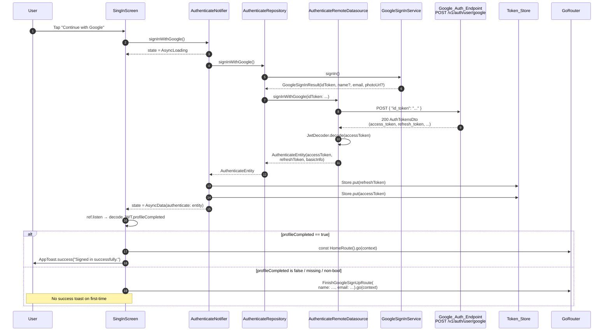
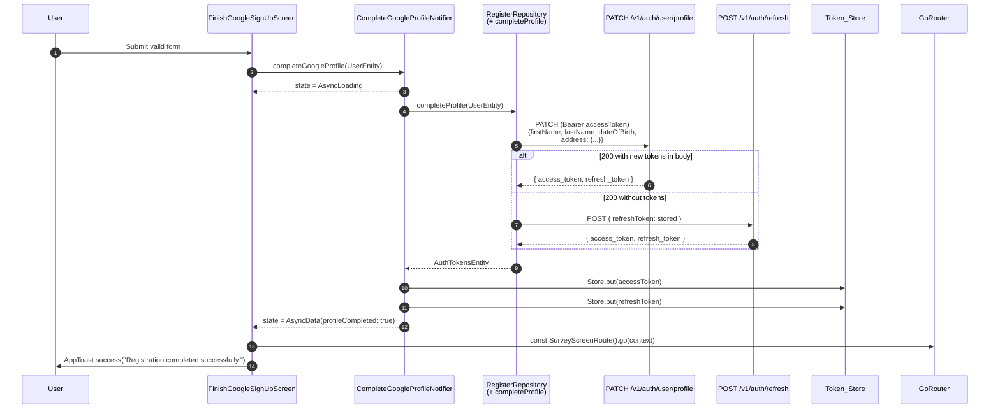

# Design Document — Google Sign-In

## 1. Overview

Add a working Google Sign-In path to the Healytics user app. The existing
`SingInScreen` at `lib/features/authenticate/presentation/screens/signin.screen.dart`
already renders a "Continue with Google" `AppButton` keyed by
`keys.signInPage.googleButton` with an empty `onPressed` callback. This design
turns that placeholder into a complete flow that:

1. Triggers Google's interactive OAuth flow on the device through the
   `google_sign_in` package, isolated behind a `GoogleSignInService` so the
   plugin is the only third-party API touched outside one file.
2. Exchanges the resulting `Google_ID_Token` with a new backend route
   `POST /v1/auth/user/google` for a Healytics access/refresh JWT pair, mirroring
   the existing `loginUser()` data path in
   `lib/features/authenticate/data/datasources/remote/authenticate_remote_datasource.dart`.
3. Branches navigation on the JWT `profileCompleted` claim (default `false` when
   the claim is missing/null/non-boolean): first-time → new
   `FinishGoogleSignUpRoute`; returning → existing `HomeRoute`.
4. Adds a new `FinishGoogleSignUpScreen` modeled on `FinishSignUpScreen` (no
   password section, name pre-fill from the Google account) plus a dedicated
   `completeGoogleProfileNotifier` that posts the profile update, refreshes
   tokens, and navigates to `SurveyScreenRoute`.

**In scope.** Items 1–4 above plus a complete configuration guide for the
Google Cloud Console, Android/iOS/Web platform integration, and the
`GOOGLE_OAUTH_WEB_CLIENT_ID` env wiring on the backend. A backend contract
is fully specified (Section 4.2) so backend implementation can proceed in
parallel.

**Explicitly deferred.** Apple Sign-In (Req glossary mentions `facebookButton`
and similar but only Google is in scope for this spec); offline access
(`serverAuthCode` exchange); biometric sign-in; account-link UI for the
HTTP-409 case (the user is told to sign in with email and password — a true
"link your Google account to your existing password account" flow is a
separate spec). A Google-link table on the backend (`account_google_links`)
is flagged in §9 as a follow-up.

---

## 2. Architecture

### 2.1 Layering

The Google flow follows the existing Clean-Architecture layout from
`.agent/rules/core-architecture.md`:

```
Presentation              Domain                    Data
─────────────             ─────────────             ─────────────
SingInScreen              AuthenticateRepository    AuthenticateRemoteDatasource
  └─ ref.listen ──▶       (+ signInWithGoogle)      (+ signInWithGoogle)
AuthenticateNotifier  ─▶  ─────────────             └─ ApiService
  (+ signInWithGoogle)    GoogleSignInResult           (POST /v1/auth/user/google)
                          (entity)                  GoogleSignInService
FinishGoogleSignUpScreen                            (wraps google_sign_in pkg)
  └─ ref.listen ──▶
CompleteGoogleProfileNotifier
                          UserEntity (reuse)        Profile-update method
                                                    (extension on register
                                                     remote datasource;
                                                     PATCH /v1/auth/user/profile)
```

Only `GoogleSignInService` (data layer) imports
`package:google_sign_in/google_sign_in.dart`. Everything above the data layer
sees a `GoogleSignInResult` freezed entity.

### 2.2 Sequence — first-time and returning sign-in



Validates: Reqs 1.1–1.8, 2.1–2.6, 3.1–3.7, 4.1–4.5, 8.1, 9.1–9.5, 10.1–10.12, 11.1–11.3.

### 2.3 Sequence — profile completion



Validates: Reqs 5.8, 6.1–6.10.

---

## 3. Component Design

Each entry lists path → responsibility → public surface → test seam.

### 3.1 Data layer

**`lib/features/authenticate/data/services/google_sign_in.service.dart`** (new)
- Responsibility: only file in the codebase that imports `package:google_sign_in/google_sign_in.dart`. Initialises the plugin with `serverClientId = AppEnvironment.googleServerClientId`, requests scopes `['openid', 'email', 'profile']`, returns an immutable `GoogleSignInResult` or `null` (cancellation).
- Public surface:
  ```dart
  abstract class GoogleSignInService {
    Future<GoogleSignInResult?> signIn();
    Future<void> signOut();
  }

  class GoogleSignInServiceImpl implements GoogleSignInService { … }

  @Riverpod(keepAlive: true)
  GoogleSignInService googleSignInService(Ref ref) =>
      GoogleSignInServiceImpl();
  ```
- Test seam: tests inject a fake `GoogleSignInService` via `ProviderContainer.overrides`. The wrapping interface lets us simulate cancellation (`null`), success (a `GoogleSignInResult`), and platform exceptions without spinning up the plugin.

**`lib/features/authenticate/domain/entities/google_sign_in_result.entity.dart`** (new)
- Responsibility: framework-neutral DTO for the result of the device-side Google flow. Pure Dart, no Flutter imports.
- Public surface:
  ```dart
  @Freezed(toJson: true)
  abstract class GoogleSignInResult with _$GoogleSignInResult {
    const factory GoogleSignInResult({
      required String idToken,
      required String email,
      String? displayName,
      String? photoUrl,
    }) = _GoogleSignInResult;

    factory GoogleSignInResult.fromJson(Map<String, dynamic> json) =>
        _$GoogleSignInResultFromJson(json);
  }
  ```
- Test seam: freezed equality + `fromJson` enables JSON round-trip property tests.

**`lib/features/authenticate/data/datasources/remote/authenticate_remote_datasource.dart`** (extend)
- Add to abstract interface and impl:
  ```dart
  Future<AuthenticateEntity> signInWithGoogle({required String idToken});
  ```
- Implementation mirrors the existing `login()` body: POST via
  `apiService.apiClient.invokeAPI('/auth/user/google', 'POST', …)` with body
  `{ 'id_token': idToken }` and a 30-second timeout (`.timeout(const Duration(seconds: 30))`).
  Decode JSON, build `AuthenticateEntity` exactly the way `login()` does:
  decode JWT, extract `BasicInfoEntity(email, name)`, return entity. Reuse
  `_messageFromResponse(...)` for error parsing. The codegen path
  `apiService.authenticateApi.authControllerSignInWithGoogle(...)` will become
  available once the backend adds the route and `openapi/openapi.json` is
  regenerated; until then the manual `invokeAPI` fallback (already used by
  `requestPasswordReset`/`resetPassword`) keeps the data layer self-contained.
- Test seam: existing pattern of injecting a mock `ApiService` via
  `apiServiceProvider.overrideWithValue(...)` in tests.

**`lib/features/authenticate/domain/repositories/authenticate.repository.dart`** (extend)
- Add abstract:
  ```dart
  Future<AuthenticateEntity> signInWithGoogle();
  ```
  Note: the repository takes no arguments — it owns the orchestration of
  calling the device-side `GoogleSignInService` and then forwarding the
  resulting `idToken` to the data source. Cancellations propagate as
  `GoogleSignInCancelledException` (defined alongside the repository).
- Test seam: domain abstract is trivially fakeable in notifier tests.

**`lib/features/authenticate/data/repositories/authenticate_repository_impl.dart`** (extend)
- New method:
  ```dart
  @override
  Future<AuthenticateEntity> signInWithGoogle() async {
    final result = await _googleSignInService.signIn();
    if (result == null) {
      throw const GoogleSignInCancelledException();
    }
    if (result.idToken.isEmpty) {
      throw AppException.unexpected(
        message: 'Google did not return an ID token',
      );
    }
    return _remoteDatasource.signInWithGoogle(idToken: result.idToken);
  }
  ```
- Constructor takes a new `GoogleSignInService` field; provider becomes:
  ```dart
  return AuthenticateRepositoryImplement(
    remoteDatasource: ref.watch(authenticateRemoteDatasourceProvider),
    googleSignInService: ref.watch(googleSignInServiceProvider),
  );
  ```
- Test seam: both dependencies are interface-typed and injected via providers.

### 3.2 Presentation layer (sign-in)

**`lib/features/authenticate/presentation/providers/authenticate.provider.dart`** (extend)
- Add `signInWithGoogle()`. **Does not perform navigation** (Req 4.5) — emits state only:
  ```dart
  Future<void> signInWithGoogle() async {
    try {
      state = const AsyncLoading();
      final entity = await ref.read(authenticateRepositoryProvider)
          .signInWithGoogle();

      // Same write order as login() so the redirect guard
      // (which watches access_token) only fires after the
      // refresh_token is already persisted.
      await Store.put(StoreKey.refreshToken, entity.refreshToken);
      if (!ref.mounted) return;
      state = AsyncData(AuthenticateStateData(authenticate: entity));
      await Store.put(StoreKey.accessToken, entity.accessToken);

      unawaited(_initializePushNotifications());
    } on GoogleSignInCancelledException {
      // Restore the previous successful state so the
      // listener does not see an error → no toast.
      // Reqs 1.8, 2.6.
      state = AsyncData(state.value ?? const AuthenticateStateData());
    } on ApiException catch (e) {
      _log.warning('Google sign-in failed', e);
      await _clearTokensIfPartial();
      state = AsyncError(AppException.fromError(e),
          e.stackTrace ?? StackTrace.current);
    } catch (e, stack) {
      _log.warning('Google sign-in failed unexpectedly', e);
      await _clearTokensIfPartial();
      state = AsyncError(AppException.fromError(e), stack);
    }
  }
  ```
  `_clearTokensIfPartial()` removes `accessToken`/`refreshToken` so a half-written
  pair never persists (Req 7.7).
- Test seam: provider is already overridable; tests stub
  `authenticateRepositoryProvider` with a fake repository.

**`lib/features/authenticate/presentation/screens/signin.screen.dart`** (edit)
- Wire the existing `googleButton.onPressed` to call
  `ref.read(authenticateNotifierProvider.notifier).signInWithGoogle()`.
- Read `authenticateNotifierProvider`'s `isLoading` to:
  - Pass `isLoading: googleIsLoading` to the Google `AppButton`. The existing
    `LoginForm` widget already reads the same state for the email/password
    button, so both buttons disable in lockstep (Reqs 1.3, 1.4). The Google
    button shows the spinner via `LoadingContainer`; the email button does
    not, because we trigger sign-in only from the Google button.
- Replace the existing `ref.listen(authenticateProvider, …)` body with the
  decision tree in §5.2.
- Test seam: widget tests use `ProviderScope(overrides: [...])` to swap the
  notifier with a stub that emits a chosen `AsyncValue`.

### 3.3 Presentation layer (profile completion)

**`lib/features/onboarding/sign_up/presentation/screens/finish_google_sign_up.dart`** (new)
- Responsibility: clone of `FinishSignUpScreen` minus the `PasswordSection`.
  Accepts optional `name` and `email` constructor parameters that come from
  query string (Req 9.2).
- Public surface:
  ```dart
  class FinishGoogleSignUpScreen extends HookConsumerWidget {
    const FinishGoogleSignUpScreen({
      super.key,
      this.googleDisplayName,
      this.googleEmail,
    });
    final String? googleDisplayName;
    final String? googleEmail;
  }
  ```
- Pre-fill rule for `first_name`/`last_name`:
  ```dart
  ({String first, String last}) _splitName(String? raw) {
    final value = raw?.trim() ?? '';
    if (value.isEmpty) return (first: '', last: '');
    final i = value.indexOf(RegExp(r'\s'));
    if (i < 0) return (first: value, last: '');
    return (
      first: value.substring(0, i),
      last: value.substring(i).trimLeft(),
    );
  }
  ```
  This satisfies Req 5 criteria 2, 3, 10:
  - `"John Doe"` → first: `John`, last: `Doe`
  - `"Cher"` → first: `Cher`, last: `""`
  - `""` / `null` → both empty
  - `"   "` → both empty (trim before split)
  - `"Mary Anne Smith"` → first: `Mary`, last: `Anne Smith`
- Reuses unchanged: `LegalNameSection`, `DateOfBirthSection`, `AddressSection`,
  `TermsAndSubmitSection`. Passes initial values into
  `FormBuilder(initialValue: { 'first_name': first, 'last_name': last })`.
- Validators identical to `FinishSignUpScreen` (Req 5.5):
  `FormValidators.fullName` for first/last, `FormValidators.dateOfBirth(minAge: 16)`
  for DOB, `FormValidators.requiredField` for address fields. Password
  validators are not invoked anywhere.
- `isFilledAll` matches `FinishSignUpScreen._isFormDataValid` minus the
  `password`/`confirm_password` validators.
- Test seam: widget test mounts the screen with each pre-fill case from §8 and
  asserts initial field text.

**`lib/features/onboarding/sign_up/presentation/providers/finish_google_sign_up.provider.dart`** (new)
- Responsibility: dedicated notifier for the profile-completion call. Lives
  next to `register_flow_provider.dart` so it can reuse
  `registerRepositoryProvider`.
- Public surface:
  ```dart
  @Freezed(toJson: true)
  abstract class CompleteGoogleProfileStateData
      with _$CompleteGoogleProfileStateData {
    const factory CompleteGoogleProfileStateData({
      @Default(false) bool isProfileCompleted,
    }) = _CompleteGoogleProfileStateData;
    factory CompleteGoogleProfileStateData.fromJson(
        Map<String, dynamic> json) =>
        _$CompleteGoogleProfileStateDataFromJson(json);
  }

  @riverpod
  class CompleteGoogleProfileNotifier
      extends _$CompleteGoogleProfileNotifier {
    @override
    Future<CompleteGoogleProfileStateData> build() async =>
        const CompleteGoogleProfileStateData();

    Future<void> completeGoogleProfile(UserEntity profile) async { … }
  }
  ```
- Algorithm:
  1. `state = const AsyncLoading();`
  2. Call `registerRepositoryProvider.completeProfile(profile)` (new method,
     §3.4).
  3. If the response includes `accessToken`/`refreshToken`, persist them.
  4. Otherwise call `apiService.authenticateApi.authControllerRefresh(...)`
     with the stored `refreshToken` and persist the returned tokens.
  5. Emit `AsyncData(CompleteGoogleProfileStateData(isProfileCompleted: true))`.
  6. On any failure: classify as 4xx / 5xx / network using
     `AppException.fromError` and emit `AsyncError`. Do **not** clear tokens
     (Req 6.10).
- Test seam: provider's only collaborator is `registerRepositoryProvider`,
  which is already mockable.

### 3.4 Profile-update endpoint — choice and rationale

The existing `RegisterRemoteDatasource.completeRegistration()` calls
`POST /v1/auth/user/register` with `RegisterDto`. That endpoint **creates** an
account; using it on a Google-signed-in user would 409 on the email check.
The existing `AccountController` exposes only `getMe`, `updateAvatar`,
`getSurvey`, `postSurvey` — no profile-update route.

**Decision.** Add a new method `completeProfile(UserEntity)` to
`RegisterRemoteDatasource` (and to `RegisterRepository`) that targets a new
backend route `PATCH /v1/auth/user/profile` (Section 4.2.2). The method body
mirrors `completeRegistration()` but uses `apiService.apiClient.invokeAPI(...)`
with method `PATCH` because the OpenAPI client will not have the new endpoint
until the backend ships and `openapi.json` is regenerated.

**Why reuse `RegisterRemoteDatasource` instead of a new file.** The shape
(`firstName`, `lastName`, `dateOfBirth`, address) is identical to what
`RegisterProfileDto` already accepts, so the DTO mapping stays in one place.
The Google flow does not need a separate domain repository — the operation is
"complete the account profile", which is a registration concern.

**Test seam.** `RegisterRemoteDatasource` is already injected through
`registerRemoteDatasourceProvider`; the new method is testable via the same
`ApiService` mock.

### 3.5 Routing

**`lib/router/routes.dart`** (extend)
- Add a new typed route after `FinishSignUpRoute`:
  ```dart
  @TypedGoRoute<FinishGoogleSignUpRoute>(
    path: '/finish_google_sign_up',
    name: FinishGoogleSignUpRoute.name,
  )
  class FinishGoogleSignUpRoute extends GoRouteData
      with $FinishGoogleSignUpRoute {
    static const String pathPattern = '/finish_google_sign_up';
    static const bool isPublic = true;
    static const name = 'finish_google_sign_up';

    const FinishGoogleSignUpRoute({this.name, this.email});
    final String? name;   // Google display name (query)
    final String? email;  // Google email (query)

    @override
    Page<void> buildPage(BuildContext context, GoRouterState state) {
      return _buildSlideTransitionPage(
        pageKey: state.pageKey,
        child: FinishGoogleSignUpScreen(
          googleDisplayName: name,
          googleEmail: email,
        ),
      );
    }
  }
  ```
  Always returns a slide-transition page (Req 9.3); never falls back to
  another transition.
- Test seam: `routes.g.dart` regenerates via
  `dart run build_runner build --delete-conflicting-outputs`.

**`lib/router/app_router.dart`** (extend)
- Add `FinishGoogleSignUpRoute` to the `isPublicRoute` chain (same shape as
  the existing entries).
- Add a redirect guard for Req 5.12. Because the redirect runs in
  `RouterListenable.redirect` and that method already accesses
  `authSessionStoreProvider`, we can read a transient flag the
  `AuthenticateNotifier` writes on a successful Google sign-in:
  ```dart
  if (path == FinishGoogleSignUpRoute.pathPattern &&
      ref.read(googleSignInJustCompletedProvider) != true) {
    return SignInRoute.pathPattern;
  }
  ```
  `googleSignInJustCompletedProvider` is a `StateProvider<bool>` cleared on
  navigation away from `FinishGoogleSignUpRoute` (set inside the screen's
  `dispose` via `ref`).
- Test seam: a unit test instantiates `RouterListenable.redirect` with a
  `ProviderContainer` and asserts the returned path.

### 3.6 Storage and logout

**`lib/core/models/store.model.dart`** — **no changes required.** The Google
flow returns the same `access_token`/`refresh_token` pair as `loginUser()`;
the optional `access_expires_in`/`refresh_expires_in` strings are already
embedded in the JWT (`exp` claim) and `JwtDecoder.isExpired` is what
`AuthSessionStore._isTokenValid` already uses, so no additional `StoreKey` is
needed (Req 8.2 holds vacuously). If a future change requires storing the
TTL separately, add `accessExpiresIn` and `refreshExpiresIn` to the existing
enum — never a parallel store.

**`lib/features/profile/presentation/screens/profile.screen.dart`** (edit)
- Replace `_handleLogout` to also call
  `ref.read(googleSignInServiceProvider).signOut()` and `apiService
  .authenticateApi.authControllerLogout()` with timeouts:
  ```dart
  Future<void> _handleLogout(BuildContext context, WidgetRef ref) async {
    // ... existing dialog ...
    if (confirmed == true) {
      try {
        await apiService.authenticateApi
            .authControllerLogout()
            .timeout(const Duration(seconds: 10));
      } catch (e, s) {
        _log.warning('Server logout failed; clearing locally', e, s);
        if (context.mounted) {
          AppToast.warning(
            context,
            'Logged out locally; the server did not confirm.',
          );
        }
      }
      try {
        await ref
            .read(googleSignInServiceProvider)
            .signOut()
            .timeout(const Duration(seconds: 5));
      } catch (_) {}
      ref.read(authSessionStoreProvider).forceLogout();
    }
  }
  ```
  Validates Reqs 8.4, 8.5, 8.6.

---

## 4. Data Contract & DTOs

### 4.1 Flutter side

**Request body sent to `POST /v1/auth/user/google`** — snake_case to match
`AuthTokensDto` and the rest of the auth controller:
```json
{ "id_token": "<Google_ID_Token>" }
```

**Response body — HTTP 200**, identical shape to `AuthTokensDto`:
```json
{
  "access_token": "eyJhbGciOiJIUzI1NiIs…",
  "refresh_token": "eyJhbGciOiJIUzI1NiIs…",
  "access_expires_in": "3600s",
  "refresh_expires_in": "7d"
}
```

**Existing `AuthenticateEntity`** lives at
`lib/features/authenticate/domain/entities/authenticate.entity.dart` and is
already declared with `@Freezed(toJson: true)`. Its current shape uses
camelCase:
```dart
const factory AuthenticateEntity({
  required String accessToken,
  required String refreshToken,
  BasicInfoEntity? basicInfo,
});
```
Because the wire format is snake_case but the entity is camelCase, the
remote datasource manually constructs the entity — exactly as the existing
`login()` method does:
```dart
AuthenticateEntity.fromJson({
  'accessToken': bodyMap['access_token'],
  'refreshToken': bodyMap['refresh_token'],
  'basicInfo': basicInfo.toJson(),
})
```
**Decision: no `@JsonKey(name: 'access_token')` is added.** Doing so would
break the existing `login()` data path. The mapping stays in the data source
to keep the contract identical between the email/password and Google flows
(Req 11.2).

**`BasicInfoEntity` extraction from JWT.** Mirroring lines 41–55 of
`authenticate_remote_datasource.dart#login`:
```dart
final claims = JwtDecoder.decode(response['access_token']);
var basicInfo = BasicInfoEntity(email: claims['email'] as String);
if (claims['firstName'] != null && claims['lastName'] != null) {
  basicInfo = basicInfo.copyWith(
    name: '${claims['firstName']} ${claims['lastName']}',
  );
}
```
Validates Req 11.3.

### 4.2 Backend side

#### 4.2.1 Google sign-in endpoint

**`backend/src/auth/dto/request/google-sign-in.dto.ts`** (new)
```ts
import { ApiProperty } from '@nestjs/swagger';
import { IsNotEmpty, IsString } from 'class-validator';

export class GoogleSignInDto {
  @ApiProperty({ example: 'eyJhbGciOiJSUzI1NiIs…',
    description: 'Google-issued ID token (audience must equal '
                + 'GOOGLE_OAUTH_WEB_CLIENT_ID).' })
  @IsString()
  @IsNotEmpty()
  id_token: string;
}
```

**`backend/src/auth/auth.controller.ts`** — add a method beside `loginUser`:
```ts
@Post('user/google')
@Public()
@Throttle({ default: { limit: 1000, ttl: 60000 } })
@HttpCode(HttpStatus.OK)
@ApiOperation({ summary: 'Sign in with a Google ID token' })
@ApiOkResponse({ type: AuthTokensDto })
async signInWithGoogle(
  @Body() dto: GoogleSignInDto,
): Promise<AuthTokensDto> {
  return this.authService.signInWithGoogle(dto.id_token);
}
```

**`auth.service.ts` — outline of `signInWithGoogle(idToken)`:**
1. `if (!process.env.GOOGLE_OAUTH_WEB_CLIENT_ID)` → throw
   `InternalServerErrorException` with body `{ code: 'GOOGLE_OAUTH_NOT_CONFIGURED' }`
   (Req 10.12).
2. `const ticket = await new OAuth2Client(...).verifyIdToken({ idToken,
   audience: GOOGLE_OAUTH_WEB_CLIENT_ID })`. On failure → 401
   `{ code: 'GOOGLE_TOKEN_INVALID' }` (Req 10.4).
3. Read `email`, `email_verified`, `given_name`, `family_name`, `picture`,
   `sub` from the verified payload. If `email_verified !== true` → 401
   `{ code: 'GOOGLE_EMAIL_NOT_VERIFIED' }` (defensive; not in Req but the
   verification library will not block on this, so we add it).
4. Lookup `Account` by lowercased email.
5. **Create-or-link branches:**
   - Account does **not** exist → insert `Account(email, passwordHash: null,
     role: USER)` + stub `UserProfile(firstName: given_name,
     lastName: family_name, profileCompleted: false)`. Issue tokens with
     `profileCompleted: false` (Req 10.6).
   - Account exists with `passwordHash != null` and no Google linkage →
     reject with HTTP 409 `{ code: 'EMAIL_ALREADY_REGISTERED_WITH_PASSWORD' }`
     (Req 10.7).
   - Account exists with `isActive === false` → 403
     `{ code: 'ACCOUNT_DISABLED' }` (Req 10.10).
   - Otherwise → issue tokens via `createTokensForUser(...)` (Req 10.8 / 10.9).
6. `this.logger.log("User signed in via Google: ${account.id}")` (Req 10.11).

**Error response examples:**
```json
// 401 GOOGLE_TOKEN_INVALID
{ "statusCode": 401,
  "message": "Invalid Google ID token",
  "code": "GOOGLE_TOKEN_INVALID" }

// 409 EMAIL_ALREADY_REGISTERED_WITH_PASSWORD
{ "statusCode": 409,
  "message": "Email already registered with a password",
  "code": "EMAIL_ALREADY_REGISTERED_WITH_PASSWORD" }

// 403 ACCOUNT_DISABLED
{ "statusCode": 403,
  "message": "Account is disabled",
  "code": "ACCOUNT_DISABLED" }

// 500 GOOGLE_OAUTH_NOT_CONFIGURED
{ "statusCode": 500,
  "message": "Google OAuth is not configured on the server",
  "code": "GOOGLE_OAUTH_NOT_CONFIGURED" }

// 401 GOOGLE_EMAIL_NOT_VERIFIED
{ "statusCode": 401,
  "message": "Google account email is not verified",
  "code": "GOOGLE_EMAIL_NOT_VERIFIED" }

// 502 GOOGLE_VERIFICATION_UNAVAILABLE (network failure to Google)
{ "statusCode": 502,
  "message": "Could not reach Google to verify the ID token",
  "code": "GOOGLE_VERIFICATION_UNAVAILABLE" }
```

#### 4.2.2 Profile-completion endpoint (new)

**`backend/src/auth/dto/request/complete-profile.dto.ts`** (new) — extends
`RegisterProfileDto` with required `firstName`, `lastName`, `dateOfBirth`,
plus the address subfields the Flutter form already collects:
```ts
export class CompleteProfileDto {
  @IsString() @IsNotEmpty() firstName: string;
  @IsString() @IsNotEmpty() lastName: string;
  @IsDateString()           dateOfBirth: string;
  @IsString() @IsNotEmpty() street: string;
  @IsString() @IsNotEmpty() ward: string;
  @IsString() @IsNotEmpty() district: string;
  @IsString() @IsNotEmpty() cityOrProvince: string;
}
```

**`auth.controller.ts`** — add:
```ts
@Patch('user/profile')
@UseGuards(JwtAuthGuard)
@HttpCode(HttpStatus.OK)
@ApiOperation({ summary: 'Complete the authenticated user profile' })
@ApiOkResponse({ type: AuthTokensDto })
async completeUserProfile(
  @Req() req,
  @Body() dto: CompleteProfileDto,
): Promise<AuthTokensDto> {
  return this.authService.completeUserProfile(req.user.id, dto);
}
```

**`auth.service.ts#completeUserProfile`** persists the fields on
`UserProfile` (`profileCompleted = true`) and re-signs a fresh token pair so
the next request carries `profileCompleted: true`. Returns the same
`AuthTokensDto`. The Flutter side persists those tokens before navigating
(Req 6.4).

**`backend/.env` and `backend/.env.sample` additions:**
```
GOOGLE_OAUTH_WEB_CLIENT_ID=
```

---

## 5. State Management & Navigation

### 5.1 `AsyncValue` transitions

**`AuthenticateNotifier.signInWithGoogle()`**

| Step                                         | `state` after step                                |
|----------------------------------------------|---------------------------------------------------|
| Method enters                                | `AsyncLoading<AuthenticateStateData>`             |
| Google plugin returns `null` (cancellation)  | `AsyncData(previous value or empty)`              |
| Google plugin throws PlatformException       | `AsyncError(AppException, stack)`                 |
| Backend 200 + JWT decodes                    | `AsyncData(AuthenticateStateData(authenticate))`  |
| Backend 4xx/5xx                              | `AsyncError(AppException.server(code, msg))`      |
| Network/timeout                              | `AsyncError(AppException.network(msg))`           |
| `Store.put(accessToken)` or `(refreshToken)` failure | `AsyncError(AppException.unexpected(msg))` after `_clearTokensIfPartial()` |

**`CompleteGoogleProfileNotifier.completeGoogleProfile(profile)`**

| Step                                         | `state` after step                                |
|----------------------------------------------|---------------------------------------------------|
| Method enters                                | `AsyncLoading<CompleteGoogleProfileStateData>`     |
| Profile-update + (optional) refresh succeed  | `AsyncData(isProfileCompleted: true)`             |
| 4xx                                          | `AsyncError(AppException.server(4xx, msg))`       |
| 5xx                                          | `AsyncError(AppException.server(5xx, msg))`       |
| Network/timeout                              | `AsyncError(AppException.network(msg))`           |
| Refresh fails after profile success          | `AsyncError(AppException…)` (tokens unchanged, Req 6.10) |

### 5.2 Sign-in screen `ref.listen` decision tree

```dart
ref.listen(authenticateNotifierProvider, (prev, next) {
  next.when(
    data: (data) {
      final entity = data.authenticate;
      if (entity == null) return;                 // Initial / reset
      if (prev?.isLoading != true) return;        // Only react once
      final completed = _decodeProfileCompleted(entity.accessToken);
      if (completed) {
        AppToast.success(context, 'Signed in successfully.');
        const HomeRoute().go(context);
      } else {
        // Mark a fresh Google sign-in so the redirect guard
        // for FinishGoogleSignUpRoute (Req 5.12) lets us in.
        ref.read(googleSignInJustCompletedProvider.notifier).state = true;
        FinishGoogleSignUpRoute(
          name: entity.basicInfo?.name,
          email: entity.basicInfo?.email,
        ).go(context);
      }
    },
    error: (err, _) {
      AppToast.error(context, _googleErrorToast(err));
    },
    loading: () {},
  );
});

bool _decodeProfileCompleted(String accessToken) {
  try {
    final claims = JwtDecoder.decode(accessToken);
    final raw = claims['profileCompleted'];
    return raw is bool && raw;       // missing/null/non-bool → false
  } catch (_) {
    return false;
  }
}
```

Validates Reqs 1.5–1.8, 4.1–4.5.

### 5.3 Redirect guard for `FinishGoogleSignUpRoute`

```dart
String? redirect(BuildContext context, GoRouterState state) {
  final path = state.uri.path;
  // ... existing guard ...
  if (path == FinishGoogleSignUpRoute.pathPattern) {
    final isLoggedIn = authSessionStore.isLoggedIn;
    final justCompletedGoogle =
        ref.read(googleSignInJustCompletedProvider) == true;
    if (!(isLoggedIn && justCompletedGoogle)) {
      return SignInRoute.pathPattern;       // Req 5.12
    }
  }
  // ... rest of the chain ...
}
```

`googleSignInJustCompletedProvider` is a `StateProvider<bool>` set inside
the listener (§5.2) and cleared by `FinishGoogleSignUpScreen.dispose()`
when the screen is left (whether by completing the form or by back
navigation). Validates Req 5.12.

---

## 6. Error Handling Matrix

Each row maps a Google sign-in failure to the four observable effects. All
error paths route through `AppException.fromError` so the `signin.screen.dart`
listener uses one shared toast helper.

| Trigger                                                   | Notifier emission                                                | Toast text                                                                 | Token_Store cleanup                                  | Button re-enable | Validates                            |
|-----------------------------------------------------------|------------------------------------------------------------------|----------------------------------------------------------------------------|------------------------------------------------------|------------------|--------------------------------------|
| User cancels Google picker (`null` from plugin)           | `AsyncData(previous)` (no error)                                 | _none_                                                                     | _none_                                                | yes              | 1.8, 2.6                              |
| `idToken` is empty in `GoogleSignInResult`                | `AsyncError(AppException.unexpected)`                            | "Could not complete Google sign-in. Please try again."                     | _none_ (tokens were never written)                    | yes              | 2.5, 7.5                              |
| Network error / DNS / TLS / no connectivity / 15 s no-resp| `AsyncError(AppException.network)`                               | "Network error. Please check your connection and try again."               | `accessToken` + `refreshToken` cleared                | yes              | 7.1, 7.6, 7.7                         |
| HTTP 401 + `code = GOOGLE_TOKEN_INVALID`                  | `AsyncError(AppException.server(401, …))`                        | "Could not verify your Google sign-in. Please try again."                  | both cleared                                          | yes              | 7.2, 7.6, 7.7                         |
| HTTP 409 + `code = EMAIL_ALREADY_REGISTERED_WITH_PASSWORD`| `AsyncError(AppException.server(409, …))`                        | "This email is already registered with a password. Please sign in with email and password instead." | both cleared                                          | yes              | 7.3, 7.6, 7.7                         |
| HTTP 403 + `code = ACCOUNT_DISABLED`                      | `AsyncError(AppException.server(403, …))`                        | "This account is disabled. Please contact support."                        | both cleared                                          | yes              | 7.4, 7.6, 7.7                         |
| HTTP 500 + `code = GOOGLE_OAUTH_NOT_CONFIGURED`           | `AsyncError(AppException.server(500, …))`                        | "Could not complete Google sign-in. Please try again."                     | both cleared                                          | yes              | 7.5, 7.6, 7.7                         |
| HTTP 401 + `code = GOOGLE_EMAIL_NOT_VERIFIED`             | `AsyncError(AppException.server(401, …))`                        | "Your Google email is not verified. Please verify it and try again."       | both cleared                                          | yes              | 7.5, 7.6, 7.7                         |
| HTTP 502 + `code = GOOGLE_VERIFICATION_UNAVAILABLE`       | `AsyncError(AppException.server(502, …))`                        | "Could not complete Google sign-in. Please try again."                     | both cleared                                          | yes              | 7.5, 7.6, 7.7                         |
| Any other non-2xx                                         | `AsyncError(AppException.server(code, …))`                       | "Could not complete Google sign-in. Please try again."                     | both cleared                                          | yes              | 7.5, 7.6, 7.7                         |
| `Store.put` write error after a 200                       | `AsyncError(AppException.unexpected)`                            | "Could not complete Google sign-in. Please try again."                     | both cleared (`_clearTokensIfPartial`)                | yes              | 3.7, 7.7                              |

The toast helper (`_googleErrorToast`) inspects `AppException` shape:
```dart
String _googleErrorToast(Object err) {
  if (err is NetworkException) {
    return 'Network error. Please check your connection and try again.';
  }
  if (err is ServerException) {
    final code = _codeFromMessage(err.message);
    return switch (code) {
      'GOOGLE_TOKEN_INVALID' =>
        'Could not verify your Google sign-in. Please try again.',
      'EMAIL_ALREADY_REGISTERED_WITH_PASSWORD' =>
        'This email is already registered with a password. '
        'Please sign in with email and password instead.',
      'ACCOUNT_DISABLED' =>
        'This account is disabled. Please contact support.',
      'GOOGLE_EMAIL_NOT_VERIFIED' =>
        'Your Google email is not verified. Please verify it and try again.',
      _ => 'Could not complete Google sign-in. Please try again.',
    };
  }
  return 'Could not complete Google sign-in. Please try again.';
}
```
Validates Req 7.8 — one toast per failure attempt because `ref.listen` only
fires once per state transition into `AsyncError`.

---

## 7. Configuration Guide

This section is fully self-contained; nothing else needs to be cross-read to
follow it. All values referenced (package names, bundle IDs, Flutter SDK
version, Riverpod versions) were lifted from `pubspec.yaml` directly.

### 7.1 Google Cloud Console (Req 12)

You will create **three** OAuth 2.0 client IDs — one Web, one Android, one
iOS — under the same project and the same OAuth consent screen (Reqs 14.5,
12.5).

1. Open <https://console.cloud.google.com/apis/credentials>, switch to the
   Healytics project.
2. **APIs & Services → OAuth consent screen** → ensure the app is configured
   (External, scopes `openid`, `email`, `profile`).
3. **Credentials → + CREATE CREDENTIALS → OAuth client ID**:
   - **Web application** — name `Healytics Backend (Web)`. Authorized
     JavaScript origins: `http://localhost:<port>` for local dev (use the
     Flutter Web dev port — typically `5050` or `5060`; see the value in
     `flutter run -d chrome --web-port=<port>` output) and the production
     `https://<your-prod-domain>` (one row per environment). No redirect
     URIs are required for ID-token-only flows. Save the **Client ID**;
     this is the `Google_Server_Client_ID`.
   - **Android** — name `Healytics User App (Android — debug)`. Package
     name: **`com.example.user_app`** (from `pubspec.yaml > patrol > android > package_name`).
     SHA-1: paste the value produced by §7.2.
     Repeat for `release`, naming it `Healytics User App (Android — release)`,
     supplying the **release** keystore SHA-1 *and* SHA-256 (Req 13.2).
   - **iOS** — name `Healytics User App (iOS)`. Bundle ID:
     **`com.example.userApp`** (from `pubspec.yaml > patrol > ios > bundle_id`).
     Save the **Client ID** and copy the auto-generated **Reversed client
     ID** of the form `com.googleusercontent.apps.<digits>-<hash>`.

> **Sanity check (Req 12.5).** The exact string from the Web client is what
> you put in `backend/.env`'s `GOOGLE_OAUTH_WEB_CLIENT_ID` *and* what the
> Flutter client passes as `serverClientId`. No surrounding whitespace.
> Misalignment surfaces as HTTP 401 `GOOGLE_TOKEN_INVALID` from the backend
> (Req 12.7).

### 7.2 SHA-1 / SHA-256 commands (Req 13)

**Debug keystore (Req 13.1):**
```bash
keytool -list -v \
  -keystore ~/.android/debug.keystore \
  -alias androiddebugkey \
  -storepass android \
  -keypass android
```
Paste the `SHA1:` line into the Android debug OAuth client.

**Release keystore (Req 13.2):**
```bash
keytool -list -v \
  -keystore /path/to/healytics-release.jks \
  -alias <release-alias>
# Enter the keystore + key passwords when prompted.
```
Paste both the `SHA1:` and `SHA-256:` lines into the Android release OAuth
client.

### 7.3 `pubspec.yaml` dependency block (Req 15)

`google_sign_in` major **7.x** is the current stable line and the only one
compatible with the post-deprecation Google Identity Services flow on Web. It
requires Dart `>=3.4.0` (compatible with our `sdk: ^3.9.2`) and the Flutter
embedder. **Pin `^7.0.0`.** Web requires the federated `google_sign_in_web`
companion at the same major.

Add to `dependencies:` (alphabetical-ish next to other plugins):
```yaml
  google_sign_in: ^7.0.0
  google_sign_in_web: ^0.12.0   # required only when targeting Flutter Web
```

> Verifying the latest patch on a fresh checkout: `flutter pub outdated
> google_sign_in google_sign_in_web` and bump the patch in pubspec.

After editing pubspec, run (Req 15.4):
```bash
flutter pub get
dart run build_runner build --delete-conflicting-outputs
```

**Smoke check (Req 15.5).** From any widget file, add `import
'package:google_sign_in/google_sign_in.dart';` and reference
`GoogleSignIn.instance` (v7+ singleton). The build succeeds → install is
correct.

### 7.4 `android/app/build.gradle` (Req 13.3 / 13.4)

```gradle
android {
  defaultConfig {
    applicationId "com.example.user_app"   // must equal Cloud Console package
    minSdkVersion 21                        // google_sign_in v7 requires >= 21
    targetSdkVersion 34
    // ...
  }
}
```

No additional `<intent-filter>` or `<meta-data>` is required in
`AndroidManifest.xml` for v6+ (Credential Manager-based) Google Sign-In —
only the standard `<uses-permission android:name="android.permission.INTERNET"/>`
which is already present.

### 7.5 iOS — `ios/Runner/Info.plist` and `ios/Podfile` (Req 14)

Append to `ios/Runner/Info.plist` (inside the root `<dict>`):
```xml
<key>GIDClientID</key>
<string>YOUR_IOS_CLIENT_ID.apps.googleusercontent.com</string>

<key>CFBundleURLTypes</key>
<array>
  <dict>
    <key>CFBundleTypeRole</key>
    <string>Editor</string>
    <key>CFBundleURLSchemes</key>
    <array>
      <!-- Reversed iOS client ID -->
      <string>com.googleusercontent.apps.YOUR_IOS_CLIENT_SUFFIX</string>
    </array>
  </dict>
</array>
```

Set the deployment target in `ios/Podfile` (Req 14.3):
```ruby
platform :ios, '14.0'
```
Then `cd ios && pod install`.

### 7.6 Backend `.env` / `.env.sample` (Reqs 10.12, 16)

Append to `backend/.env.sample`:
```
# Google Sign-In — must match the Web OAuth client ID used as
# `serverClientId` in the Flutter app.
GOOGLE_OAUTH_WEB_CLIENT_ID=
```
Set the actual value in `backend/.env`. The backend MUST read this through
`ConfigService` and fail fast at boot in `production` if missing (Req 16.3).

### 7.7 Verification checklist

1. **Backend boot.** `docker compose logs backend | grep -i google` — no
   "GOOGLE_OAUTH_WEB_CLIENT_ID is not set" warnings.
2. **Smoke run on Android.** `flutter run -d <android-device>` → tap
   "Continue with Google" → pick an account. The app navigates either to
   `/home` or `/finish_google_sign_up`. There is no
   `PlatformException(sign_in_failed, …)` in the logs.
3. **JWT audience check.** Copy the `id_token` your client sends (set a
   breakpoint on `signInWithGoogle()` in `authenticate_repository_impl.dart`)
   and paste it into <https://jwt.io>. The `aud` claim must equal
   `GOOGLE_OAUTH_WEB_CLIENT_ID`. Any mismatch produces 401
   `GOOGLE_TOKEN_INVALID`.
4. **Backend access token check.** Copy the `access_token` returned by
   `POST /v1/auth/user/google` into <https://jwt.io>. The `iss` (or, if
   absent, the signature verifying with `JWT_SECRET`) must match the same
   issuer used by `loginUser()`.
5. **Profile-completed branching.** First sign-in should land on
   `/finish_google_sign_up`; sign in again after completing the form and
   confirm you land on `/home`.
6. **iOS URL scheme.** Open `ios/Runner/Info.plist`, search for the reversed
   client ID, then run on a device — the consent screen must close back
   into the app (no "Safari can't open this page" dialog).

---

## 8. Testing Strategy

### 8.1 Property reflection

The only universal property in this feature is the JSON round-trip on
`AuthenticateEntity` (Req 11.1) which subsumes Req 11.2 (any two entities
constructed from semantically equivalent payloads round-trip to the same
shape) and Req 11.3 (`BasicInfoEntity` is part of `AuthenticateEntity`'s
JSON). Everything else listed below is example-, edge-, or
integration-style. Properties were de-duplicated as follows:
- Req 11.1 ⊃ Req 11.2 ⊃ Req 11.3 → one property covers all three.
- Req 6 sub-criteria around 4xx/5xx/network are example tests, not properties,
  because they exercise specific HTTP status codes rather than universally
  quantified inputs.

A single PBT property is therefore listed in §8.4 below, alongside a list
of example/edge/integration tests.

### 8.2 Unit tests (data layer)

**File:** `test/features/authenticate/data/datasources/authenticate_remote_datasource_test.dart`

| # | Test name                                                           | Validates  |
|---|---------------------------------------------------------------------|------------|
| 1 | `signInWithGoogle posts {id_token} to /auth/user/google`            | 3.2, 10.2  |
| 2 | `signInWithGoogle applies a 30 second timeout to the HTTP call`     | 3.2        |
| 3 | `signInWithGoogle returns AuthenticateEntity with decoded basicInfo on 200` | 3.3, 11.3 |
| 4 | `signInWithGoogle throws ApiException(401, GOOGLE_TOKEN_INVALID)`   | 3.4, 7.2   |
| 5 | `signInWithGoogle throws ApiException(409, EMAIL_ALREADY_REGISTERED_WITH_PASSWORD)` | 3.4, 7.3 |
| 6 | `signInWithGoogle throws ApiException(403, ACCOUNT_DISABLED)`       | 3.4, 7.4   |
| 7 | `signInWithGoogle wraps SocketException as network failure`         | 3.4, 7.1   |
| 8 | `signInWithGoogle wraps TimeoutException after 30s as network failure` | 3.4, 7.1 |

**File:** `test/features/onboarding/sign_up/data/datasources/register_remote_datasource_complete_profile_test.dart`

| # | Test name                                                           | Validates  |
|---|---------------------------------------------------------------------|------------|
| 1 | `completeProfile patches /auth/user/profile with Bearer token`      | 6.1, 6.2   |
| 2 | `completeProfile times out after 30s`                               | 6.7        |

### 8.3 Unit tests (notifiers)

**File:** `test/features/authenticate/presentation/providers/authenticate_provider_google_test.dart`

| # | Test name                                                           | Validates    |
|---|---------------------------------------------------------------------|--------------|
| 1 | `signInWithGoogle: cancellation restores previous AsyncData (no error toast)` | 1.8, 2.6 |
| 2 | `signInWithGoogle: success → AsyncData; tokens persisted in correct order`   | 1.5, 3.5, 3.6 |
| 3 | `signInWithGoogle: 4xx error → AsyncError; tokens cleared`          | 3.7, 7.6, 7.7 |
| 4 | `signInWithGoogle: network error → AsyncError(NetworkException); tokens cleared` | 7.1, 7.6, 7.7 |
| 5 | `signInWithGoogle: emits AsyncLoading before any await`             | 1.3, 1.4     |

**File:** `test/features/onboarding/sign_up/presentation/providers/finish_google_sign_up_provider_test.dart`

| # | Test name                                                           | Validates    |
|---|---------------------------------------------------------------------|--------------|
| 1 | `completeGoogleProfile: 200 with new tokens persists tokens then emits AsyncData` | 6.3, 6.4, 6.5 |
| 2 | `completeGoogleProfile: 200 without new tokens → fallback to /auth/refresh` | 6.3 |
| 3 | `completeGoogleProfile: 4xx error → AsyncError, tokens unchanged`   | 6.6, 6.10    |
| 4 | `completeGoogleProfile: 5xx error → AsyncError, tokens unchanged`   | 6.9, 6.10    |
| 5 | `completeGoogleProfile: refresh failure → AsyncError, tokens unchanged` | 6.10     |

### 8.4 Property-based test (Req 11)

**File:** `test/features/authenticate/domain/entities/authenticate_entity_property_test.dart`

```dart
// Feature: google_signin, Property 1:
// For all valid AuthenticateEntity values produced by the Google sign-in
// path, AuthenticateEntity.fromJson(entity.toJson()) returns an entity
// equal to the original.
forAll(authenticateEntityGen, (entity) {
  expect(AuthenticateEntity.fromJson(entity.toJson()), equals(entity));
}, iterations: 100);
```

Runs minimum 100 iterations using `glados` or equivalent generator library
(introduced in this spec; not currently in dev-deps — add `glados: ^0.7.0`
to `dev_dependencies` as part of task work). Generators cover:
- Random ASCII access/refresh tokens (length 16–512).
- Optional `BasicInfoEntity(email, name?)` with email regex
  `^[a-z0-9.]+@[a-z]+\.[a-z]+$` and `name` either `null` or non-empty string.

### 8.5 Widget tests

**File:** `test/features/onboarding/sign_up/presentation/screens/finish_google_sign_up_screen_test.dart`

| # | Test name                                                                           | Validates     |
|---|-------------------------------------------------------------------------------------|---------------|
| 1 | `Screen renders LegalName / DateOfBirth / Address / TermsAndSubmit; no PasswordSection` | 5.1, 5.6  |
| 2 | `googleDisplayName "John Doe" pre-fills first_name=John, last_name=Doe`             | 5.2           |
| 3 | `googleDisplayName "Cher" pre-fills first_name=Cher, last_name=""`                  | 5.3           |
| 4 | `googleDisplayName "" leaves both fields empty`                                     | 5.10          |
| 5 | `googleDisplayName null leaves both fields empty`                                   | 5.10          |
| 6 | `googleDisplayName "   " leaves both fields empty (whitespace-only)`                | 5.10          |
| 7 | `googleDisplayName "Mary Anne Smith" splits to first_name=Mary, last_name="Anne Smith"` | 5.2       |
| 8 | `submit button stays disabled while any required field is empty`                    | 5.7           |
| 9 | `submit with all valid → completeGoogleProfile called once`                         | 5.8           |
| 10 | `submit with invalid field → completeGoogleProfile NOT called, error shown, values preserved` | 5.11 |

### 8.6 Router redirect tests

**File:** `test/router/finish_google_sign_up_redirect_test.dart`

| # | Test name                                                                           | Validates  |
|---|-------------------------------------------------------------------------------------|------------|
| 1 | `Direct navigation to /finish_google_sign_up without Google sign-in → /signin`      | 5.12       |
| 2 | `Direct navigation to /finish_google_sign_up after a successful Google sign-in renders the screen` | 5.12 |
| 3 | `Logged-in user without recent Google sign-in is redirected away from /finish_google_sign_up` | 5.12 |

### 8.7 Integration / smoke (Patrol)

Add to `patrol_test/sign_in_test.dart` a single Google smoke test that uses
the existing `keys.signInPage.googleButton` finder and asserts navigation to
`/home` after a stubbed success. This is a **smoke** test (Req 12.7
verification, configuration alignment) not a property test — it does not
re-iterate.

### 8.8 Why no PBT for the rest

| Concern | Classification | Reason |
|---|---|---|
| HTTP 4xx/5xx mapping (Req 7) | EXAMPLE | Status codes are a finite enum; example tests cover each branch. |
| Toast text contents (Req 7) | EXAMPLE | Specific strings, not universal. |
| Routing redirect (Req 5.12) | EXAMPLE | A single decision per session. |
| AWS / external service behaviour | n/a | Backend uses no AWS in this flow. |
| `Store.put` write semantics | EXAMPLE | Already covered by Drift; varying inputs add no edge-case coverage. |
| Google plugin behaviour | INTEGRATION | We do not own the plugin — wrap it and trust it. |

---

## 9. Open Questions / Risks

1. **Google linkage table.** Req 10.7 says "no prior Google linkage is
   recorded" — but the current `Account` entity does not have a `googleSubject`
   column. Before backend implementation starts, decide between:
   - **Option A (minimal):** add a nullable `google_subject text` column on
     `Account`, populated on first Google sign-in. Lookup by lowercased email
     OR `google_subject`. Cheapest; cannot represent users with both methods
     side by side.
   - **Option B (clean):** new `account_google_links(account_id, google_sub
     unique, linked_at)` table. Models multi-provider OAuth cleanly; one
     extra migration.
   We recommend Option B because it lets a future "Apple Sign-In" or
   "link your Google account" feature reuse the table without schema churn.
2. **`POST /v1/auth/refresh` claim continuity.** The current backend
   `refresh()` method re-issues tokens from the stored refresh-session
   record. Confirm that after `completeUserProfile()` updates the
   `UserProfile.profileCompleted` flag, the refresh path picks up the new
   value (i.e., `buildJwtPayload` re-reads from DB rather than copying from
   the old session) — otherwise Req 6.3's fallback path returns a token
   that still says `profileCompleted: false`.
3. **Web (PWA) audience mismatch on stage/prod hosts.** Each new public
   origin needs to be added to the Web OAuth client's "Authorized JavaScript
   origins" list. Document the exact list before we cut a Web release.
4. **`google_sign_in_web` v0.12+ uses GIS, not the deprecated JS library.**
   Confirm this is acceptable for Vietnamese network conditions where the
   GIS bundle from `accounts.google.com` may be slow to load — a UX
   consequence we should monitor in the smoke test.
5. **Patrol fixture for Google.** Patrol does not natively drive the Google
   Account picker. Smoke tests will mock `GoogleSignInService` rather than
   exercising the real picker. Real-device manual tests are the only end-to-end
   coverage of the OAuth UI itself.
6. **JWT field casing of `profileCompleted`.** The frontend reads
   `claims['profileCompleted']` (camelCase). Confirm via a backend test
   that no future migration introduces `profile_completed` in the payload —
   that change would silently route every Google user to the
   profile-completion screen on every sign-in.
