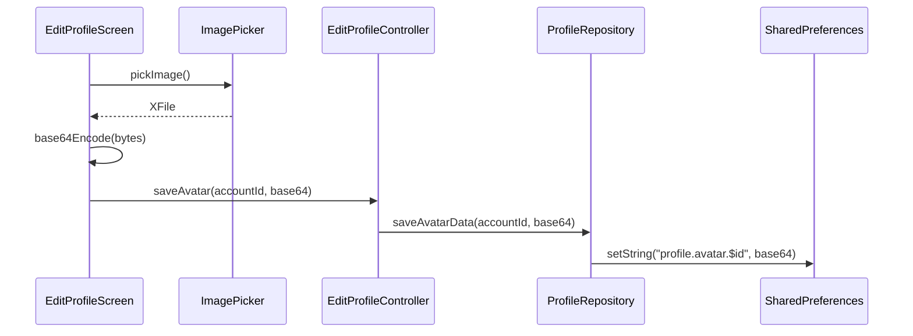

# Edit Profile Screen — Refactoring Plan

## Scope

Two refactors for [edit_profile.screen.dart](file:///Volumes/WD850X/Users/workspace/datn/Healytics/healytic_fe/user_app/lib/features/profile/presentation/screens/edit_profile.screen.dart):

1. **Avatar Upload** — Replace the current local-only `SharedPreferences` + base64 strategy with real S3 presigned-URL upload, persisting the avatar URL on the user profile.
2. **Form Pre-population** — Ensure form fields show the user's current data as initial values reliably, removing the fragile `addPostFrameCallback` pattern.

---

## Current State Analysis

### Avatar Flow (Current — Local Only)



> [!WARNING]
> The current avatar is stored entirely in `SharedPreferences` as a base64 string. It never reaches the backend, is lost on reinstall, and bloats local storage.

### Form Pre-population (Current — Fragile)

```dart
// edit_profile.screen.dart:L40-L50
WidgetsBinding.instance.addPostFrameCallback((_) {
  final accountData = ref.read(accountMeProvider).value;
  if (accountData != null) {
    _nameController.text = accountData.displayName;
    _emailController.text = accountData.email;
    _phoneController.text = accountData.phone ?? '';
    _locationController.text = 'San Francisco, CA'; // Mock!
  }
});
```

> [!WARNING]
> - Uses `addPostFrameCallback` which may fire before `accountMeProvider` has resolved (race condition on cold start).
> - Location is hardcoded to `'San Francisco, CA'` (mock data leak).
> - If `accountMeProvider` is still loading, all fields remain empty with no retry mechanism.

---

## Refactor 1: Avatar Image Upload via S3

### 1.1 — Understand the Upload Pipeline

The backend already exposes a presigned URL upload flow:

| Step | API | DTO |
|------|-----|-----|
| Get presigned URL | `POST /v1/s3/presign` | `PresignRequestDto { fileName, contentType }` → `PresignResponseDto { uploadUrl, key }` |
| Upload binary to S3 | `PUT <uploadUrl>` (direct S3) | Raw bytes with `Content-Type` header |
| Store key on profile | _(Needs backend endpoint — see §1.2)_ | — |

> [!IMPORTANT]
> The `AccountApi` currently only exposes `GET /account/me`. There is **no** `PATCH /account/me` or `PATCH /user/profile` endpoint in the OpenAPI spec. Two options:
> 1. **Request backend team** to add `PATCH /v1/account/profile` accepting `{ firstName, lastName, phone, avatarUrl }`.
> 2. **Use `invokeAPI` raw call** against a known endpoint pattern (consistent with `changePassword` and `deleteAccount` implementations at [profile_remote_datasource.dart:L87-L105](file:///Volumes/WD850X/Users/workspace/datn/Healytics/healytic_fe/user_app/lib/features/profile/data/datasources/remote/profile_remote_datasource.dart#L87-L105)).
>
> **Decision needed from you**: Is the `PATCH /account/profile` endpoint available or planned? The plan below assumes Option 2 (raw `invokeAPI`) so work can begin immediately, with a clean migration path to the typed API once the spec is regenerated.

### 1.2 — Domain Layer Changes

**File**: [profile.repository.dart](file:///Volumes/WD850X/Users/workspace/datn/Healytics/healytic_fe/user_app/lib/features/profile/domain/repositories/profile.repository.dart)

Add a new method to the abstract interface:

```diff
+  /// Uploads avatar image and returns the public URL.
+  Future<String> uploadAvatar({
+    required String fileName,
+    required String contentType,
+    required List<int> bytes,
+  });

-  Future<String?> getAvatarData(String accountId);
-
-  Future<void> saveAvatarData({
-    required String accountId,
-    required String avatarData,
-  });
```

> [!NOTE]
> We **remove** `getAvatarData` and `saveAvatarData` (SharedPreferences-based) and replace with a single `uploadAvatar` that handles the full S3 pipeline. The avatar URL will be returned from `getAccountMe()` (via `UserProfileDto.avatarUrl` — needs backend field addition or a new field on the entity).

**File**: [user_account.entity.dart](file:///Volumes/WD850X/Users/workspace/datn/Healytics/healytic_fe/user_app/lib/features/profile/domain/entities/user_account.entity.dart)

Add `avatarUrl` field:

```diff
 const factory UserAccountEntity({
   required String id,
   required String email,
   String? firstName,
   String? lastName,
   String? phone,
   String? dateOfBirth,
+  String? avatarUrl,
   required bool profileCompleted,
 }) = _UserAccountEntity;
```

### 1.3 — Data Layer Changes

#### Remote Datasource

**File**: [profile_remote_datasource.dart](file:///Volumes/WD850X/Users/workspace/datn/Healytics/healytic_fe/user_app/lib/features/profile/data/datasources/remote/profile_remote_datasource.dart)

**Abstract interface** — mirror the domain:

```diff
- Future<String?> getAvatarData(String accountId);
- Future<void> saveAvatarData({...});
+ Future<String> uploadAvatar({
+   required String fileName,
+   required String contentType,
+   required List<int> bytes,
+ });
```

**Real implementation** (`ProfileRemoteDatasourceImpl`):

```dart
@override
Future<String> uploadAvatar({
  required String fileName,
  required String contentType,
  required List<int> bytes,
}) async {
  // Step 1: Get presigned URL
  final presignResponse = await _apiService.apiClient
      .invokeAPI(
        '/s3/presign',
        'POST',
        const [],
        {
          'fileName': fileName,
          'contentType': contentType,
        },
        {'Content-Type': 'application/json'},
        {},
        'application/json',
      );

  if (presignResponse.statusCode >= 400) {
    throw Exception('Failed to get upload URL');
  }

  final presignData = jsonDecode(
    presignResponse.body,
  ) as Map<String, dynamic>;
  final uploadUrl = presignData['uploadUrl'] as String;
  final s3Key = presignData['key'] as String;

  // Step 2: Upload bytes to S3 via PUT
  final uploadResponse = await _apiService.apiClient
      .client
      .put(
        Uri.parse(uploadUrl),
        headers: {'Content-Type': contentType},
        body: bytes,
      );

  if (uploadResponse.statusCode >= 400) {
    throw Exception('Failed to upload avatar');
  }

  // Step 3: Return the S3 key (or build
  // the full CDN URL if needed)
  return s3Key;
}
```

**Mock implementation** (`ProfileRemoteDatasourceMock`):

```dart
@override
Future<String> uploadAvatar({
  required String fileName,
  required String contentType,
  required List<int> bytes,
}) async {
  await Future.delayed(
    const Duration(milliseconds: 800),
  );
  return 'mock-avatars/$fileName';
}
```

**Entity mapping** — update `_mapDtoToEntity`:

```diff
 UserAccountEntity _mapDtoToEntity(AccountMeResponseDto dto) {
   return UserAccountEntity(
     id: dto.id,
     email: dto.email,
     firstName: dto.userProfile?.firstName,
     lastName: dto.userProfile?.lastName,
     phone: dto.userProfile?.phone,
     dateOfBirth: dto.userProfile?.dateOfBirth,
+    // avatarUrl: dto.userProfile?.avatarUrl,
+    // ↑ Uncomment once backend adds this field
     profileCompleted:
         dto.userProfile?.profileCompleted ?? false,
   );
 }
```

#### Repository Implementation

**File**: [profile_impl.repository.dart](file:///Volumes/WD850X/Users/workspace/datn/Healytics/healytic_fe/user_app/lib/features/profile/data/repositories/profile_impl.repository.dart)

```diff
- @override
- Future<String?> getAvatarData(String accountId) {
-   return remoteDatasource.getAvatarData(accountId);
- }
-
- @override
- Future<void> saveAvatarData({...}) {
-   return remoteDatasource.saveAvatarData(...);
- }

+ @override
+ Future<String> uploadAvatar({
+   required String fileName,
+   required String contentType,
+   required List<int> bytes,
+ }) {
+   return remoteDatasource.uploadAvatar(
+     fileName: fileName,
+     contentType: contentType,
+     bytes: bytes,
+   );
+ }
```

### 1.4 — Presentation Layer Changes

#### Provider Updates

**File**: [profile.provider.dart (presentation)](file:///Volumes/WD850X/Users/workspace/datn/Healytics/healytic_fe/user_app/lib/features/profile/presentation/providers/profile.provider.dart)

```diff
- final profileAvatarProvider =
-     FutureProvider.family<String?, String>((ref, accountId) {
-   final repo = ref.watch(profileRepositoryProvider);
-   return repo.getAvatarData(accountId);
- });
```

> Remove `profileAvatarProvider` entirely — avatar URL now comes from `accountMeProvider` via `UserAccountEntity.avatarUrl`.

#### Controller Updates

**File**: [edit_profile_controller.provider.dart](file:///Volumes/WD850X/Users/workspace/datn/Healytics/healytic_fe/user_app/lib/features/profile/presentation/providers/edit_profile_controller.provider.dart)

Replace `saveAvatar`:

```diff
- Future<bool> saveAvatar({
-   required String accountId,
-   required String avatarData,
- }) async {
-   state = const AsyncValue.loading();
-   state = await AsyncValue.guard(() async {
-     final repo = ref.read(profileRepositoryProvider);
-     await repo.saveAvatarData(
-       accountId: accountId,
-       avatarData: avatarData,
-     );
-     ref.invalidate(
-       profileAvatarProvider(accountId),
-     );
-   });
-   return !state.hasError;
- }

+ /// Uploads avatar via S3 and returns the
+ /// resulting storage key.
+ Future<bool> uploadAvatar({
+   required String fileName,
+   required String contentType,
+   required List<int> bytes,
+ }) async {
+   state = const AsyncValue.loading();
+   state = await AsyncValue.guard(() async {
+     final repo = ref.read(
+       profileRepositoryProvider,
+     );
+     await repo.uploadAvatar(
+       fileName: fileName,
+       contentType: contentType,
+       bytes: bytes,
+     );
+     // Refresh account data to pick up
+     // new avatarUrl
+     ref.invalidate(accountMeProvider);
+   });
+   return !state.hasError;
+ }
```

#### Screen Updates

**File**: [edit_profile.screen.dart](file:///Volumes/WD850X/Users/workspace/datn/Healytics/healytic_fe/user_app/lib/features/profile/presentation/screens/edit_profile.screen.dart)

Replace `_pickAvatar` method (L84-L118):

```dart
Future<void> _pickAvatar() async {
  try {
    final image = await _imagePicker.pickImage(
      source: ImageSource.gallery,
      maxWidth: 768,
      maxHeight: 768,
      imageQuality: 85,
    );
    if (image == null) return;

    final bytes = await image.readAsBytes();
    final contentType = _resolveContentType(
      image.name,
    );
    final controller = ref.read(
      editProfileControllerProvider.notifier,
    );
    final success = await controller.uploadAvatar(
      fileName: image.name,
      contentType: contentType,
      bytes: bytes,
    );

    if (!mounted) return;
    if (success) {
      AppToast.success(
        context,
        'Avatar updated successfully.',
      );
    } else {
      AppToast.error(
        context,
        _controllerError('Unable to update avatar.'),
      );
    }
  } catch (_) {
    if (mounted) {
      AppToast.error(
        context,
        'Unable to select avatar.',
      );
    }
  }
}

String _resolveContentType(String fileName) {
  final ext = fileName.split('.').last.toLowerCase();
  return switch (ext) {
    'png' => 'image/png',
    'webp' => 'image/webp',
    'gif' => 'image/gif',
    _ => 'image/jpeg',
  };
}
```

Update `build()` method avatar data resolution (L282-L286):

```diff
- final avatarData = accountData == null
-     ? null
-     : ref
-           .watch(profileAvatarProvider(accountData.id))
-           .whenOrNull(
-             data: (avatarData) => avatarData,
-           );

  // Avatar now comes from the entity directly
+ final avatarUrl = accountData?.avatarUrl;
```

Update `EditProfilePicture` invocation (L343-L348):

```diff
  EditProfilePicture(
    name: accountData?.displayName ?? '',
-   avatarData: avatarData,
+   imageUrl: avatarUrl,
    onEditAvatar: _pickAvatar,
    isBusy: isLoading,
  ),
```

Remove `import 'dart:convert';` (no longer needed).

#### Picture Widget Updates

**File**: [edit_profile_picture.widget.dart](file:///Volumes/WD850X/Users/workspace/datn/Healytics/healytic_fe/user_app/lib/features/profile/presentation/widgets/edit_profile/edit_profile_picture.widget.dart)

Simplify `_EditableAvatarImage` — remove base64 decoding logic, use `AvatarImage` exclusively (it already handles `imageUrl`):

```diff
 class _EditableAvatarImage extends StatelessWidget {
   const _EditableAvatarImage({
     required this.name,
     this.imageUrl,
-    this.avatarData,
   });

   final String name;
   final String? imageUrl;
-  final String? avatarData;

   @override
   Widget build(BuildContext context) {
-    final bytes = _decodeAvatarData(avatarData);
-    if (bytes == null) {
-      return AvatarImage(
-        name: name,
-        imageUrl: imageUrl,
-        radius: 64,
-      );
-    }
-    return CircleAvatar(
-      radius: 64,
-      backgroundColor:
-          Theme.of(context).colorScheme.onSurface,
-      child: ClipOval(
-        child: Image.memory(
-          bytes,
-          width: 128,
-          height: 128,
-          fit: BoxFit.cover,
-        ),
-      ),
-    );
+    return AvatarImage(
+      name: name,
+      imageUrl: imageUrl,
+      radius: 64,
+    );
   }
-
-  Uint8List? _decodeAvatarData(String? raw) {
-    if (raw == null || raw.isEmpty) return null;
-    try {
-      return base64Decode(raw);
-    } catch (_) {
-      return null;
-    }
-  }
 }
```

Remove `avatarData` parameter from `EditProfilePicture`:

```diff
 class EditProfilePicture extends StatelessWidget {
   const EditProfilePicture({
     super.key,
     required this.name,
     this.imageUrl,
-    this.avatarData,
     this.onEditAvatar,
     this.isBusy = false,
   });

   final String name;
   final String? imageUrl;
-  final String? avatarData;
   final VoidCallback? onEditAvatar;
   final bool isBusy;
```

And update the internal `_EditableAvatarImage` call:

```diff
  _EditableAvatarImage(
    name: name,
    imageUrl: imageUrl,
-   avatarData: avatarData,
  ),
```

Remove `import 'dart:convert';` and `import 'dart:typed_data';`.

---

## Refactor 2: Form Field Pre-population

### Problem Statement

The current approach has three issues:
1. **Race condition**: `addPostFrameCallback` reads `accountMeProvider` which may still be loading.
2. **No reactivity**: If the provider refreshes (e.g., after avatar upload invalidates it), form fields don't update.
3. **Mock data leak**: Location is hardcoded to `'San Francisco, CA'`.

### 2.1 — Strategy: `ref.listen` with One-Shot Population

Replace `addPostFrameCallback` with `ref.listen` on `accountMeProvider` that populates controllers **once** when data first becomes available:

**File**: [edit_profile.screen.dart](file:///Volumes/WD850X/Users/workspace/datn/Healytics/healytic_fe/user_app/lib/features/profile/presentation/screens/edit_profile.screen.dart)

```diff
 class _EditProfileScreenState
     extends ConsumerState<EditProfileScreen> {
   late TextEditingController _nameController;
   late TextEditingController _emailController;
   late TextEditingController _phoneController;
   late TextEditingController _locationController;
   final ImagePicker _imagePicker = ImagePicker();
+  bool _isPopulated = false;

   @override
   void initState() {
     super.initState();
     _nameController = TextEditingController();
     _emailController = TextEditingController();
     _phoneController = TextEditingController();
     _locationController = TextEditingController();
-
-    // Fill initial data if available
-    WidgetsBinding.instance.addPostFrameCallback((_) {
-      final accountData =
-          ref.read(accountMeProvider).value;
-      if (accountData != null) {
-        _nameController.text =
-            accountData.displayName;
-        _emailController.text = accountData.email;
-        _phoneController.text =
-            accountData.phone ?? '';
-        // Mock location
-        _locationController.text =
-            'San Francisco, CA';
-      }
-    });
+
+    // Populate on first data emission
+    WidgetsBinding.instance
+        .addPostFrameCallback((_) {
+      _tryPopulateFields(
+        ref.read(accountMeProvider),
+      );
+    });
   }

+  void _tryPopulateFields(
+    AsyncValue<UserAccountEntity> state,
+  ) {
+    if (_isPopulated) return;
+    final data = state.valueOrNull;
+    if (data == null) return;
+
+    _isPopulated = true;
+    _nameController.text = data.displayName;
+    _emailController.text = data.email;
+    _phoneController.text = data.phone ?? '';
+    _locationController.text = ''; // No location
+  }

   @override
   Widget build(BuildContext context) {
+    // Listen for provider resolution
+    // (handles cold-start loading state)
+    ref.listen<AsyncValue<UserAccountEntity>>(
+      accountMeProvider,
+      (_, next) => _tryPopulateFields(next),
+    );
+
     final colorScheme = Theme.of(context).colorScheme;
     // ...rest of build
```

### 2.2 — Location Field Decision

> [!IMPORTANT]
> The `UserProfileDto` from the backend has **no** `location` field. Options:
> 1. **Remove the Location field** from the form entirely (recommended if backend doesn't support it).
> 2. **Add a `location` field** to the backend `UserProfileDto` and entity.
> 3. **Keep it as display-only** with empty default until backend support arrives.
>
> **Recommendation**: Keep the field visible but empty (no mock data). Remove mock value `'San Francisco, CA'`.

### 2.3 — Email Field: Read-Only

The email comes from the `Account` entity (authentication level), not the user profile. It should be **read-only** in the edit form to prevent confusion:

**File**: [edit_profile_form.widget.dart](file:///Volumes/WD850X/Users/workspace/datn/Healytics/healytic_fe/user_app/lib/features/profile/presentation/widgets/edit_profile/edit_profile_form.widget.dart)

```diff
 _buildField(
   context,
   label: 'EMAIL ADDRESS',
   icon: Icons.mail_outline,
   controller: emailController,
   hintText: 'your@email.com',
   keyboardType: TextInputType.emailAddress,
+  readOnly: true,
 ),
```

Update `_buildField` to accept and forward `readOnly`:

```diff
 Widget _buildField(
   BuildContext context, {
   required String label,
   required IconData icon,
   required TextEditingController controller,
   required String hintText,
   TextInputType? keyboardType,
+  bool readOnly = false,
 }) {
   // ...
   TextFormField(
     controller: controller,
     keyboardType: keyboardType,
+    readOnly: readOnly,
     // ...
   ),
 }
```

---

## Task Sequence

### Phase 1: Domain + Entity (No UI changes yet)

| # | Task | File(s) | Depends On |
|---|------|---------|------------|
| 1.1 | Add `avatarUrl` to `UserAccountEntity` | [user_account.entity.dart](file:///Volumes/WD850X/Users/workspace/datn/Healytics/healytic_fe/user_app/lib/features/profile/domain/entities/user_account.entity.dart) | — |
| 1.2 | Run `build_runner` to regenerate freezed | Terminal | 1.1 |
| 1.3 | Replace `getAvatarData`/`saveAvatarData` with `uploadAvatar` in `ProfileRepository` interface | [profile.repository.dart](file:///Volumes/WD850X/Users/workspace/datn/Healytics/healytic_fe/user_app/lib/features/profile/domain/repositories/profile.repository.dart) | 1.1 |

### Phase 2: Data Layer

| # | Task | File(s) | Depends On |
|---|------|---------|------------|
| 2.1 | Update `ProfileRemoteDatasource` interface (add `uploadAvatar`, remove old methods) | [profile_remote_datasource.dart](file:///Volumes/WD850X/Users/workspace/datn/Healytics/healytic_fe/user_app/lib/features/profile/data/datasources/remote/profile_remote_datasource.dart) | 1.3 |
| 2.2 | Implement `uploadAvatar` in `ProfileRemoteDatasourceImpl` (S3 presign flow) | Same file | 2.1 |
| 2.3 | Implement `uploadAvatar` in `ProfileRemoteDatasourceMock` | Same file | 2.1 |
| 2.4 | Remove SharedPreferences imports and `_avatarKey` helpers from both impl/mock | Same file | 2.2, 2.3 |
| 2.5 | Update entity mapping `_mapDtoToEntity` for `avatarUrl` | Same file | 1.1 |
| 2.6 | Update `ProfileImplRepository` | [profile_impl.repository.dart](file:///Volumes/WD850X/Users/workspace/datn/Healytics/healytic_fe/user_app/lib/features/profile/data/repositories/profile_impl.repository.dart) | 1.3, 2.1 |

### Phase 3: Presentation — Providers

| # | Task | File(s) | Depends On |
|---|------|---------|------------|
| 3.1 | Remove `profileAvatarProvider` | [profile.provider.dart (presentation)](file:///Volumes/WD850X/Users/workspace/datn/Healytics/healytic_fe/user_app/lib/features/profile/presentation/providers/profile.provider.dart) | 2.* |
| 3.2 | Replace `saveAvatar` with `uploadAvatar` in controller | [edit_profile_controller.provider.dart](file:///Volumes/WD850X/Users/workspace/datn/Healytics/healytic_fe/user_app/lib/features/profile/presentation/providers/edit_profile_controller.provider.dart) | 2.6 |
| 3.3 | Run `build_runner` for provider codegen | Terminal | 3.1, 3.2 |

### Phase 4: Presentation — Widgets & Screen

| # | Task | File(s) | Depends On |
|---|------|---------|------------|
| 4.1 | Remove `avatarData` prop from `EditProfilePicture`, simplify `_EditableAvatarImage` | [edit_profile_picture.widget.dart](file:///Volumes/WD850X/Users/workspace/datn/Healytics/healytic_fe/user_app/lib/features/profile/presentation/widgets/edit_profile/edit_profile_picture.widget.dart) | 3.* |
| 4.2 | Add `readOnly` support and make email read-only in `EditProfileForm` | [edit_profile_form.widget.dart](file:///Volumes/WD850X/Users/workspace/datn/Healytics/healytic_fe/user_app/lib/features/profile/presentation/widgets/edit_profile/edit_profile_form.widget.dart) | — |
| 4.3 | Refactor `EditProfileScreen`: replace `_pickAvatar`, use `ref.listen` for form population, remove `profileAvatarProvider` usage | [edit_profile.screen.dart](file:///Volumes/WD850X/Users/workspace/datn/Healytics/healytic_fe/user_app/lib/features/profile/presentation/screens/edit_profile.screen.dart) | 3.*, 4.1, 4.2 |

### Phase 5: Cleanup & Verification

| # | Task | File(s) | Depends On |
|---|------|---------|------------|
| 5.1 | Check for any remaining references to `profileAvatarProvider`, `getAvatarData`, `saveAvatarData` across the codebase | All | 4.* |
| 5.2 | Run `dart analyze` — fix any lint issues | Terminal | 4.* |
| 5.3 | Verify on device: form pre-populates correctly, avatar upload works (mock mode) | Manual | 5.2 |

---

## Open Questions

> [!IMPORTANT]
> Please confirm the following before implementation begins:

1. **Backend `PATCH /account/profile` endpoint**: Is it available or should we proceed with raw `invokeAPI` calls? If the endpoint exists, what is the DTO shape?
2. **Avatar URL field on `UserProfileDto`**: Does the backend currently return an `avatarUrl` on the user profile response? If not, should we coordinate with backend to add it, or use a separate provider in the interim?
3. **Location field**: Remove from form, keep as placeholder, or add backend support?
4. **Image source**: Should we offer both camera and gallery, or gallery only (current)?
