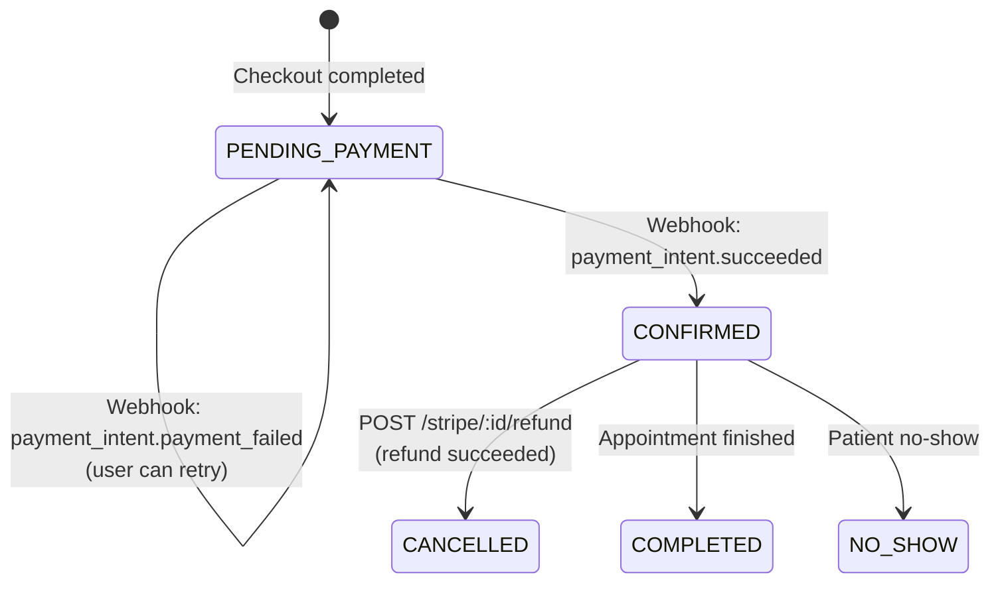
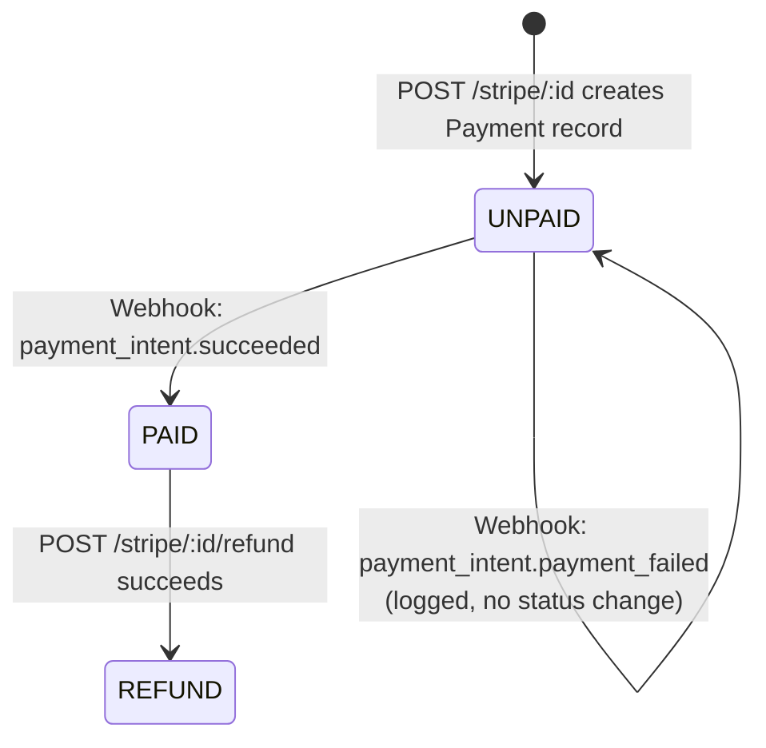
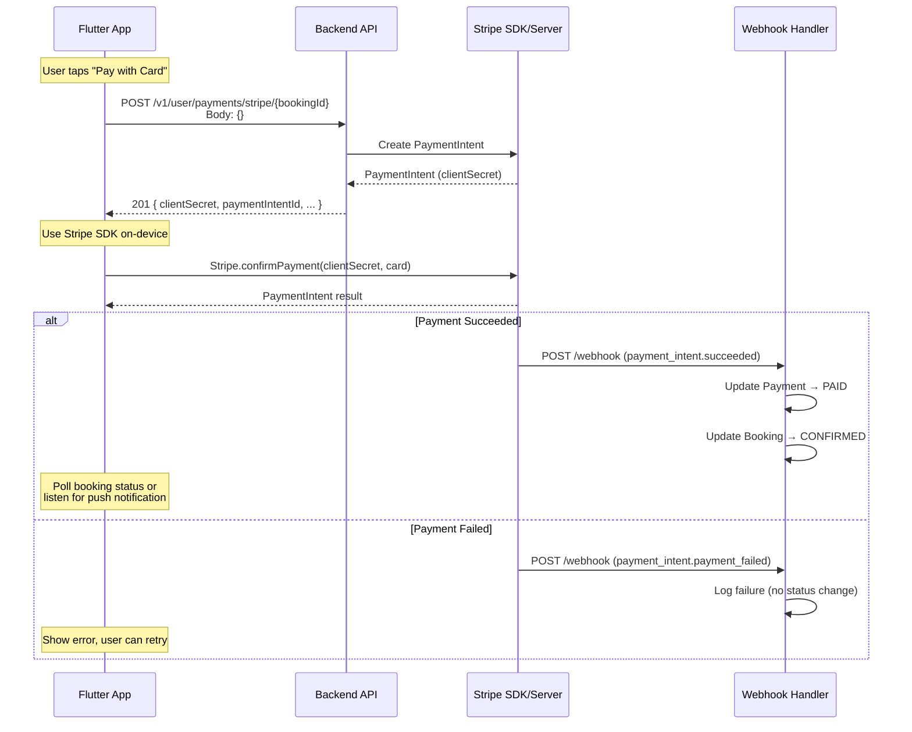

# Stripe Payment API — Frontend Integration Guide

> [!NOTE]
> **Base URL**: `/v1/user/payments`
> **Authentication**: All endpoints require a valid **User JWT** in the `Authorization: Bearer <token>` header.
> **Generated Client**: These endpoints are available in the OpenAPI-generated client under `UserPaymentControllerApi`.

---

## Table of Contents

1. [API Overview](#api-overview)
2. [Endpoint 1 — Create Stripe Payment](#endpoint-1--create-stripe-payment)
3. [Endpoint 2 — Request Stripe Refund](#endpoint-2--request-stripe-refund)
4. [Payment Lifecycle & State Machine](#payment-lifecycle--state-machine)
5. [Flutter Implementation (flutter_stripe)](#flutter-implementation)
6. [Error Handling](#error-handling)
7. [Testing Checklist](#testing-checklist)

---

## API Overview

| # | Method | Path | Purpose | Auth |
|---|--------|------|---------|------|
| 1 | `POST` | `/v1/user/payments/stripe/{bookingId}` | Create a Stripe PaymentIntent → returns `clientSecret` | User JWT |
| 2 | `POST` | `/v1/user/payments/stripe/{bookingId}/refund` | Request full refund for a paid booking | User JWT |

> [!IMPORTANT]
> These endpoints follow a **two-step client-side confirmation** pattern. The backend creates a `PaymentIntent` and returns a `clientSecret`. The **Flutter app** must then use the Stripe SDK to confirm payment on-device. Payment success is **confirmed asynchronously via webhook**, not by the POST response.

---

## Endpoint 1 — Create Stripe Payment

### Request

```
POST /v1/user/payments/stripe/{bookingId}
Content-Type: application/json
Authorization: Bearer <user_jwt>
```

| Parameter | Location | Type | Required | Description |
|-----------|----------|------|----------|-------------|
| `bookingId` | Path | `UUID` | ✅ | The booking to pay for |
| Body | Body | `{}` | ✅ | Empty JSON object — server derives everything from `bookingId` |

> [!TIP]
> The request body is intentionally empty (`{}`). Send `Content-Type: application/json` with an empty object `{}`. The backend derives the amount, currency, and metadata from the booking record.

### Response — `201 Created`

```json
{
  "paymentIntentId": "pi_3RKabcXYZ...",
  "clientSecret": "pi_3RKabcXYZ..._secret_abc123...",
  "amount": 500000,
  "currency": "vnd",
  "status": "requires_payment_method"
}
```

| Field | Type | Description |
|-------|------|-------------|
| `paymentIntentId` | `string` | Stripe PaymentIntent ID (for reference/logging) |
| `clientSecret` | `string` | **Critical** — used by Stripe SDK to confirm payment on-device |
| `amount` | `number` | Amount in smallest currency unit (VND = đồng) |
| `currency` | `string` | ISO currency code (e.g., `"vnd"`) |
| `status` | `string` | Initial PaymentIntent status — typically `"requires_payment_method"` |

> [!CAUTION]
> **Never store `clientSecret` persistently** (DB, SharedPreferences, etc.). It is a one-time-use secret for the Stripe SDK. Use it immediately for `confirmPayment()`, then discard.

### Preconditions

- Booking must exist and belong to the authenticated user
- Booking status must be `PENDING_PAYMENT`
- Booking amount must be a valid positive number

---

## Endpoint 2 — Request Stripe Refund

### Request

```
POST /v1/user/payments/stripe/{bookingId}/refund
Content-Type: application/json
Authorization: Bearer <user_jwt>
```

| Parameter | Location | Type | Required | Description |
|-----------|----------|------|----------|-------------|
| `bookingId` | Path | `UUID` | ✅ | The booking to refund |

> [!NOTE]
> **No request body needed.** The backend automatically finds the original PaymentIntent from the existing Payment record and issues a full refund.

### Response — `200 OK`

```json
{
  "refundId": "re_3RKxyzABC...",
  "amount": 500000,
  "currency": "vnd",
  "status": "succeeded",
  "paymentIntentId": "pi_3RKabcXYZ..."
}
```

| Field | Type | Nullable | Description |
|-------|------|----------|-------------|
| `refundId` | `string` | No | Stripe Refund ID |
| `amount` | `number` | No | Refunded amount (smallest currency unit) |
| `currency` | `string` | No | ISO currency code |
| `status` | `string` | No | Refund status: `"succeeded"`, `"pending"`, or `"failed"` |
| `paymentIntentId` | `string` | **Yes** | Original PaymentIntent ID that was refunded |

### Preconditions

- Booking must exist and belong to the authenticated user
- A **paid** Stripe payment must exist for this booking (`PaymentStatus = PAID`)

### Side Effects (on success)

When `status = "succeeded"`:
- Payment status → `REFUND`
- Booking status → `CANCELLED`

---

## Payment Lifecycle & State Machine

### Booking Status Flow



### Payment Status Flow



### End-to-End Sequence



---

## Flutter Implementation

### Dependencies

```yaml
# pubspec.yaml
dependencies:
  flutter_stripe: ^11.0.0   # Stripe SDK for Flutter
```

### 1. Initialize Stripe (main.dart)

```dart
import 'package:flutter_stripe/flutter_stripe.dart';

Future<void> main() async {
  WidgetsFlutterBinding.ensureInitialized();

  Stripe.publishableKey = const String.fromEnvironment('STRIPE_PK');
  // Optional: set merchant identifier for Apple Pay
  // Stripe.merchantIdentifier = 'merchant.com.healytics';

  await Stripe.instance.applySettings();

  runApp(const HealyticsApp());
}
```

### 2. Create Payment & Confirm on-device

```dart
/// Call from your checkout/payment screen.
Future<void> payWithStripe(String bookingId) async {
  // ── Step 1: Create PaymentIntent via backend ──
  final response = await apiService
      .userPaymentControllerCreateStripePayment(bookingId: bookingId);

  final clientSecret = response.clientSecret;

  // ── Step 2: Confirm payment using Stripe SDK ──
  try {
    await Stripe.instance.confirmPayment(
      paymentIntentClientSecret: clientSecret,
      data: const PaymentMethodParams.card(
        paymentMethodData: PaymentMethodData(),
      ),
    );

    // ✅ Payment confirmed on-device.
    // The actual booking confirmation happens via webhook.
    // Navigate to a "Processing..." or success screen.
    _showPaymentProcessing();

  } on StripeException catch (e) {
    // ❌ Card declined, cancelled by user, etc.
    if (e.error.code == FailureCode.Canceled) {
      // User cancelled the payment sheet
      return;
    }
    _showPaymentError(e.error.localizedMessage ?? 'Payment failed');
  }
}
```

### 3. Request Refund

```dart
/// Call from booking detail / cancellation screen.
Future<void> requestRefund(String bookingId) async {
  try {
    final response = await apiService
        .userPaymentControllerRefundStripePayment(bookingId: bookingId);

    if (response.status == 'succeeded') {
      // ✅ Refund processed immediately
      _showRefundSuccess(amount: response.amount);
    } else {
      // ⏳ Refund is pending — Stripe processing
      _showRefundPending();
    }
  } on ApiException catch (e) {
    if (e.code == 404) {
      _showError('No paid payment found for this booking');
    } else {
      _showError('Refund failed: ${e.message}');
    }
  }
}
```

### 4. Post-Payment: Polling Booking Status

Since payment confirmation happens via webhook (async), the app should poll or listen for the booking status change:

```dart
/// Poll booking status after Stripe.confirmPayment() succeeds.
Future<BookingStatus> waitForConfirmation(
  String bookingId, {
  int maxAttempts = 10,
  Duration interval = const Duration(seconds: 2),
}) async {
  for (var i = 0; i < maxAttempts; i++) {
    await Future.delayed(interval);

    final booking = await bookingApi.getBookingById(bookingId: bookingId);

    if (booking.status == BookingStatus.CONFIRMED) {
      return BookingStatus.CONFIRMED;
    }
    // PENDING_PAYMENT means webhook hasn't arrived yet — keep polling
  }
  // Timeout — show "payment is being processed" message
  throw TimeoutException('Payment confirmation is taking longer than expected');
}
```

---

## Error Handling

### Create Payment Errors

| HTTP Status | Condition | Frontend Action |
|-------------|-----------|-----------------|
| `400` | Booking not in `PENDING_PAYMENT` status | Show "This booking has already been paid or is no longer available" |
| `400` | Invalid booking amount | Show "Unable to process payment. Please contact support." |
| `404` | Booking not found | Show "Booking not found" |
| `401` | Invalid/expired JWT | Redirect to login |

### Refund Errors

| HTTP Status | Condition | Frontend Action |
|-------------|-----------|-----------------|
| `404` | Booking not found | Show "Booking not found" |
| `404` | No paid Stripe payment exists | Show "No payment found to refund" |
| `401` | Invalid/expired JWT | Redirect to login |

### Stripe SDK Errors (on-device)

| Error Code | Meaning | Action |
|------------|---------|--------|
| `FailureCode.Canceled` | User dismissed payment sheet | No-op, return to checkout |
| `FailureCode.Failed` | Card declined / processing error | Show error message, allow retry |
| `FailureCode.Timeout` | Network timeout | Show retry option |

---

## Testing Checklist

### Stripe Test Cards

| Card Number | Scenario |
|-------------|----------|
| `4242 4242 4242 4242` | ✅ Payment succeeds |
| `4000 0000 0000 9995` | ❌ Declined (insufficient funds) |
| `4000 0000 0000 0002` | ❌ Declined (generic) |
| `4000 0025 0000 3155` | ⚠️ Requires 3D Secure authentication |
| `4000 0000 0000 3220` | ⚠️ 3DS2 required |

> [!TIP]
> Use expiry **any future date**, CVC **any 3 digits**, and ZIP **any 5 digits** with test cards.

### Integration Test Scenarios

- [ ] **Happy path**: Create payment → confirm with test card → verify booking becomes `CONFIRMED`
- [ ] **Card declined**: Create payment → use decline test card → verify error displayed, booking stays `PENDING_PAYMENT`
- [ ] **User cancels**: Create payment → dismiss Stripe payment sheet → verify no status change
- [ ] **3DS flow**: Create payment → use 3DS test card → complete authentication → verify success
- [ ] **Refund success**: Pay for booking → request refund → verify booking becomes `CANCELLED`
- [ ] **Refund on unpaid**: Attempt refund on `PENDING_PAYMENT` booking → verify `404` error
- [ ] **Double payment**: Create payment for already `CONFIRMED` booking → verify `400` error
- [ ] **Webhook delay**: Confirm payment → poll booking status → verify eventual consistency

### Environment Setup

```bash
# .env for Flutter
STRIPE_PK=pk_test_xxxxxxxxxxxxx   # Stripe publishable key (test mode)
```

```bash
# Backend .env (already configured)
STRIPE_SECRET_KEY=sk_test_xxxxxxxxxxxxx
STRIPE_WEBHOOK_SECRET=whsec_xxxxxxxxxxxxx
STRIPE_CURRENCY=vnd
```
